# Collections

So far, we've mostly been discussing types that store a single "blob" of data

But, software engineers regularly need to think about working with multiple "blobs" of data of the same type, this is where collections come in.

As ever, this series is accompanied by a free book, check the description for a link straight to this chapter.

My name is Daniel, welcome to iris.

# Intro

Two types you'll use a lot are `Vec` and `HashMap`, but there's actually quite a lot of collections in the Rust standard library, each with their own special use cases.

Before we get to them though, we're going to start with the absolute basics.

# Arrays

Arrays are... technically not collections. Or at least, they are quite different to the other collections in one key way.

They're `Sized`!

While other collections can have elements added to or removed from them, Arrays are always the same size. 

This means that they can exist on the stack, which also means they can be `Copy` (so long as the type stored in the array is also `Copy`).

We can create arrays in two ways

🦀 either by defining a list of expressions, 

🦀 or by using an expression and a length:

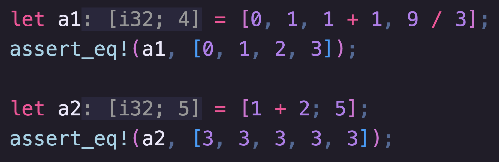

🦀 If you've used other languages, you're probably used to accessing the items in arrays and array like structures with square brackets and you can do that in Rust... 

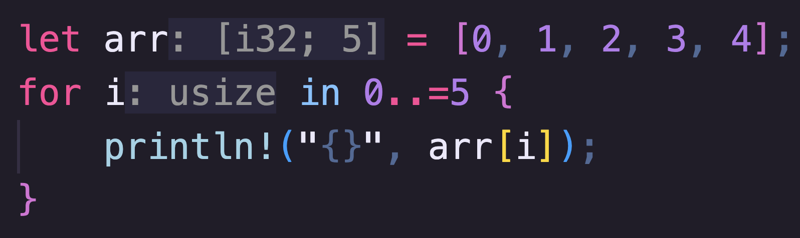

🦀 but you have to be careful! This code will panic, can you see why?

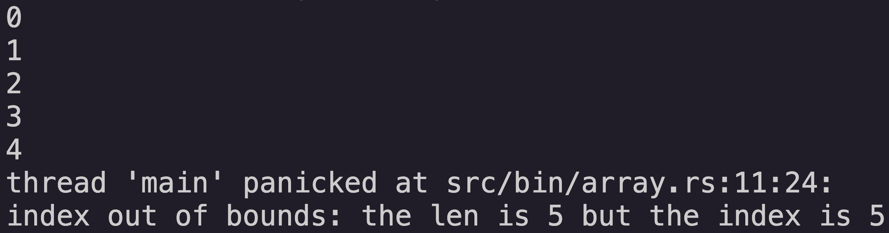

🦀 The final index used is out of bounds

🦀💁🏻‍♂️ This example is a little contrived to demonstrate the problem, there are better ways to step through items in arrays

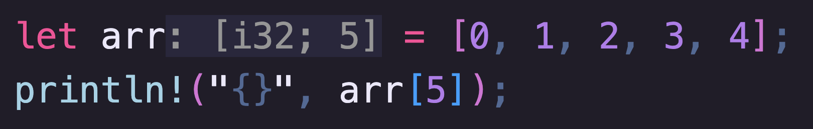

🦀💁🏻‍♂️  That said, because Arrays are sized, Rust is smart enough to know if you've hardcoded an index out of bounds, so this
won't even compile!

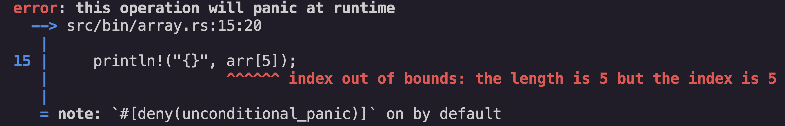

🦀 If you're not sure an index is definitely in bounds, a safer way to get the data there is to use, well... the get method which returns an option containing a reference to the data inside the array

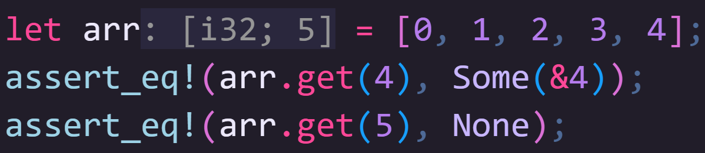

🦀 If the array is mutable, you can get a mutable reference to an entry in the array using `get_mut`.

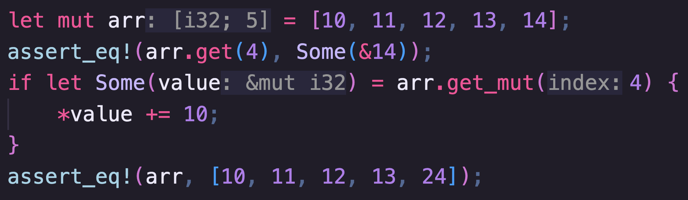

🦀 Note the use of if-let to unwrap the Option we get back from get_mut

🦀 Also because get and get_mut actually return references, to change the value, we have to dereference first

🦀 Finally, you can pass arrays into functions, and if the types in the array are copy, the array itself is also copy meaning you won't lose ownership when you do this.

🦀 Passing an array like this needs the type of the array to be defined including its size, so if the size is different, it won't work.

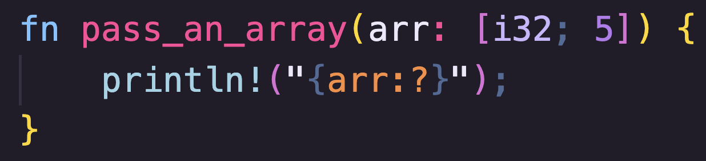

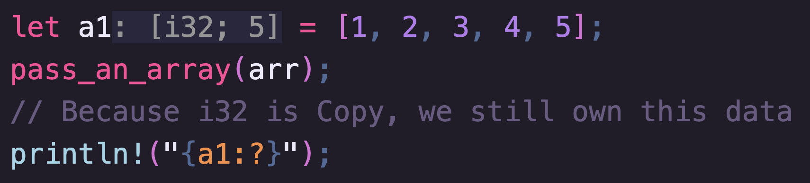

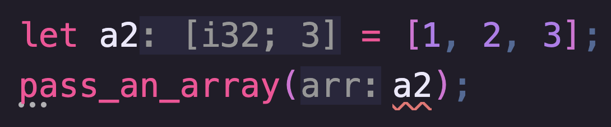

🦀 If you want to pass an arbitrarily sized array into a function, you can... by using a slice.

Slices
------

Obviously, passing exactly sized arrays around isn't particularly useful in most real world circumstances. 

So the first dynamically sized collection we should talk about is the "slice".

You can think of a slice as a view or window into a series of contiguous data. 

The fact that it's a view of some other type hopefully indicates to you that this is a reference type

🦀 The simplest way to get a slice is to reference an array or any other compatible collection.

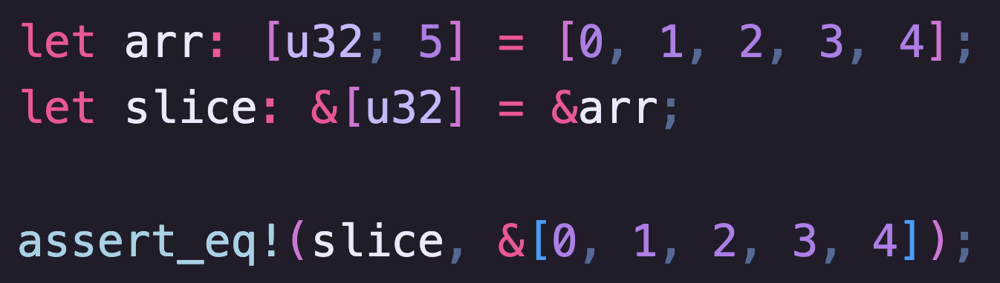

You can also get a sub slice of an array by using range notation, which we've discussed before, but let's do a quick recap

This can include open ranges which are a bit more complicated. 

The way to think about this is, where `X..Y`:

🦀 if X and Y are both specified, the slice begins before the `X`th element and ends before the `Y`th element

🦀 if Y is preceded by an equals sign, the slice ends after the `Y`th element

🦀 if X is not specified, the slice begins at the start of the collection being sliced

🦀 if Y is not specified, the slice ends at the end of the collection being sliced

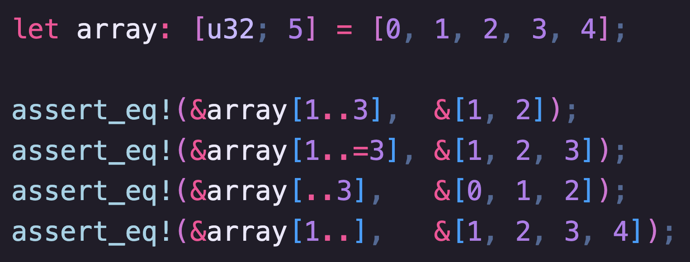

When using slices, you don't need to specify their size, that information is encoded into the data at runtime, meaning you can work with slices of arbitrary size. 

Bear in mind though that they are references, so you _may_ need to use lifetimes to keep track, if you need a reminder of lifetimes (and even those of us well versed in Rust often need a reminder), I covered them in the functions video, linky in the corner.

In that video we discussed a function for splitting a `String` which returned two  "string slice references".

That's right, `str` is another, special, kind of slice. 

🦀 Here's that code again, and here's some things to note that will hopefully make a lot more sense after the last few chapters:

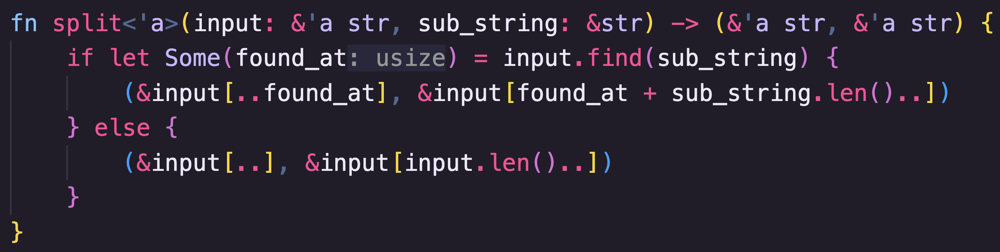

🦀 `String` implements `Deref` targeting `str` so we can get a string slice just by referencing `String`

🦀 The lifetime `'a` (attached to `yuki`) enters `split()` through `input` and is tied to the return parameters `left` and `right`.

🦀 The same range notation is used to create the slices as our previous examples

🦀 In the "`found_at`" branch, open ranges are used to capture the beginning and end for `left` and `right` respectively

🦀 In the "`else`" branch, the completely open range creates a slice the full length of the collection, while the slice that starts at `input.len()` is a zero length slice that starts before the element that _would_ be after the final element and runs to the end.

🦀 Hopefully code like this is starting to make a lot more sense!

Vectors
-------

`Vec` (short for Vector) is similar to an array (and can be dereferenced as an array slice), but unlike array, `Vec` can grow in size.

`Vec` is a generic type (`Vec<T>`) with no trait bound, meaning you use to store any type.

There are several ways to instantiate `Vec`s, and which way is best can vary depending on how you're going to use them.

The fact that `Vec`s are dynamically sized means they need to exist on the Heap, and so when instantiating a `Vec`, your program, under the hood, will request an amount of heap memory.

If your vector exceeds the amount of memory that is currently available to it, code inside the `Vec` type will automatically request a new, larger, portion of heap memory from the operating system, copy the current data into that new location, then free the memory it used to hold, all automatically without you needing to do anything.

This process however is expensive, and you should do what you can to avoid it.

So, with that in mind, you should try to start with a vector large enough to contain as much as you think is reasonable, using the `with_capacity` constructor.

This will construct an empty `Vec` with at least (but possibly not exactly) the capacity you requested.

🦀 Note that capacity and length are not the same thing in Rust. 

🦀 You can get the number of items of data currently in the vector with `.len()` and its capacity with `.capacity()`.

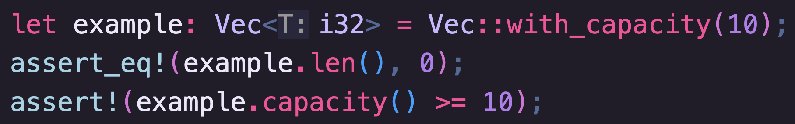

🦀 If you're not worried about the potential costs of resizing your vector, particularly if you're not going to resize it, and you already have some data that you want to instantiate, you should use the `vec!` macro as this can be optimised by the compiler.

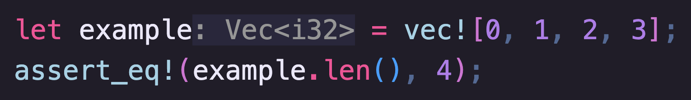

🦀 Usually you'll make Vectors mutable, and they provide a huge array (pun intended) of useful methods, but here are some of the basics.

🦀 To add elements to the end of a vector we use the `.push(t: T)` method

🦀 and to remove them from the end of the vector we use the `.pop()` method which returns an `Option<T>`, since the vector may be empty.

🦀 Like arrays, you _can_ index directly into a `Vec` _but_, just like arrays, you generally shouldn't. 

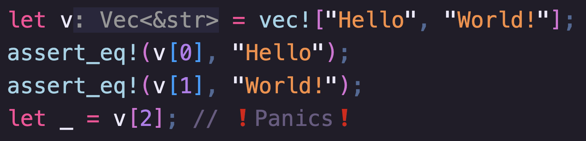

🦀 If you try to access an element out of bounds, your program will panic, an unlike sized arrays, there's not even any protection against hard coded out-of-bounds indices.

🦀 Again, using `.get()` and `.get_mut()` will return an `Option` containing either an immutable or mutable reference to an item inside the vector.

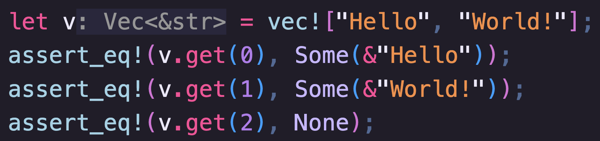

🦀 This is much safer as the program will not halt if there is no item at the given index, you'll simply get a `None`.

🦀 `.get()` and `.get_mut()` will also allow you to create an array slice if you give it a `Range` instead.

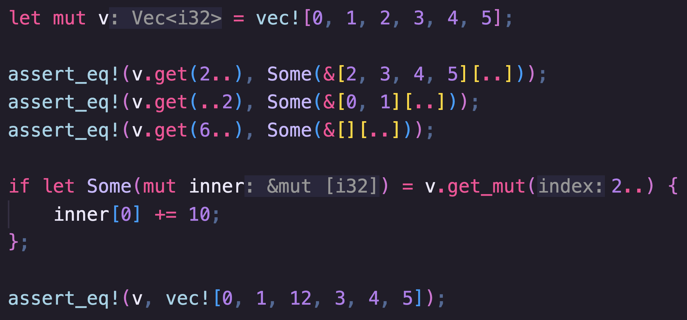

🦀 Note the weird syntax as `get` returns an array slice, not an array

🦀 You can even edit values inside the returned slice

🦀 Be careful, this is actually element 2!

When you put a variable into a `Vec`, or any other collection, unless that variable is copy you are moving ownership into the collection. 

Using methods like `get` will give you a reference to the data, but the only way to get ownership back is to either clone it (and take the potential memory and runtime hit), or to remove to use a method that removes the element from the collection, like `pop` in `Vec`.

We'll discuss similar methods for other collections as we go.

### VecDequeue

`VecDeque` is very similar to `Vec` however, where in `Vec` you can only add and remove items to and from the end of the collection, `VecDeque` also allows you to add and remove items to and from the front!

🦀 You can create a `VecDeque` in much the same way as a `Vec`, though there isn't a macro. 

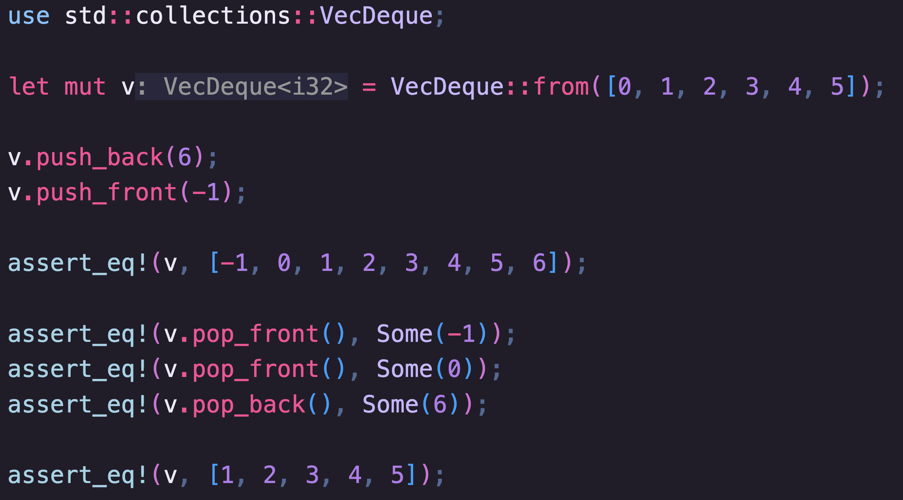

🦀 Instead, here we'll use the `From` trait to take a static array and turn it into a `VecDeque`.

🦀 We can then push elements onto the back of a `VecDeque` with `push_back` or on to the front with, you probably guessed it, `push_front`.

🦀 Similarly, we can remove elements from the front of a `VecDeque` with `pop_front`, or from the back using `pop_back`. 

### Linked Lists

It is very rare to actually need a full `LinkedList`, and for performance reasons, you should try to avoid them where possible. 

`Vec` and `VecDeque` will almost always beat `LinkedList` in both speed and memory efficiency if all you want to do is add items to the end of a list (or, in the case of `VecDeque` to the front).

Where `LinkedList`s are useful though, is when splitting and merging your collection is a core feature you will be heavily reliant on.

🦀 To demonstrate this, lets create a simple example by pushing items on to the end of a linked list.

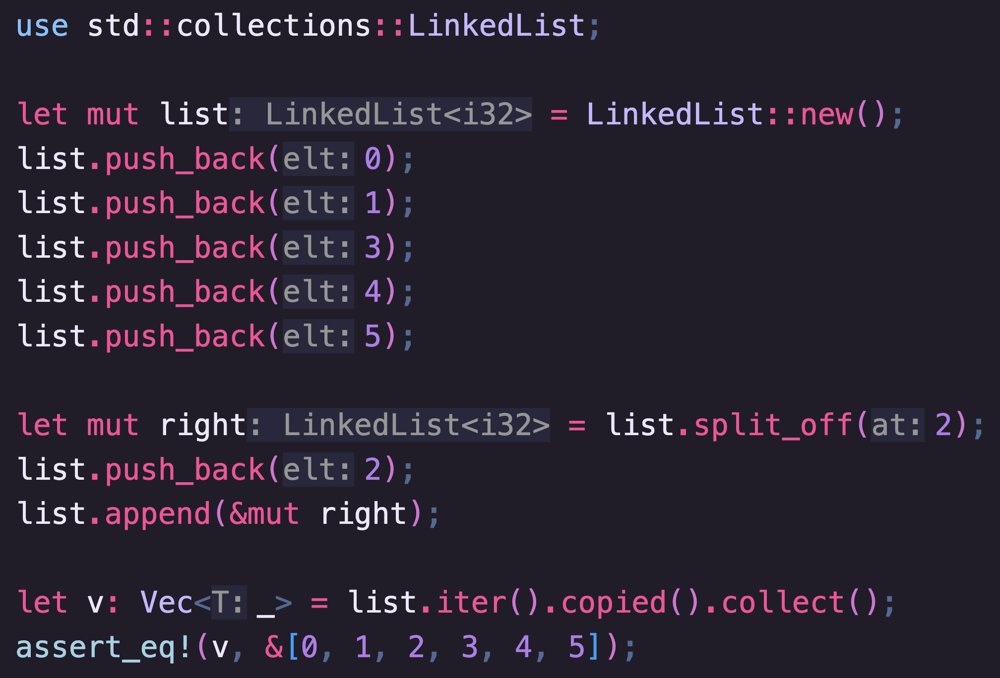

🦀 I'm intentionally skipping over 2 here

🦀 In order to add 2 in at the logical position we can split the linked list before the 2nd element using `split_off(2)`

🦀 We can then append a new element onto the end of the left part of the list (in the original variable) and then re-append the right part of the list.

🦀 You can't easily do this in other linear collections

### BinaryHeap

`BinaryHeap`s allow you to add items to a heap in any order, but the first item off the heap is always the largest item according to its `Ord`.

🦀 For example, lets add some chars to a `BinaryHeap`

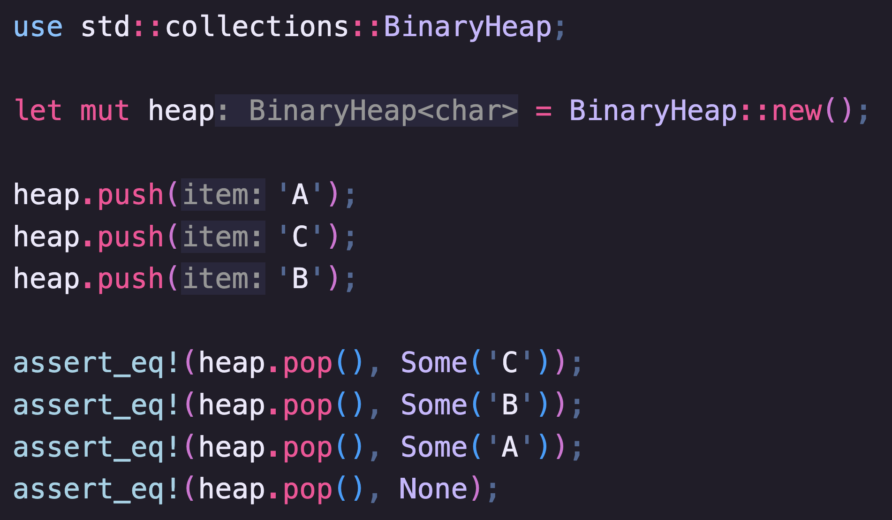

🦀 When we pop them off the heap, they come out from largest to smallest.

🦀 The obvious limitation here though is, what do you do if you need to know the smallest value in the stack?

🦀 In the standard library there's a cool little newtype that can wrap other types and inverts their ordering:

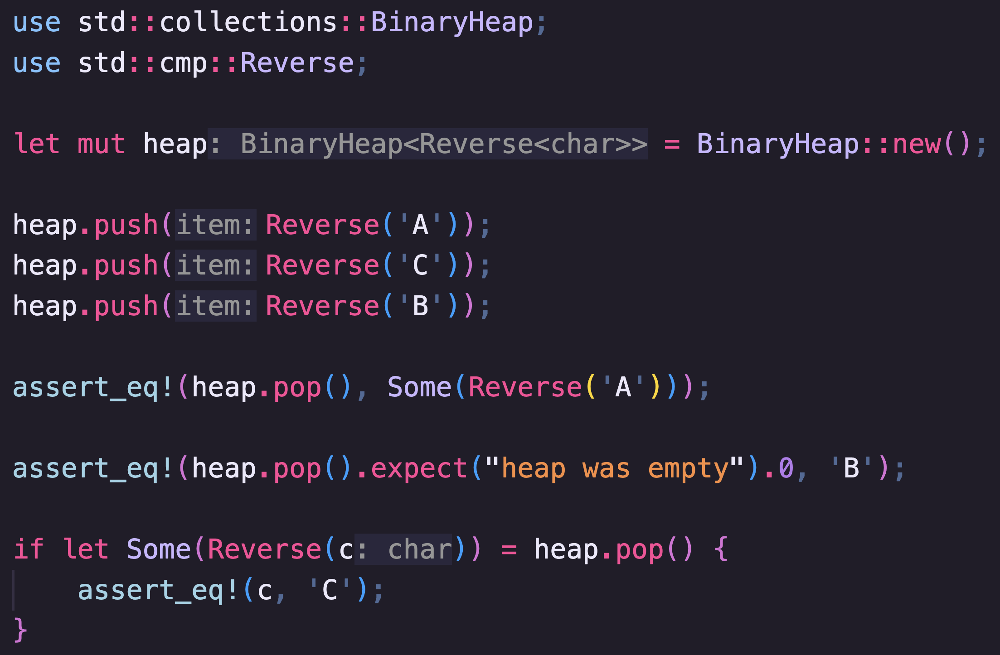

🦀 The only slight downside is that the item will pop off the `BinaryHeap` still wrapped in the `Reverse` newtype

🦀 Because the newtype is a tuple struct with a public field, you can access the data directly there

🦀 Pattern matching will also allow you to extract the inner data

HashMap
-------

A `HashMap` is a key, value lookup table. 

You store a value with a key and use the same key to look up the value you previously stored.

The value can be any type but the type you use for the key must implement the `Hash` trait, see our last video.  

Hashing the key results in a `u64` that is used to create the lookup table.

There's more details on how hashing works in the official book, including how to create a `HashMap` with a different hashing algorithm, but that's beyond the scope of _this_ series.

🦀 Similar to `Vec`s, `HashMap`s can be initialised in a few ways, the main three you're likely to use are:

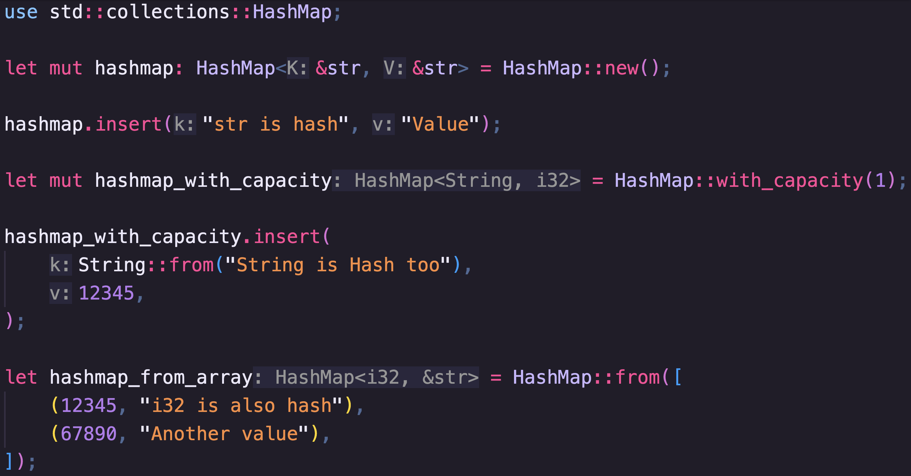

🦀 "new" which creates a hashmap with arbitrary capacity

🦀 "with_capacity" which, like with other collections, can help minimise re-allocation

🦀 or you can create a hashmap from a collection of tuples representing key-value pairs

🦀 To access data you've stored in your hashmap, there's a few handy methods:

🦀 `.get()` and `.get_mut()` work the same as with other collections but take a key instead of an index.

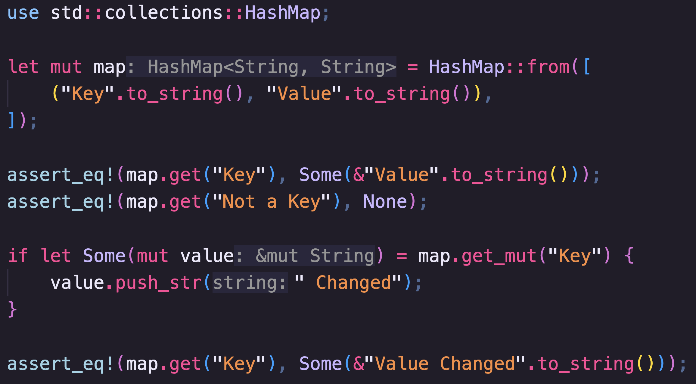

🦀 As with other collections, using `get` will return an `Option` making it very safe to use

🦀 And `get_mut` will allow us to modify data via a mutable reference 

🦀 The `.entry()` method returns a special `Entry` enum that allows you to modify a value if it exists

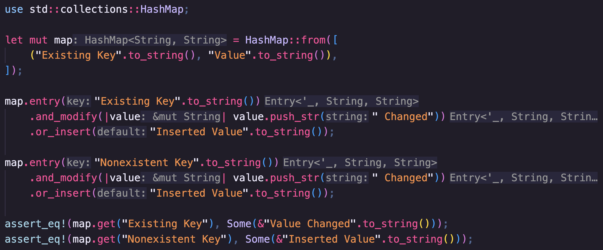

🦀 or insert a value if it doesn't

🦀 Pretty handy right!

🦀 The `.remove` method takes a value out of the HashMap (if it exists)

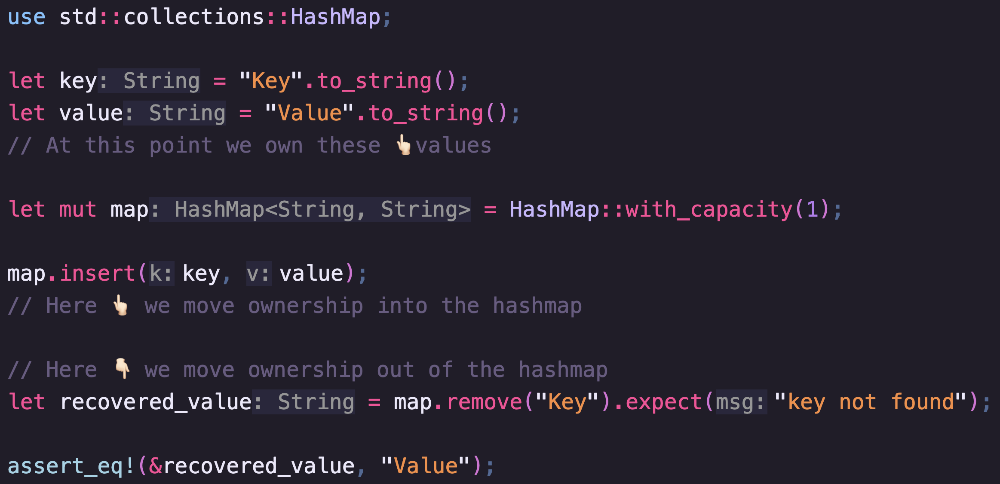

🦀 This is really handy because inserting values into collections, moves ownership into them, and `remove` allows you to move ownership out again

🦀 Similarly `.remove_entry()` can be used to gain ownership of both the value _and_ the key as you remove them from the map

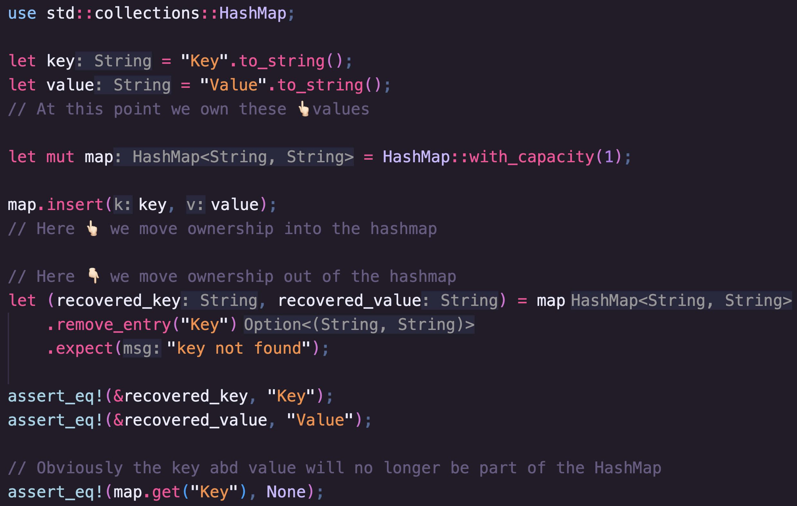

### BTreeMap

`BTreeMap` is a Binary Search Tree version of `HashMap`.

Now, for storing arbitrary data it's a touch slower than `HashMap`, but it internally sorts keys so that you can easily get the values at the largest and smallest keys, a little bit like a `VecDeque`:

🦀 Let's say we have BTreeMap with some keys and values.

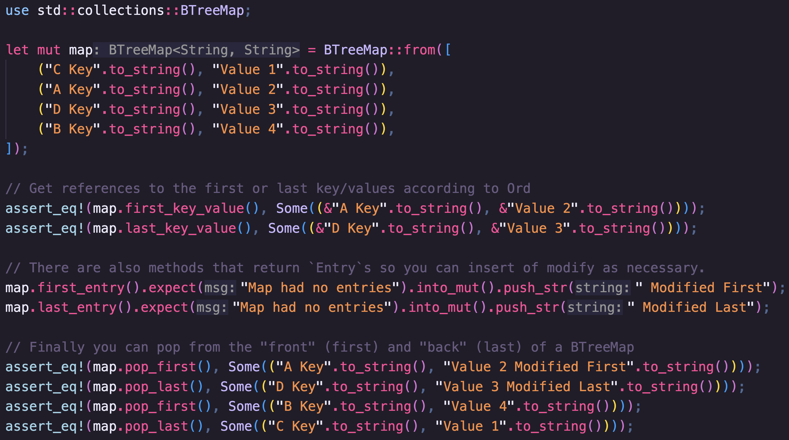

🦀 You can see I've intentionally got the keys out of order here

🦀 We can get references to the first or last key/values according to the Ord of the key type

🦀 We can also get Entry enums this way

🦀 Finally we can pop both the key and value from either the front or back of the BTreeMap, much like a `VecDeque`, but sorted!

Sets
----

🦀 There are two Set types in Rust that allow you to store values with no duplicates, `HashSet` and `BTreeSet`. 

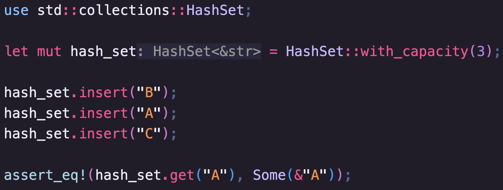
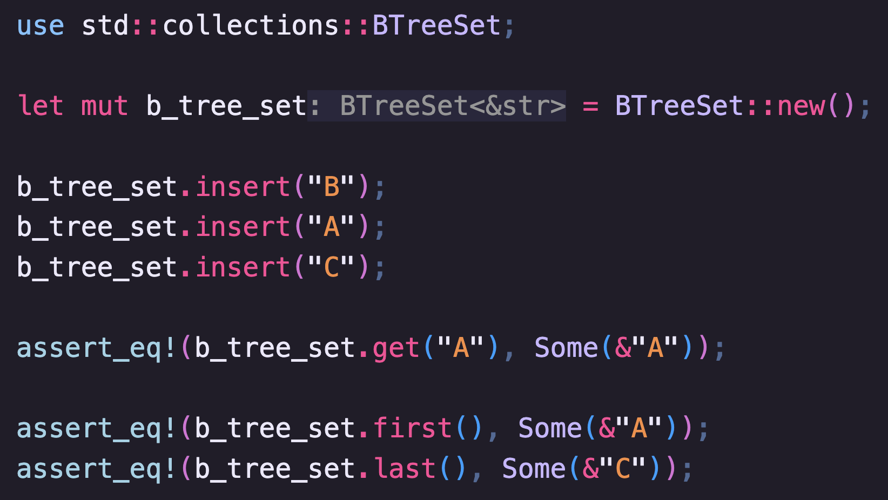

🦀 These are implemented using `HashMap<K, ()>` and `BTreeMap<K, ()>`, though they "fix" some of the issues you might run in to if you were to naively do this yourself.

🦀 For example, `.insert(T)` only takes a single value, and methods like `.get(K)` return an Option with only one value.

🦀 The differences between `HashSet` and `BTreeSet` are the same as between `HashMap` and `BTreeMap`, including `BTreeSet` allowing easy access to the "first" and "last". 

🦀 Furthermore, when you turn `BTreeSet` into an Iterator, it will be in order!

🦀 We'll talk more about Iterators

Next Time
---------

Haha, silly transitions! Yeah, next time, Iterators. 

So fun fact, Iterators are the last core synchronous language feature we'll discuss in this series.

Once you've got your head around them, you're going to be in a great place to build all kinds of apps.

After that we'll be covering threads, async, macro rules and unsafe rust.

Don't worry, though there's plenty of things I want to cover on this channel after we move on from IRISS.

In the meantime, I'd like to thank my Patreons, you're support means an incredible amount to me.

If you enjoyed the video, don't forget to like and subscribe.

And I'll see you...

---

Wait! Before you go I want to talk about a "mistake" in the HashMap section

I noticed this while writing the script but wanted to leave it in, and talk about it at the end of the video.

🦀 When showing the code for `get`, did you spot this...

🦀 See the hashmap key type is a String _but_ I've accidentally used a string slice as the parameter in `get`.

🦀 This code works though... how?

📕 Well, if we check the documentation, we can see that `get` does not take the same generic type as the `Key`, `K`, but a different generic `Q`

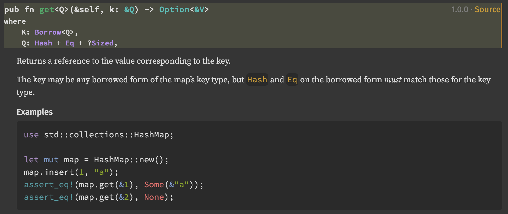

📕 `Q` is any type that `K` implements `Borrow` for (and is Hash, Eq and may or may not be sized), which feels very backwards but makes sense.

📕 String, our key type, implements Borrow string slice, so we can use string slices in the get method.

📕 Using the actual `Key` type, `K`, or `String` in this case, will always work too because all types implement `Borrow` for themselves

Ok, thanks for putting up with another one of my little digressions.

Now I'll see you next time.
