# Iterators

I've been foreshadowing it for a while but today we finally cover Iterators!

Iterators are a way to produce, and perform operations on, a sequence of values.

We often use them with collections (which we covered in our last video) so that we can perform the same operation on
each item in a collection, or reduce a collection to a single value.

They're also often used implicitly in some forms of loop.

As ever, this series is accompanied by a free book, check the description for a link straight to this chapter.

My name is Daniel, welcome to iris.

## The Iterator Trait

The Iterator trait can be applied to any type and has a single required method:

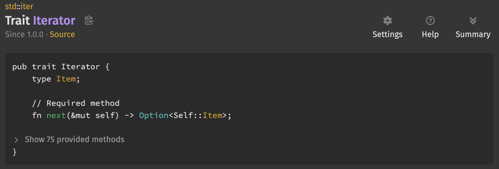

📕 `.next()` returns an `Option` telling the caller there either is another item (Some), or there isn't (None).

📕 Iterator also has 75 provided methods, which I think goes to show how incredibly versatile this trait is.

📕 We'll be talking about some of these methods, but it's well worth checking out the documentation to see what else is
possible.

While you'll usually get iterators from things like collections, it's possible to "Iterate" through anything.

To show the power of Iterators, we're going to start by building an Iterator from scratch, one that produces the
Fibonacci sequence.

The Fibonacci sequence is a sequence of numbers where each number is the sum of the previous two.

Depending on whom you ask, the sequence either starts, `1, 2`, `1, 1`, or `0, 1`.

Purists will say it's the former (as "Leonardo Bonacci" intended), software engineers usually use the latter... I'm
sticking mine in the middle, but it really doesn't matter.

🦀 Anyway, let's start by making a Struct to store the state of the Iterator.

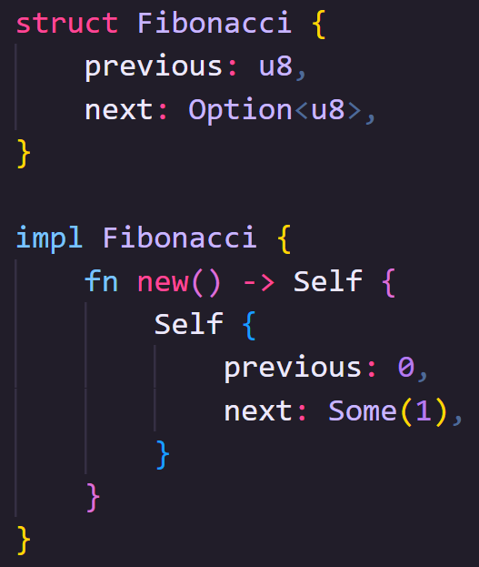

🦀 We'll need to know the previous number and the next number, and to keep it simple we'll use a `u8` so we'll only get
numbers zero to two-five-five.

🦀 Let's make a constructor so that the Iterator always starts in a valid state.

🦀 So, let's move on to implementing Iterator itself.

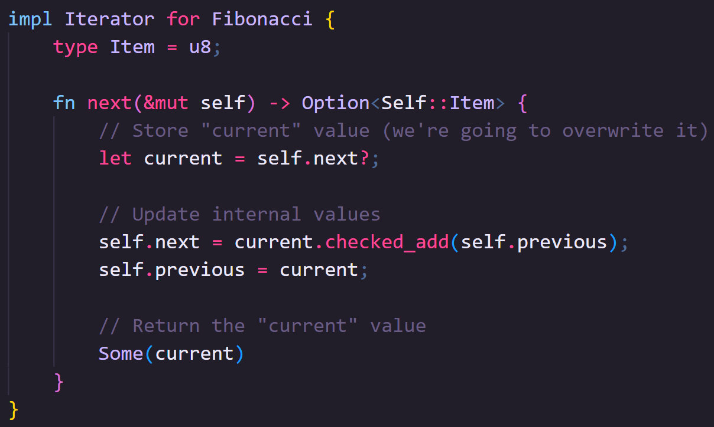

🦀 The trait has an associated type `Item` that describes the type returned by each iterator.

🦀 It's an associated type rather than a generic type as it needs to be referenced a _lot_ but, it's type is dictated by
the process used to create the Iterator.

🦀 To implement the `next` method, we'll temporarily store the current value of the value `next`.

🦀 Because `self.next` is an Option, and the `next` method returns an Option, we can use the same question mark operator
to either unwrap a `Some` variant, or immediate return a `None` variant depending on what's in there.

🦀 If there is a `None` at this point, then we've reached the end of our sequence.

🦀 Next we'll update our internal state, our new next is the current value plus the previous, and our previous becomes
the old current.

🦀 By using `checked_add` here we get an `Option` that is `None` if the result is out of bounds.

🦀 Finally, we return the stored "current" value, though we'll have to re-wrap it in an Option after unwrapping it
earlier.

🦀 So now we have our iterator type!

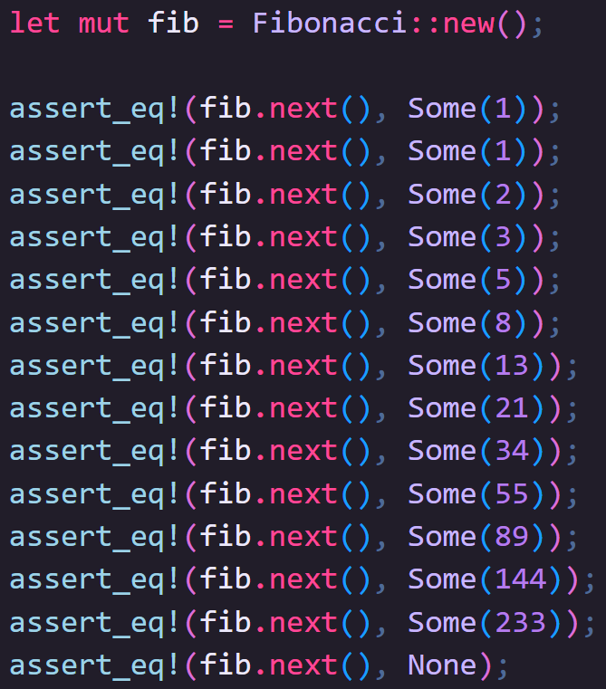

🦀 We can now get each item off the iterator one at a time by calling the next function:

🦀 You can see that each item in the sequence is wrapped in an `Option`.

🦀 When an Iterator has no more items to provide, it will produce a `None`.

🦀 The final number this Iterator will produce is `233`, after which we would overflow the `u8` we've used.

🦀 Just calling `.next()` is pretty boring, no one wants to iterate through things by hand.

🦀 What if we want to print out all the Fibonacci values that fit inside a `u8`?

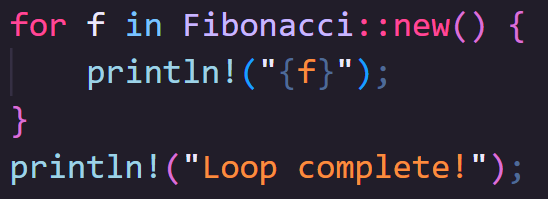

🦀 You can give an Iterator to a `for ... in ...` loop, and it will automatically unwrap the `Option` for you.

🦀 This code will print out each number on a new line

🦀 Once the loop hits a `None` the loop ends.

That's cool, but on its own, it's still not very interesting.

Iterators are designed to be chained.

Those 75 provided methods I mentioned earlier allow you to do some exceptional tricks.

🦀 For example, a list of Fibonacci numbers might be more useful if we knew what number in the sequence we're on.

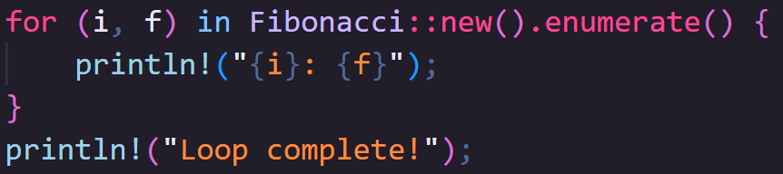

🦀 We can chain a method called `.enumerate` which will take the old iterator and give us a new one where each `next` now
returns a tuple of `(usize, T)` where the `T` is the original item and the `usize` is the position.

🦀 What's brilliant about this though is that when I say it "takes the old iterator", it doesn't try to process every
item in the iterator (a process in Rust we refer to as "consuming" the iterator), it merely takes ownership of it.

🦀 When we call `.next()` on the iterator returned by `.enumerate()`, _it_ calls next on the iterator being enumerated.

Rust iterators are "lazy" meaning that they try to avoid doing any unnecessary work.

Getting Iterators
-----------------

Having built our own, hopefully you now have a _vague_ understanding of how Iterators work, but usually you'll get an
Iterator from a collection.

As with most things in Rust, Iterators (or specifically, the items being iterated) can be thought of in three groups.

All the collections we discussed in the last video can give you an iterator in any of the following forms.

Firstly, referenced data

Often we don't need to _own_ the data we're iterating over, it can be enough to just read it.

All built in collections have a method called `.iter()` which returns an Iterator type where the items are references to
the data held in the collection.

🦀 Here we have two variables that _own_ the Strings inside them.

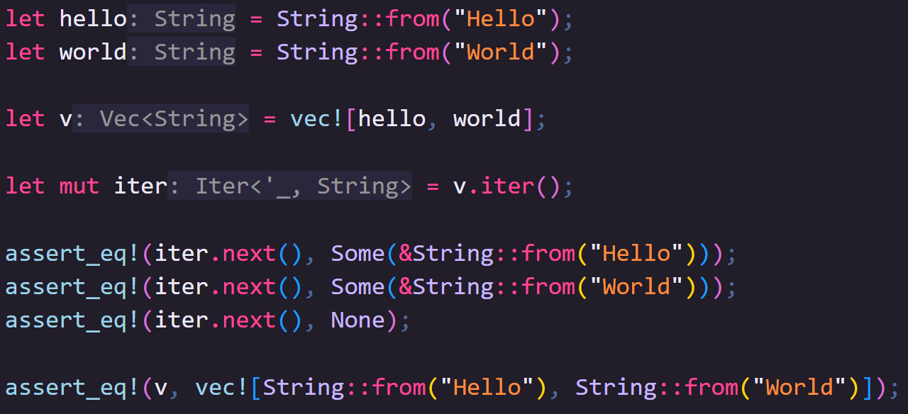

🦀 We move ownership of the variables inside the Vector

🦀 And then we create an Iterator with the Iter method which will iterate over references that point to the data now
owned by the vector

🦀 So calling `.next()` on the iterator gives as a reference, not the original data.

🦀 This means the vector still owns the data

🦀 One thing to bear in mind is that if the collection contains references, then `.iter()` will give you an Iterator that
produces references to references.

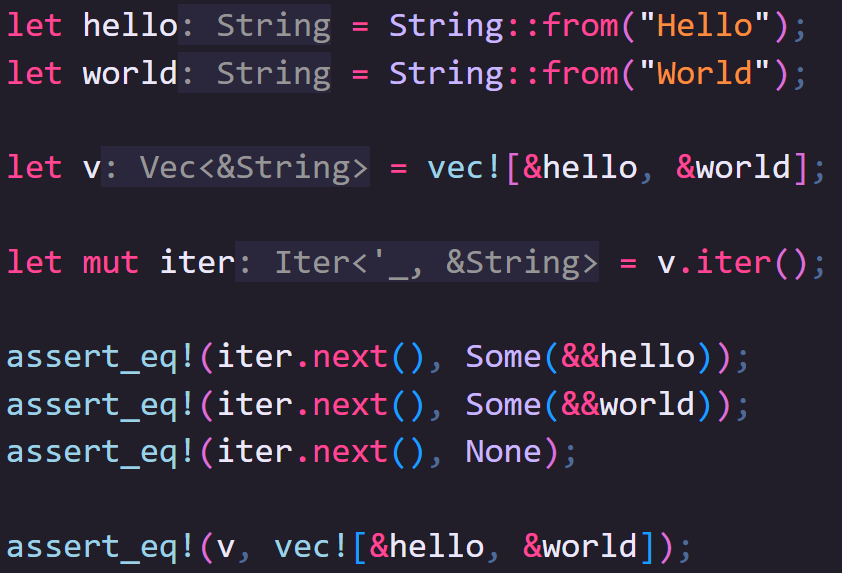

🦀 So if we change the original vector to reference the Strings rather than take ownership

🦀 When we call `.next()` we get a reference to a reference

Sometimes, you need to edit things while iterating through them; our second option lets us do that.

`.iter_mut()` can give you a mutable iterator, and all of Rust's built-in collections support it (so long as the
underlying collection is mutable).

🦀 In this example, we'll use a Vector of numbers, as I mentioned, we need this Vector to be mutable.

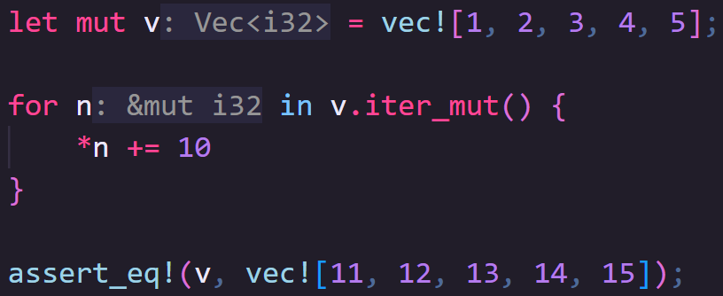

🦀 We'll use a for ... in ... loop like earlier, using `.iter_mut()`.

🦀 So here, n, is a mutable reference to the value stored in the vector.

🦀 By dereferencing n, we can add 10 to the original value.

🦀 If we check the original Vector now, we can see all values have increased by 10.

Finally, you may want to take ownership of the underlying data, and that's where our third option comes in.

`.into_iter()` takes ownership of the collection (meaning that collection will no longer be available) and the data
inside.

One place this is particularly useful is when converting between types, either on the item level or for the entire
collection.

There is a trait called `FromIterator<A>` that is implemented for types that can consume an iterator and populate
themselves.

This is almost always used with the `.collect()` iterator method, though you need to be explicit about what you're
collecting into.

You can do this either by typing the variable you're collecting into, or by using the turbofish operator that allows you
to be explicit about the concrete types to fill in generics.

🦀 In this example, we'll go back to our Strings as they aren't `Copy`.

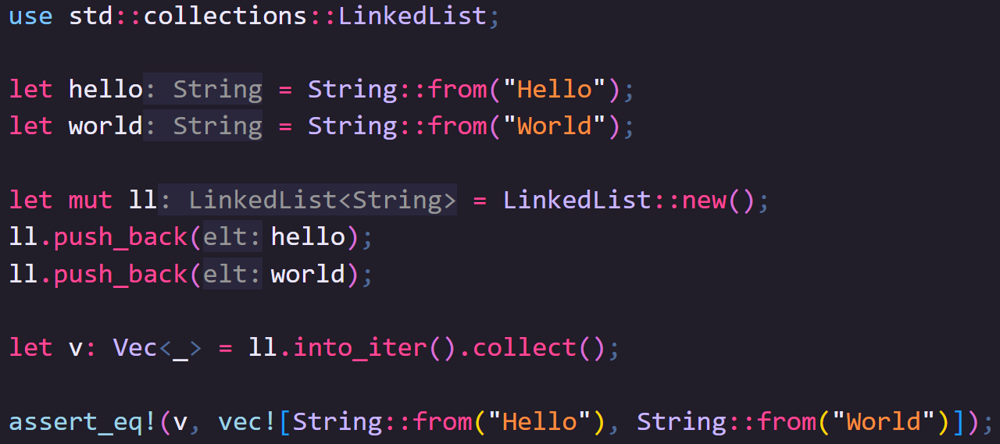

🦀 Instead of using a Vector this time, we'll use a LinkedList, and push our strings onto the end.

🦀 This moves ownership from the variables into the LinkedList.

🦀 To turn the LinkedList into a Vector, we'll first convert the LinkedList into an Iterator that owns the original data
with `.into_iter()`.

🦀 Then we'll "collect" that Iterator into a collection.

🦀 Because `v` is explicitly typed, Rust knows to use the `FromIterator` implementation of `Vector` when calling
`.collect()`.

Honestly, even after years of using Rust, this backwards way of writing code that makes it super modular still makes me
think: "wow"

🦀 In this example, we've created a variable _basically_ just to provide type information.

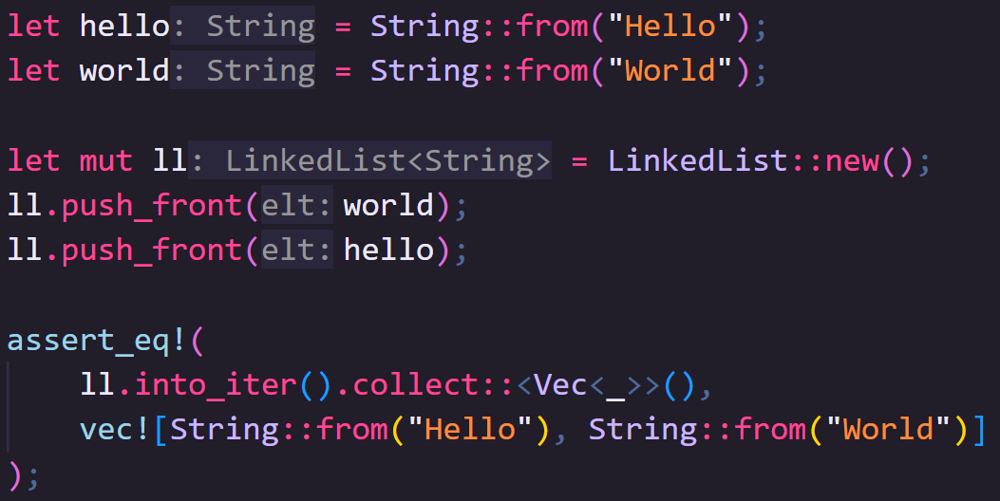

🦀 You can skip this step using the turbofish operator which looks like this.


Copying and cloning Items
-------------------------

Using what we've learned above, what if we want to use owned data, but we need to keep the original collection, so
`.into_iter()` is out of the question?

There are two methods on `Iterator` for this purpose: `.copied()` and `.cloned()`.

Each one takes the old iterator and returns a new one where the appropriate action is applied to the next Item as its
called.

`.copied()` only works on Iterators where the item is `Copy` will take the iterator and return a new iterator which
returns each Item copied.

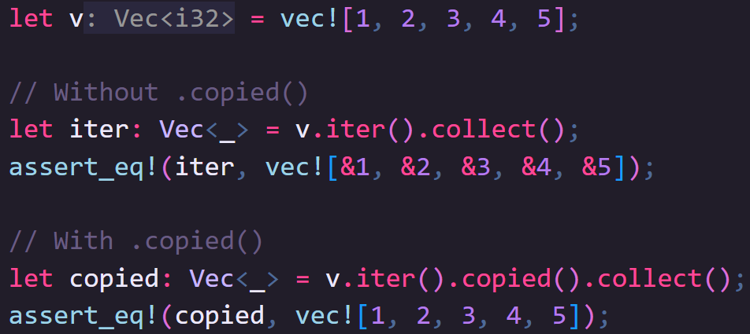

`.cloned()` does the same for types that are `Clone`.

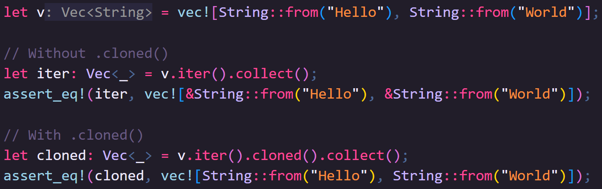

Other Ways to get Iterators
---------------------------

Beyond collections, there are other things that can be iterated through.

🦀 Ranges _are_ iterators, it's why you often see them used in for loops:

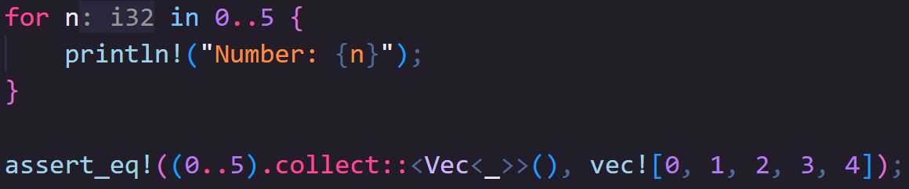

🦀 But they implement all the same methods so we can collect them like any other iterator.

🦀 You can make an infinitely repeating iterator of anything so long as it implements `Clone`, using `std::iter::repeat`.

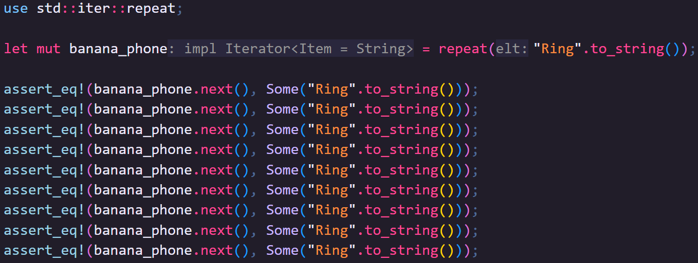

🦀 Now, because immutable references implement `Clone` we could use this function to repeat a reference to string slice
like "hi".

🦀 Um, I said "hi".

🦀 Wait!

🦀 It literally never ends, every time you call `.next()` it just clones a new value

🦀 Ok enough of that.

🦀 We can also repeat existing iterators infinitely using a method on the iterator called `.cycle()`

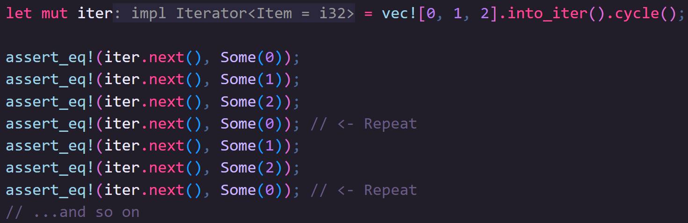

🦀 Once the iterator has run out of items, instead of returning a `None`, it simply starts again.

You can also create iterators by combining other iterators, although they have to be of the same type:

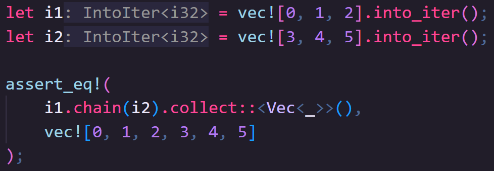

Many other Types in Rust can also be broken down into Iterators.

This script for this video, for example, can be represented as one large `str`, which you can break the data down by
`.lines()`, `.chars()` or `.bytes()`.

Cool ways to use Iterators
--------------------------

### Mathematics

One common thing we might want to do is consume an iterator of numeric values and get some new value from it.

A quick warning though!

Unlike some other operations we might perform on iterators which add some step that _will_ be performed when we call
`.next`, methods that "consume" the Iterator will actually try to process everything in the Iterator.

This means if you call them on an infinite iterator, like those created by `.repeat()` or `.cycle()`, your code will enter an infinite loop and never end.  

However, when that's not the case there's some useful mechanisms we can use:

For iterators of items that implement the `Sum` trait (eg, numbers) `.sum()` will add all the items in the iterator:

```rust
assert_eq!(
    vec![1, 2, 3, 4].iter().sum::<i32>(),
    10
);
```

For iterators of items that implement the `Product` trait (eg, again, numbers) `.product()` will multiply all the items
in the iterator, eg:

```rust
assert_eq!(
    vec![1, 2, 3, 4].iter().product::<i32>(),
    24
);
```

Its worth noting that some surprising things implement `Sum` and `Product`, including blanket implementations for
`Option<T>` and `Result<T, E>` where `T` already implements the trait.

```rust
let v: Vec<Option<usize> > = vec![
    Some(10),
    Some(20),
    Some(12),
];

// Note: the Option needs to be owned, references won't work, so we'll use .into_iter()
let total: Option<usize> = v.into_iter().sum();
assert_eq!(total, Some(42));
```

I want to add another quick warning here, `.sum()` and `.product()` use the basic `add` and `multiply` operators respectively.

This can be problematic because there's no check to see if the result still fits inside the numeric type. 

For example, this will panic.

Usually this won't be a problem as you'll likely be using number types with a lot of space, but we'll touch on slower (but safer) ways to get around this later 

Anyway, carrying on:

For iterators of items that implement `Ord` you can use `.min()` and `.max()` to find the largest and smallest values respectively:

```rust
let v = vec!['H', 'e', 'l', 'l', 'o', 'w', 'o', 'r', 'l', 'd'];

assert_eq!(v.iter().min(), Some(&'H'));
assert_eq!(v.iter().max(), Some(&'w'));
```

If you just want to know how many items there are, you can use `.count()` which merely tells us how many items are in an iterator.

```rust
let v = vec!['H', 'e', 'l', 'l', 'o', 'w', 'o', 'r', 'l', 'd'];

let iter = v.clone().into_iter();
assert_eq!(iter.count(), v.len()); // iter has same number of items as v is long
// iter no longer exists
```

However, if the iterator implements `ExactSizeIterator`, which many of the built-in ones do, then you can use `.len()` instead

Not only does this not consume the iterator, it's almost always faster to get the same result:

```rust
let v = vec!['H', 'e', 'l', 'l', 'o', 'w', 'o', 'r', 'l', 'd'];

let mut iter = v.iter();
assert_eq!(iter.len(), v.len());
assert_eq!(iter.next(), Some(&'H'));
```

### Applying a Process over each item

One of the most common uses for Iterators is to process a set of Items one at a time.

There are a number of methods on the Iterator trait (that themselves return new Iterators) that are really helpful for this.

You can take one iterator and exclude Items based on the result of a predicate using the `.filter(P)`.

For example, we could take a range of numbers, and filter out all odd numbers like this:

```rust
// Many iterator methods return a new iterator which is great for chaining
let mut iter = (1..=10).filter( | n| n % 2 == 0);

assert_eq!(iter.next(), Some(2));
assert_eq!(iter.next(), Some(4));
assert_eq!(iter.next(), Some(6));
assert_eq!(iter.next(), Some(8));
assert_eq!(iter.next(), Some(10));
assert_eq!(iter.next(), None);
```

If we were to look at the length of the iterators before and after this filter you'll see they've changed! 

But here's where things get a little... interesting.

I mentioned earlier that ideally we should try to use `.len()` instead of `.count()` when the Iterator implements `ExactSizeIterator`

For the obvious reasons we don't know if an Item is included or not before an item is processed by the filter, we don't get an `ExactSizeIterator` back from the `.filter()` method, so we have to count each item.

But, to my surprise, `ExactSizeIterator` is not implemented for `RangeInclusive`... but it is for `Range`.

I don't know why this is, if you do, let me know in the comments, but I think it's a sign to prefer `Range` over `RangeInclusive`.

```rust
let full_iter = (1..=10);
let filtered_iter = full_iter.clone().filter( | n| n % 2 == 0);

// We need to use count as ranges do not implement ExactSizeIterator 
assert_eq!(full_iter.count(), 10);
assert_eq!(filtered_iter.count(), 5);
```

Anyway, another great way to process Iterators one Item at a time is to take that Item and transform it in some way.

We can pass a function into the `.map()` method that receives the item and returns a new value.

If that value is of a different type, the Iterator you get back will also be of that new type:

If we start off with a Range like this, this is an Iterator where the Item is of type `i32`.

We can then use `.map()` to take the number and return the result of the format macro. 

And now we have an Iterator where the Item is of type `String`.

```rust
let mut iter = (0..3) // An Iterator where Item is i32
.map( | n| format!("This is item number {n}")); // New Iterator where Item is String

assert_eq!(iter.next(), Some("This is item number 0".to_string()));
assert_eq!(iter.next(), Some("This is item number 1".to_string()));
assert_eq!(iter.next(), Some("This is item number 2".to_string()));
assert_eq!(iter.next(), None);
```

Sometimes the process you apply to an item might itself result in an `Option`, and rather than having an iterator of `Options` you may want to discard `None`s and unwrap the `Ok`, this is where `.filter_map()` is really handy.

This range gives us every valid `u8` number in sequence from smallest to largest (this time it has to be RangeInclusive obviously).

If we add 250 to each number, most of them will no longer fit inside of a `u8`.

The `.checked_add()` method found on most numeric types in Rust will return an Option, where the `None` variant represents an overflow.

If we combine this with a `.filter_map()` all numbers that overflow will automatically be excluded (because of the None) and all numbers in the `Some` variant are automatically unwrapped

That leaves us with these 6 numbers.

```rust
let mut iter = (u8::MIN..=u8::MAX)
.filter_map( | n| n.checked_add(250u8));

assert_eq!(iter.next(), Some(250)); // 0 + 250
assert_eq!(iter.next(), Some(251)); // 1 + 250
assert_eq!(iter.next(), Some(252)); // 2 + 250
assert_eq!(iter.next(), Some(253)); // 3 + 250
assert_eq!(iter.next(), Some(254)); // 4 + 250
assert_eq!(iter.next(), Some(255)); // 5 + 250
assert_eq!(iter.next(), None);
```

This not only saves us from having to deal with doubly wrapped options from `next` (for example `Some(Some(255))`) but entirely removes the items from the iterator meaning anything else we chain doesn't have to deal with it either.

```rust
assert_eq!((u8::MIN..=u8::MAX).map(|n| n.checked_add(250u8)).count(), 256);
assert_eq!((u8::MIN..=u8::MAX).filter_map(|n| n.checked_add(250u8)).count(), 6);
```

Another way to reduce how many items we want to deal with in an iterator is by using `.take(n)` and `.skip(n)`.

We can end an iterator earlier by only taking a certain number of items from it with `.take(n)` 

Or we can skip over a number of items with `.skip(n)` before resuming the iterator from that point.

```rust
let v = vec![1, 2, 3, 4, 5, 6];

let iter_take = v.iter().take(3);
let iter_skip = v.iter().skip(3);

assert_eq!(iter_take.collect::<Vec<_>>(), vec![&1, &2, &3]);
assert_eq!(iter_skip.collect::<Vec<_>>(), vec![&4, &5, &6]);
```

As with most iterators, you can chain them together too!

```rust
# let v = vec![1, 2, 3, 4, 5, 6];
#
assert_eq!(v.iter().skip(1).take(4).collect::<Vec<_>>(), vec![&2, &3, &4, &5]);
```

An Iterator method we used earlier, `.enumerate()`, allows us to add an index to our Iterator by changing the type of the iterator `T` to a tuple of `(usize, T)`.

This can be really handy in combination with other iterators when the position in an iterator is important.

Here's a silly example, we'll do a sensible one at the end of the video, but let's say we want to filter every other item out of a `Vec`. 

We can do that by chaining together several of the Iterators we've just learned.

We'll take ownership of the data because we don't need the original after this.

We'll enumerate the iterator so we get the index from the point we're at in the iterator onwards (in this case we're at the start but that might not always be the case)

The index starts at zero so by checking the modulo of the index we can take every other item starting with the first.

Filter doesn't change the data only decides if it should be kept or not

Since we no longer need the index, we can map the tuple and return just the data we care about

When we collect it we can see this method works

```rust
let v1 = vec!["This", "sentence", "is", "not", "shorter"];

let v2: Vec<_ > = v1.into_iter()
.enumerate()
.filter( | (i, _) | i % 2 == 0) // Use the index added by enumerate to skip odd items
.map( | (_, s) | s) // Turn the iterator (usize, T) back into T
.collect();

assert_eq!(v2, vec!["This", "is", "shorter"]);
```

Any time you see a `filter` and a `map` next to each other though, you might be able to abbreviate your code.

Booleans can be turned into `Option`s with `.then_some()`, so this works, but...

in my opinion, you should always go with the code that's easiest to read, and its up to you to decide what that is 

```rust
let v1 = vec!["This", "sentence", "is", "not", "shorter"];

let v2: Vec<_ > = v1.into_iter()
.enumerate()
.filter_map( | (i, s) | (i % 2 == 0).then_some(s))
.collect();

assert_eq!(v2, vec!["This", "is", "shorter"]);
```

Finally, there's three more consuming methods I want to cover for processing data

`.fold()` and `.reduce()` consume iterators and return a single value by modifying that value for each item in the Iterator. 

`.fold()` lets you specify the initial value for the returned value, but `.reduce()` uses the first item in the iterator as the initial value and continues processing from the next item.

Earlier I mentioned some risk with `.sum()` and `.product()` and promised slower but safer ways to do the same thing.

So now we'll use `.fold()`, it takes two parameters, the first being the initial value, and the second being a closure with two parameters

We'll use an Option with a 0 for the initial value, which is why we can't use `.reduce()` in this specific case.

For the clusure, I usually stick to calling the parameters `acc` and `cur` representing the "acc-umulated" value which starts as our initial value, and the "cur-rent" value, which is the current Item in the iterator.

This closure is called for every Item in the iterator and returns the _next_ accumulated value.

We're simply going to add the values together, our accumulated value is an Option and we only need to add if it's a `Some` varient

We can use `.and_then()` to get inside the Option, and we'll use the same `checked_add` to increase the value

This maps our Option to the Option that comes out of checked_add so we don't need to do anything else to 

```rust
let good_sum = (1u8..6)
    .into_iter()
    .fold(Some(0u8), |acc, cur| {
        acc.and_then(|total| total.checked_add(cur))
    });

assert_eq!(good_sum, Some(15));

let bad_sum = (100u8..106)
    .into_iter()
    .fold(Some(0u8), |acc, cur| {
        acc.and_then(|total| total.checked_add(cur))
    });

assert_eq!(bad_sum, None);
```

That said, there's actually a better way to provide this functionality. 

The way we've built this, once we hit our first `None`, we _know_ the answer is going to be `None` too

There's a method designed exactly for this, `.try_fold()` which not only will stop iterating on it's first `None`, potentially ending very early, but because it knows we're dealing with `Option`s will automatically unwrap our option for us, making the code much simpler!

```rust
let bad_sum = (100u8..106)
    .into_iter()
    .try_fold(0u8, | acc, cur| acc.checked_add(cur)) // Consumes iterator, returns Option

assert_eq!(bad_sum, None);
```

The last consumer method I wanted to talk about is `.for_each()`.

It lets you do something with each item in the iterator without returning anything.

The simplest example might be, if we went back to our Fibonacci sequence instead of printing the value in a loop, we can use `.for_each()` to print the value.

```rust
Fibonacci::new().enumerate().take(5).for_each(|(i, f)| {
    println!("{}: {f}", i + 1);
});
```

The lack of return value might _feel_ like it rather limits the usefulness of this function, but it can be useful when doing things like sending data somewhere else, for example across threads. 

More Iterator Traits
--------------------

There's a few more traits you may want to be aware of when making your own iterators:

`IntoIterator` can be implemented on any type that can be turned into an `Iterator`. One place you may find yourself
using it is on newtypes.

```rust
{{# include iterators / src / bin / albums.rs: Albums}}

{{# include iterators / src / bin / albums.rs: IntoIterator}}

fn main() {
    {
        {
            # include
            iterators / src / bin / albums.rs: UseIntoIterator
        }
    }
}
```

`FromIterator` allows you to turn an Iterator into another type, usually through the `.collect()` method on `Iterator`s

```rust
{{# include iterators / src / bin / albums.rs: Albums}}

{{# include iterators / src / bin / albums.rs: FromIterator}}

fn main() {
    {
        {
            # include
            iterators / src / bin / albums.rs: UseFromIterator
        }
    }
}
```

Finally, the last two traits you should be aware of are `DoubleEndedIterator` and `ExactSizeIterator`. The Iterators
returned from collections are all both of these (to my surprise, even the `Iter` structs used for `LinkedList` and
`BinaryHeap` are `DoubleEndedIterator`).

`ExactSizeIterator` can tell you the size of the iterator _without_ consuming it, using the `.len()` method (if you need
to see if the iterator is empty, you should us `.is_empty()` instead).

```rust
let v = vec![1, 2, 3, 4, 5];

let iter = v.into_iter();

assert_eq!(iter.len(), 5); // iter still exists after this
assert_eq!(iter.count(), 5); // iter is consumed
```

`DoubleEndedIterator` allows you to reverse the order of an Iterator with `.rev()`.

```rust
let v = vec![1, 2, 3];

let mut iter = v.into_iter().rev();

assert_eq!(iter.next(), Some(3));
assert_eq!(iter.next(), Some(2));
assert_eq!(iter.next(), Some(1));
assert_eq!(iter.next(), None);
```

Next Chapter
------------

We've now covered all of what I'd describe as the core, synchronous language features (at least... I hope). We're going
move on to Threads in the next chapter, discuss what they are and some of the most important and useful tools to use
when working with them.
