# Threads

Threads allow us to build programs where parts of the program can run independently of one another.

Threads _can_ (big emphasis on "can") help you make faster and more responsive programs.

For example:

- As a web developer, I would like the server framework I'm using to start responding to the next request before it's finished responding to the previous request
- As a game developer, I would like my game engine to capture player inputs without being blocked by the renderer
- As a data engineer, I would like to process large sets of data in parallel

As ever, this series is accompanied by a free book, check the description for a link straight to this chapter.

My name is Daniel, welcome to IRISS.

## Intro

We're going to step through:

1. how we can run code in a thread, including sending data before it starts
2. how we can wait for a thread to end, including receiving data when it ends
3. how we can communicate with running threads
4. how we can share state between threads

We'll also be touching again on our marker traits Send and Sync

## What is a thread?

Before we get into the Rust, it's worth discussing what a thread actually is.

When you run a program, that specific instance of the program is called a Process.

The process incorporates not just the instructions to be run but is an abstraction around various resources that the program has access to, such as memory.

You can run multiple processes which the operating system will schedule separately which could allow you to do more things at once, however, those processes won't (or at least, shouldn't) have access to the same memory.

There are ways to communicate between processes, but they can be slower and more restrictive than if we could share memory.

The specific part of the Process responsible for executing your code is called a thread, and a single process will always have at least one thread but can have many.

Threads are scheduled by the operating system independently, allowing one process to do multiple things effectively concurrently.

## Starting a thread

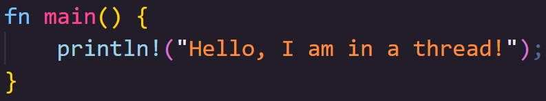

🦀👨🏻 Your program always has at least one thread, even your basic hello-world program runs in a thread.

🦀👨🏻 What we're interested in today is how we start more threads.

🦀👨🏻 This is a process called Spawning.

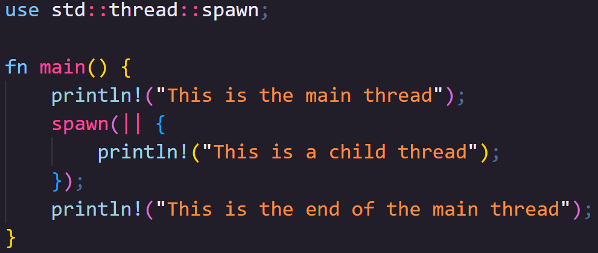

🦀👨🏻 To spawn a thread, we use `std::thread::spawn`... but, this will do little on its own.

🦀👨🏻 If we run this code, can you see what's missing in the output?

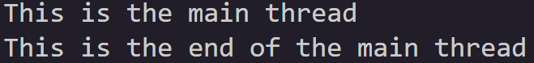

🦀👨🏻 It looks like our thread didn't run... but actually, its even worse than that.

🦀👨🏻 When writing this portion of the book, this is the output I consistently got from my Mac, and from Rust Playground.

🦀👨🏻 That consistency actually surprised me a little, but then when writing the script for this video on my Windows machine...

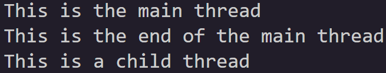

🦀👨🏻 I got this.

🦀👨🏻 This is the inconsistency I was actually expecting, its not that our thread doesn't run, it's that it might... or it might not.


🦀👨🏻 Spawning a thread returns a `JoinHandle`.

🦀👨🏻 The `JoinHandle` is what ties the spawned thread to the thread that spawned it.

🦀👨🏻 When the `JoinHandle` is dropped, which in this case happens instantly, the thread is orphaned.

🦀👨🏻 It may still run but, in this case, the process ends at the end of main, so whether the child thread runs or not, is no longer up to us.

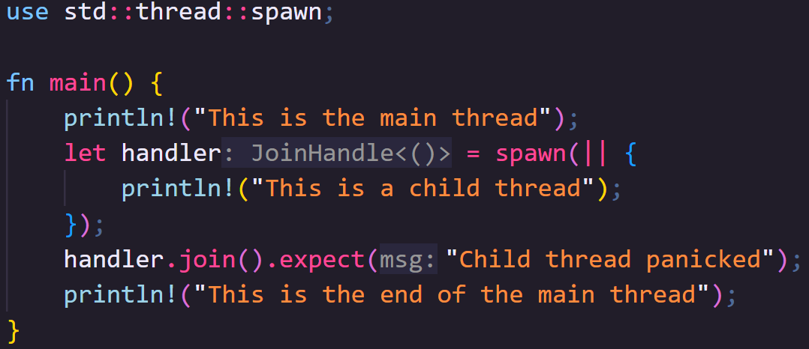

🦀👨🏻 We can tell our main thread to pause and wait for a running thread to end by calling `join` on the `JoinHandle`.

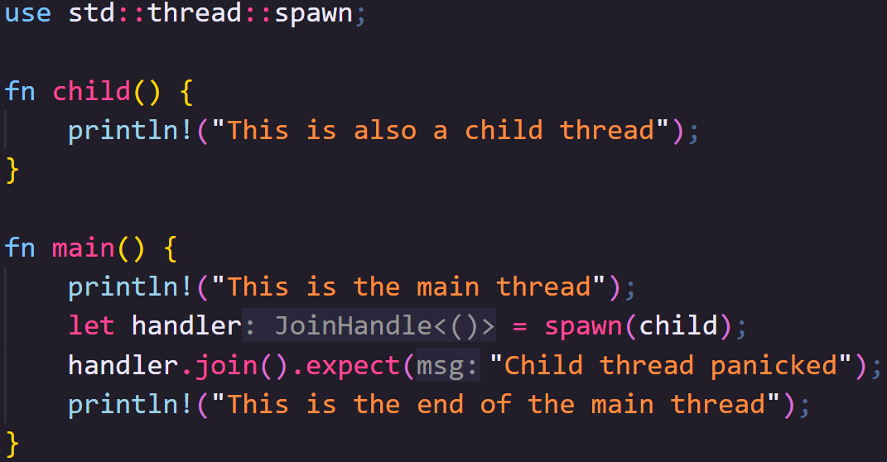

🦀👨🏻 We've been using closures, but functions work just as well and can be better for more complex programs.

🦀👨🏻 The only restrictions are:

🦀👨🏻 - the function needs to be "FnOnce returning T, Send and static"

🦀👨🏻 - and T also needs to be "Send and static"

Exactly _when_ threads are allowed to execute code is controlled by a scheduler which we can't directly manage ourselves, but we can influence it.

Putting one thread to sleep can allow another thread to run.

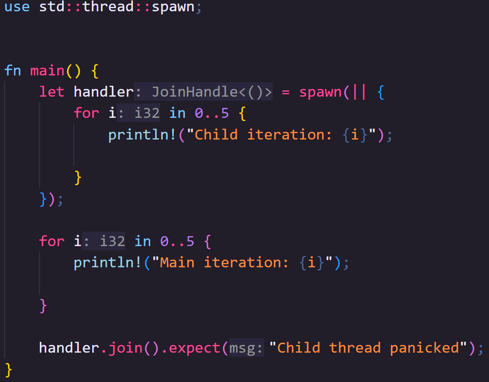

🦀 If we run this code as-is, you'll see the main thread runs to completion before the child thread starts

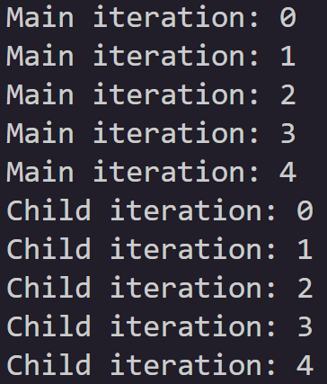

🦀 If we put each thread to sleep after it writes to standard out, we can "encourage" the scheduler to start work on the other thread if it isn't already.

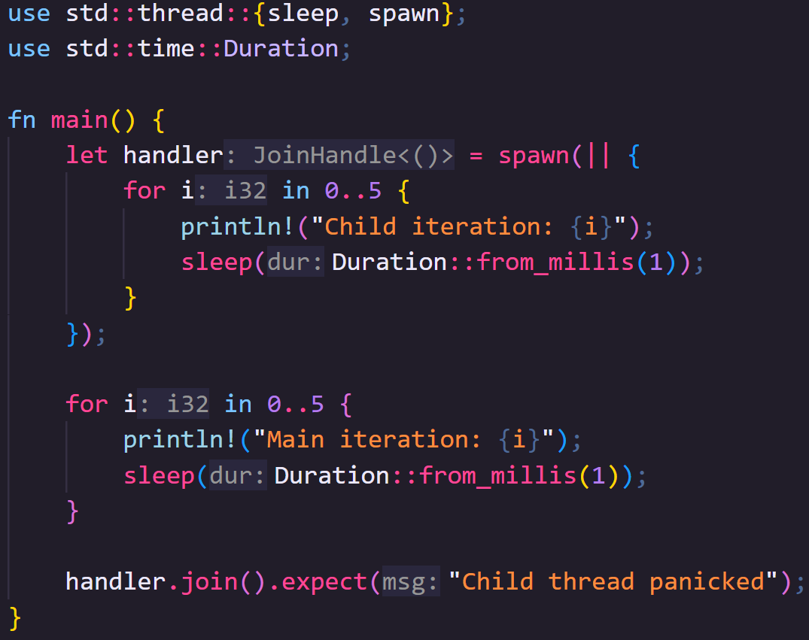

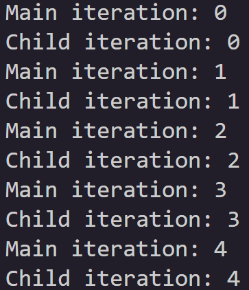

🦀👨🏻 There's two _very_ important things I want you to note here though

🦀👨🏻 Firstly, thread::sleep is _not_ a timer, your thread may sleep for longer than you requested or not at all in certain situations.

🦀👨🏻 Secondly, the scheduler ultimately decides when code is run, so there's no guarantee you will get this _exact_ output, so bare that in mind if _when code runs_ matters to you.

So now we can run threads, let's start looking at how to send data back and forth between them.

We can pass data into a thread before it starts so long as the data is `Send`.

We previously talked about this trait in the Traits video, but to recap, data is `Send` so long as it can be safely sent between threads.

This trait is automatically implemented for all types that can be `Send` (though it is also possible to opt out of it).

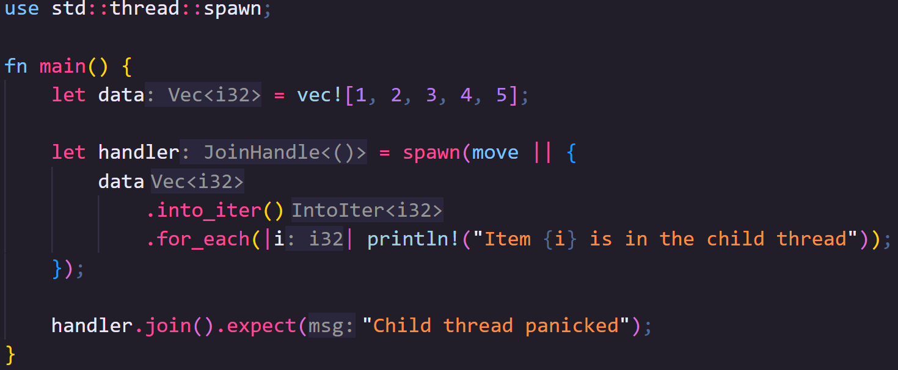

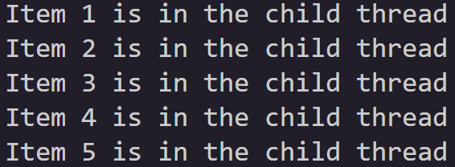

🦀👨🏻 We can move data into the closure that will be sent to the thread using the `move` keyword.

🦀👨🏻 Here we move the entire data vector into the spawned thread.

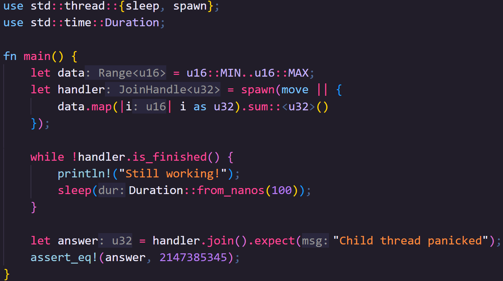

🦀👨🏻 You can also return data via the join handler.

🦀👨🏻 This means you could pass hard work to a thread and do other work, coming back to check on the thread at a later time.

🦀👨🏻 A little side note, if it's helpful, you can check if the thread is finished with `.is_finished()`.

🦀👨🏻 Here I'm using it to let the person running the program know we're still waiting on the thread to do its work, but the program is still running.

## Sending messages

Now we can start one thread, there's no stopping us!

Modern schedulers can manage a _lot_ of threads at once, however, so far, we can only send data between a child thread and the parent that started it, and before and after that thread runs, not during.

What if we want to communicate across multiple threads, or send data to a thread while its running?

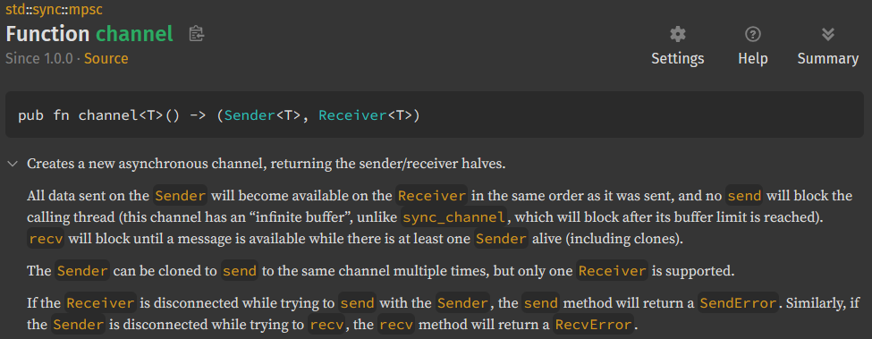

📕 Multi-producer, single-consumer (MPSC) is a queue pattern that allows us to create channels with multiple `Sender`s that can send messages, and a single `Reciever` that can receive them.

📕 As per the name, Multi-producer, you can clone `Sender`s but each of those clones can only send to a single `Reciever`.

The `Sender` and `Receiver` types are `Send` meaning that you can create them in one thread and send them to another.

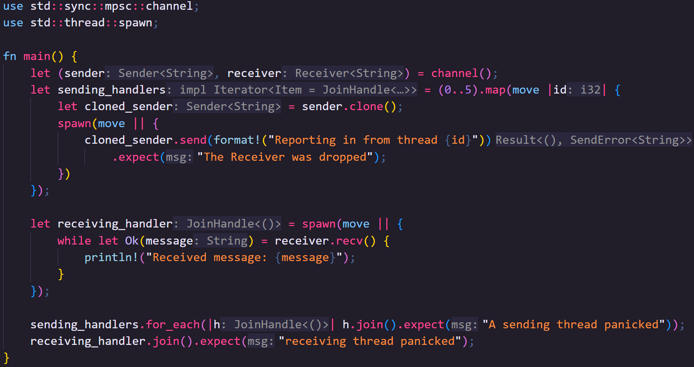

🦀👨🏻 Let's create a bunch of threads and give each of them a `Sender` that points back to a single `Reciever`

🦀👨🏻 We move the sender into the closure being run in the map method of an iterator.

🦀👨🏻 Because the closure now owns it, we can clone it for each thread we're spawning

🦀👨🏻 And _move_ the cloned sender to the child thread.

🦀👨🏻 We'll send the `Reciever` to a final thread that will collect the data from the other threads.

🦀👨🏻 Finally, we'll join all the threads with a sender, before we join the thread with the receiver.

🦀👨🏻 This is important because this is the first bit of code we've produced that can cause a deadlock, where two or more threads get blocked by each other

🦀👨🏻 If you forget to join the senders first, they won't send their messages but will block the receiver thread here, so your program gets stuck.

For what its worth, there's no built-in way to create a channel with multiple receivers (`Receiver` is not `Clone`), however, there's nothing stopping you building your own type for that, or there are crates that support it like [Crossbeam](https://docs.rs/crossbeam/latest/crossbeam/).

## Sharing State

So now we can send messages across threads, but what if we need multiple threads to have access to the _same_ data, maybe even able to edit that data.

To do this, we need to use types that implement the `Sync` trait.

Something is `Send` if it can be sent between threads, but doing this moves ownership from one thread to another.

Something is `Sync` if a reference to it can be sent between threads

i.e. `T` is `Sync` if a reference `T` is `Send`.

Most things are `Sync`, but we still have to abide the rules of references in that we can have as many immutable references to something as we like, but we can only have one mutable reference.

Furthermore, references cannot outlive the data they reference... which is a little harder to confirm with threads.

How do you know the thread referencing your data doesn't exist for longer than the data it's referenced?

One option is using scoped threads which we can create with `std::thread::scope`.

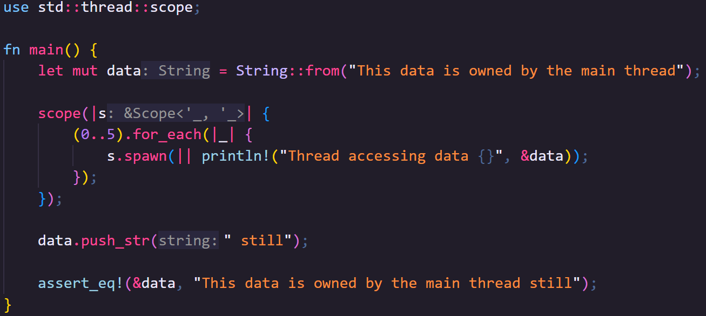

🦀👨🏻 The scope function takes a closure with a single parameter that gives us the scope context.

🦀👨🏻 We can use the scope context to spawn threads.

🦀👨🏻 We don't need to keep track of `JoinHandle`s this time, all scoped threads are joined at the end of the scope closure.

🦀👨🏻 However, the spawn method on the scope context does still return a `JoinHandle` if you want to handle potential thread panics.

🦀👨🏻 The scope function blocks the thread that called it, until all the threads it started have been joined, so after that we're safe to modify the data again, which here would require a mutable reference. 

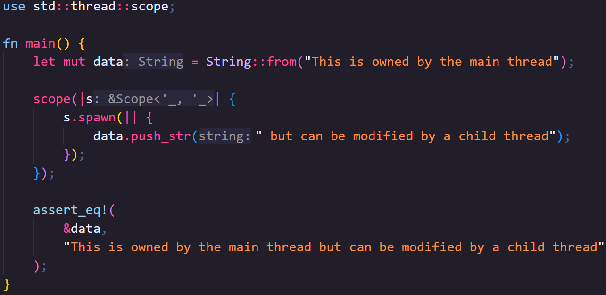

🦀👨🏻 You can also send mutable references across threads like this, but, bear in mind, only one thread can access the mutable reference, and it must end before we can access our data again.

```rust
use std::thread::scope;

fn main() {
    let mut data = String::from("This is owned by the main thread");

    scope(|s| {
        s.spawn(|| {
            data.push_str(" but can be modified by a child thread");
        });
    });

    assert_eq!(
        &data,
        "This is owned by the main thread but can be modified by a child thread"
    );
}
```

So we can share readable data across multiple threads with immutable references, or share writable data temporarily with a single thread, but what if we want to share read/write access to data across multiple threads.

Let's start by thinking why we can't do this with just references.

When we're using threads, multiple parts of our program _can_ be executed at the same time.

---

Imagine we have two threads that want to change the data, behind a reference, based on what is currently stored there, something simple like each thread wants to multiply a numeric value.

1. Thread 1 reads the value from memory into a register
2. Thread 2 reads the value from memory into a register
3. Thread 1 multiplies the data and stores it back in memory
4. Thread 2 multiplies the data and stores it back in memory

---

In this situation, we've lost the effect of Thread 1, which _could_ be a bug.

Let's consider a more serious version of this.

Imagine the data rather than just being a single value, is an image stored in an array like structure, and you're applying multiple processes to the image at the same time.

This time, if one thread were to override another's work, we have a much more obvious problem.

---

To get around this, we need to prevent two threads accessing the same piece of data at the same time.

There is a general software abstraction concept called a "mutex" that makes access to the data MUTually EXclusive.

Rust provides it's mutex through `std::sync::Mutex`.

Once you place data inside a Mutex, to access it again, you need to "lock" the Mutex.

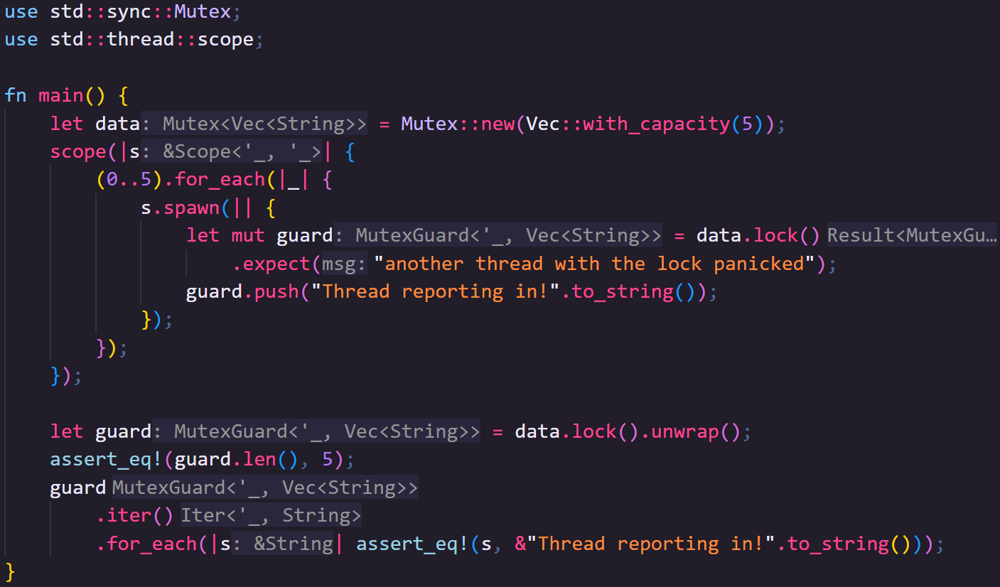

🦀👨🏻 If the Mutex is already locked, then the thread currently trying to access the data needs to wait for the existing lock to be released.

🦀👨🏻 the lock method on a `Mutex` returns a `MutexGuard`

🦀👨🏻 When the MutexGuard goes out of scope, the lock is dropped, allowing other threads to use the Mutex

🦀👨🏻 If a thread panics while holding a MutexGuard, this poisons the Mutex, so locking a Mutex returns a result.

However, there's still a slight problem here.

We're currently very dependent on using scoped threads because we need our references to point back to the owned data, but scoped threads aren't the norm.

In fact, most of the time you use threads in Rust, they will probably be abstracted behind some other framework (for example, a web server, a game engine, or data processing tools).

The problem, of course, is that we don't know when the owned data will go out of scope and no longer be accessible.

We can solve this problem using an Atomic Reference Count.

---

We haven't discussed reference counting yet as it's usually fairly niche, however, reference counting allows you to share data around an application without needing to clone it and side stepping complex reference rules or lifetimes.

It works by moving the data you want to share onto the heap, and allowing access through a reference count type.

When you clone the reference count value, instead of the data being cloned, it modifies its internal count of how many clones currently exist.

Every time a reference count type goes out of scope, the count is decreased.

Once the count hits zero, there are no further references to the data and so it can be safely dropped.

---

Now, if you've paid attention as to why we need a Mutex for modifying data across threads, you'll see that using a normal reference count won't work.

If the reference counter is cloned or dropped while also being cloned or dropped in another thread, you could end up with an inconsistent count of references, meaning data gets dropped at the wrong time.

This is why we need a special reference count type, `std::sync::Arc`, an Atomic Reference Count.

Atomic data types guarantee atomic changes.

Atomic changes are guaranteed to appear to be instantaneous to all external observers, meaning that two threads can change the value, but that this change cannot overlap.

`Arc` is a little slower than Rusts built in basic reference counting type `std::rc::Rc`, but prevents corruption across threads.

> Editors note: I don't think I've _ever_ used `Rc`, but I use `Arc` all the time, so don't worry that we didn't cover it in this series.
> 
> If you need to pass data around a single thread, wrapped in its own container, it's there for you to use

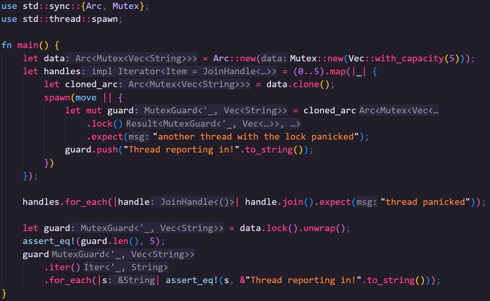

🦀👨🏻 So, armed with this knowledge, we can go back to unscoped threads!

🦀👨🏻 Like earlier, we can clone the arc in the map method of the iterator, and move the cloned value to the thread.

🦀👨🏻 Arc also implements Deref for its internal type, so we can call lock on the Mutex from the Arc.

And that's it!

Hopefully threads feel a lot more accessible now, but let me know in the comments if you have any other questions or want to share tips, tricks, or things I missed with others.

## Next Video

Once again, a massive thank-you to my Patreons, your support for the channel so early on really helps!

If you enjoyed the video, remember to like and subscribe!

I've changed the order of the last three videos; Async Rust is now going to be the final boss of IRISS, using a _lot_ of what we've already learned.

Instead of Async then, next video will be on macros, specifically `macro_rules!` which is a built-in tool that allows metaprogramming in Rust.

This is great to mitigate lots of repeated boilerplate code, can be used to create domain-specific languages (DSLs), and I'll be showing off my specific recent use case.

I don't think I've mentioned it on the main channel, but I've started streaming, here on Tuesdays, 7pm UK time.

We're building a Job Tracking app, and the stream's chat has been filled with really wonderful people with amazing thoughts and ideas and encouragement, if that interests you do drop by and say hi!

So, whether on stream or in the macros IRISS video, I'll see you next time.
