# Macros

Macro's let us do meta-programming in Rust. 

Metaprogramming allows us to treat our code as data; manipulate it, expand it, and generate new code.

Macro's let us do a _lot_ of things so I've split this video into two parts.

This time we're going to go through the basics of creating macro's with macro rules.

That includes pattern matching, metavariables and repetitions.

I also want to show you a real work example of how I use them.

In part two of the video, we'll create a domain specific language (DSL) within Rust using macros.

This series is accompanied by a free book, check the description for a link straight to this chapter.

My name is Daniel, welcome to IRISS.

---

There are two types of macro in Rust, `macro_rules!`, also known as declarative macros, or macros by example... and `proc macro`s.

We won't be dealing with `proc macro`s in this series, but they allow you to create custom Derive macros, custom attributes.

They also let you make the same function style macros we'll be making with `macro_rules!` but can unlock even more power!

If you'd like me to do a video on this after the IRISS series, let me know in the comments.

Today though, we're just covering `macro_rules!`

## Anatomy of `macro_rules!`

`macro_rules!` is, itself, a macro, providing its own domain specific language that allows you to create more macros.

This gets very powerful and, honestly, very weird.

Let's take it slow.

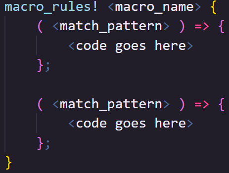

🦀👨🏻 The general layout of `macro_rules!` looks like this:

🦀👨🏻 We write `macro_rules!`, with an exclamation mark, followed by the name the macro we're creating.

🦀👨🏻 We then have a block containing a list of rules.

🦀👨🏻 The rule contains a pattern to match on, which itself potentially contains metavariables which we'll discuss later.

🦀👨🏻 Each rule also has a block that describes how code will be generated when the macro is invoked with a matching pattern.

Rather than it generating code with a simple copy/paste, `macro_rules!` works on the Abstract Syntax Tree or AST.

This is an intermediate step of the compilation process where your code has already been turned into datastructures that represents what your program does.

This makes it much safer and more fully featured that copy-paste style macros.

## Hello, macro!

We'll start by making a hello world macro that produces a `String`.

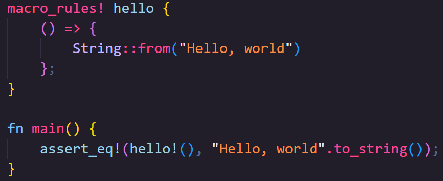

🦀👨🏻 As we said a moment ago, immediately after `macro_rules!` we provide the name of the macro we're creating, in this case `hello`.

🦀👨🏻 Our first draft won't match anything between the brackets, so we leave those empty.

🦀👨🏻 We then have an arrow, followed by some curly brackets surrounding what our macro will generate.

🦀👨🏻 Here's a little test for it to show how it might be used.

🦀👨🏻 Our `hello` macro simply creates a string containing `"Hello, world"` at the site where the macro is called (in this case inside an `assert_eq!` macro).

🦀👨🏻 This type of macro _could_ be useful if you have a block of code you need to repeat but don't want to put in a function, but let's be honest, that's not going to come up very often.

🦀👨🏻 Let's upgrade our macro to match a pattern.

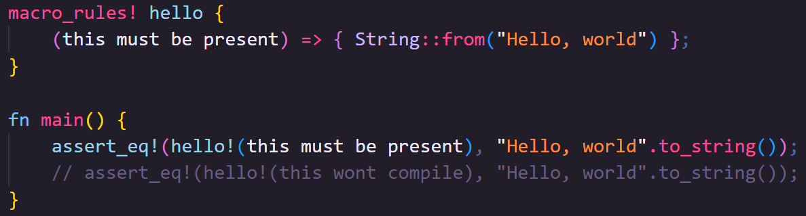

🦀👨🏻 What madness is this?!

🦀👨🏻 What kind of parameters are we passing to this macro?

🦀👨🏻 The key to understanding the power of macros is that they _don't_ take parameters.

🦀👨🏻 The thing in the brackets at the start of each rule is a pattern, and that pattern can be _almost_ anything.

🦀👨🏻 The content of the macro's invocation is broken up into something called a token tree, which we'll talk about in the next section.

🦀👨🏻 Here, `this must be present` is parsed as four token trees: `this`, `must`, `be`, `present`.

🦀👨🏻 Different tokens won't match, so this won't compile.

🦀👨🏻 We can invoke different rules based on the matched pattern.

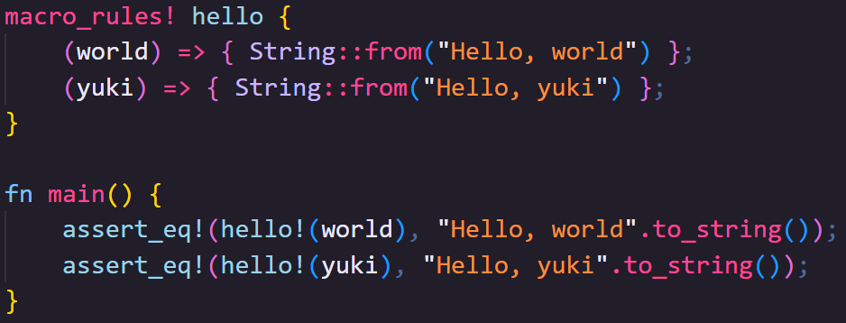

🦀👨🏻 We obviously can't write out _every_ possible thing that we might want match on, what if we want to be able to say "hello" to lots of different people

🦀👨🏻 Instead, we can capture tokens into metavariables.

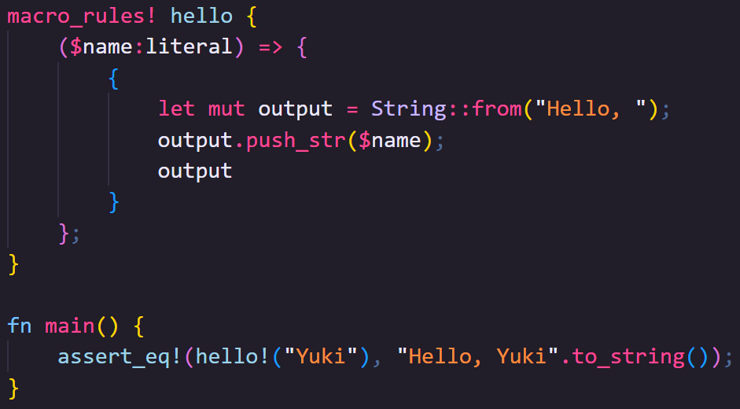

🦀👨🏻 Things got a little bit weird here, right?

🦀👨🏻 Let's step through our changes.

🦀👨🏻 First, we added a metavariable, and you'll immediately notice this looks nothing like a normal function parameter in Rust.

🦀👨🏻 In `macro_rules!`, we can parameterise tokens into "metavariables" which are preceded by a dollar symbol, followed by a colon, and what's called a fragment-specifier.

🦀👨🏻 Fragment-specifiers are a bit like types but are specific to how Rust classifies tokens trees.

🦀👨🏻 We can't specify `str` here, but we can specify that we expect a `literal`, which is any raw value, such as a string slice, a number, a boolean, etc.

🦀👨🏻 You might still wonder what happens if our macro gets a literal that's not a `str` and the answer is it won't compile.

🦀👨🏻 The person who passed in the non-`str` _will_ get an error relating to the `.push_str` method on `String` though admittedly errors like this can be a little harder to work with.

🦀👨🏻 That said, over the 10 years since Rust came out, contributors to the language have done a lot of work to clarify these errors.

🦀👨🏻 Anyway, there are a number of different fragment-specifiers, some of which overlap with each other, we'll go over more of them in the next section.

🦀👨🏻 The second change we've made here is that inside of the code block... we've added _another_ block.

🦀👨🏻 The reason for this is that when we invoke the macro, Rust generates code at the point that you place the macro.

🦀👨🏻 If we didn't have the extra brackets, when we use the macro in our `assert_eq!`, our code would look to Rust as if it were this:

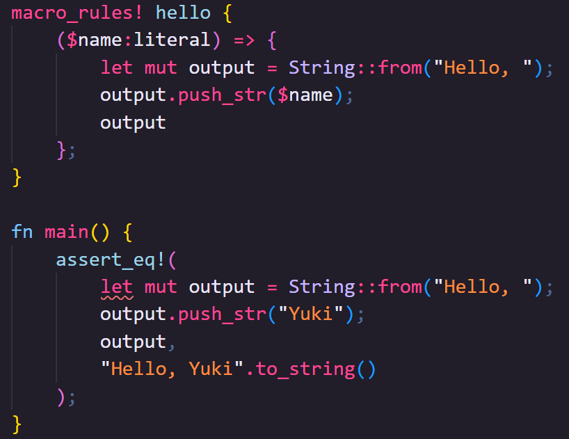

🦀👨🏻 This doesn't work because `assert_eq!`, which is also a macro, expects to match expressions, represented by the fragment-specifier `:expr`.

🦀👨🏻 Oh no, I'm going to have to work out how to vocalise a few unique things this episode, wish me luck!

In Rust, an expression is a segment of code that produces a value.

So `String::from("Hello, ")` is an expression, but `let mut output = String::from("Hello, ");` is not, that's a `:stmt`, a statement.

Blocks of code, even multiple statements, surrounded by curly brackets are expressions though, they have a value, even if the value is the unit type.

When we wrap our macro in curly brackets then, and have some value as the final line, our code block becomes a single expression the value and type of which matches that final value.

🦀👨🏻 This means that when we add those extra curly brackets to our macro, the generated code now looks like this, which is valid!


🦀👨🏻 Expressions in Rust are particularly useful as they have a type and a value, just like variables, allowing you to use them inside other expressions.

🦀👨🏻 Let's go deeper and add another rule. Let's bring back our original behaviour for an empty `hello!` macro:

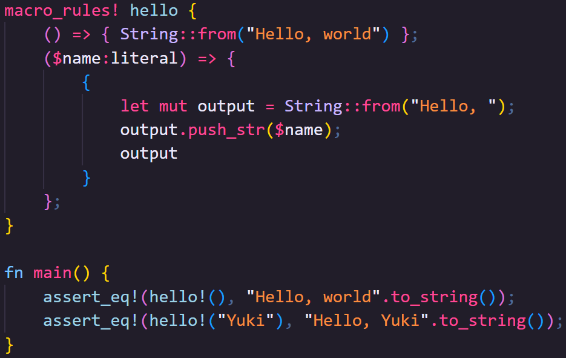

🦀👨🏻 This is fine, but we're repeating ourselves a little bit.

🦀👨🏻 We should avoid having two copies of the  `"Hello, "` string slice.

🦀👨🏻 To maintain consistency, we can call our macro recursively!

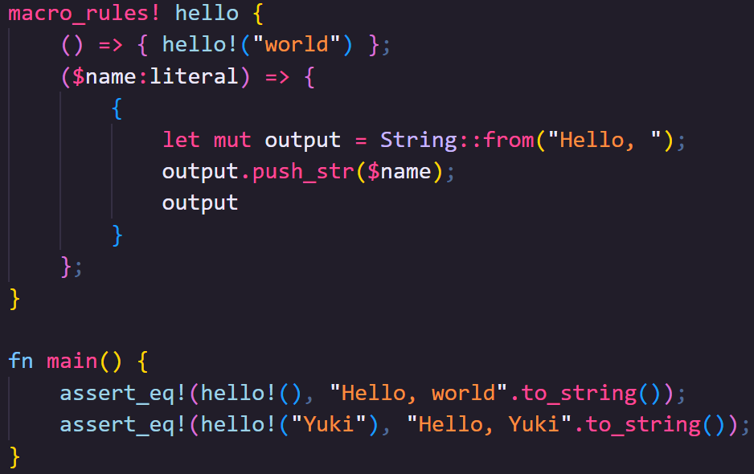

We're nearly there now, but I think our hello macro is missing one critical feature; what if we want to greet lots of people at the same time?

We can "repeat" patterns inside macros by surrounding them with parenthesis preceded by a dollar and followed by either a `?`, a `+`, or a `*`.

Similar to regex rules:

- `?` means the content is repeated zero or one times
- `+` means one or more times
- and `*` means zero or more times

You can add a separator to the repeat pattern by placing it before the repeat character.

This token can be almost anything except the repeat tokens or delimiter tokens.

The most common separators you're likely to use are commas or semicolons, but you could use something like tilde's... if you're twisted.

---

Repeats are used in rule matchers to match patterns, including metavariables, multiple times

They're also used in code generation to repeat code for each repeated metavariable.

We already have zero and one metavariable dealt with, so we want a rule in our macro that takes two or more inputs

For want of space, I'm going to condense the formatting from now on, so keep an eye out for those double curly brackets

🦀👨🏻 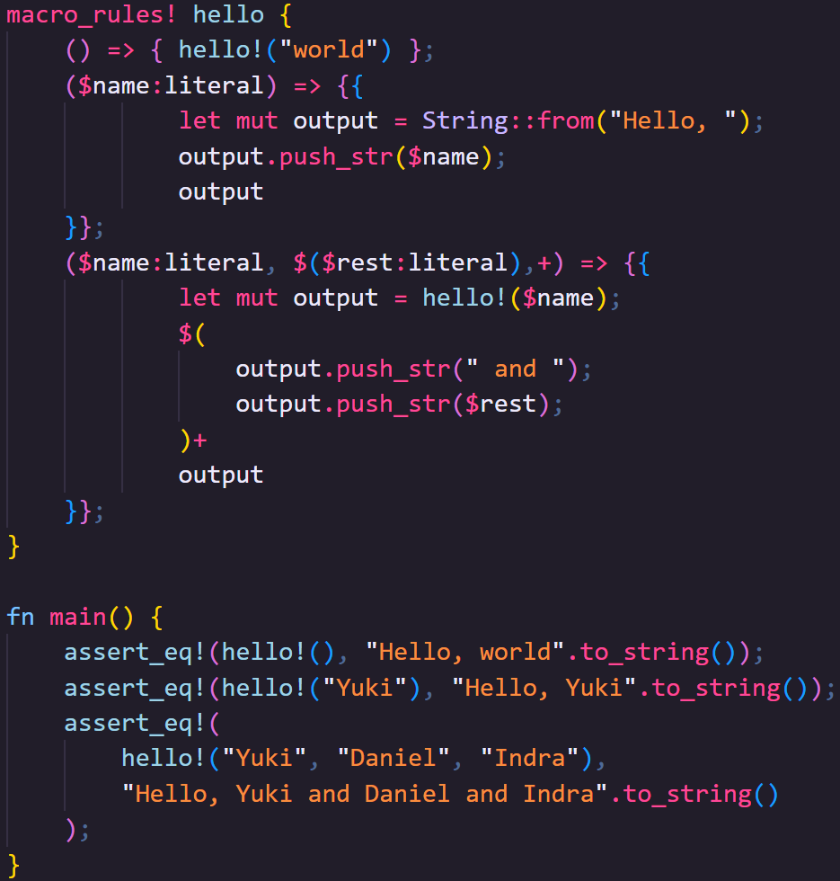

🦀👨🏻 Our new rule looks a bit like the previous one, but now there's a comma after `$name:literal` and then a repeat pattern.

🦀👨🏻 The repeat pattern contains a metavariable, `$rest:literal`, which will be used to store all metavariables passed to the macro after the first.

🦀👨🏻 It uses a `+` to show that there must be at least one additional metavariable, but there may be many.

🦀👨🏻 In the body of the macro, we initialise our output in much the same way as we do in the version with no inputs, by calling the hello macro with the first metavariable.

🦀👨🏻 We then have another repeat pattern that contains the `$rest` metavariable.

🦀👨🏻 Because we have a repeated metavariable inside a repeated block, this block will be repeated for every `literal` that `$rest` matched to.

🦀👨🏻 If we were to unwrap the code generated for the final test, it would look something like this:

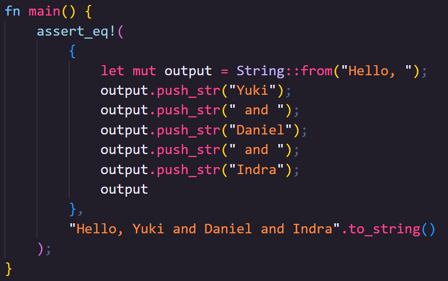

Hopefully, you're starting to see why writing a quick macro can really cut down on repeated boilerplate code, and we're really only making a quick toy macro to demonstrate the power they provide!

You might be wondering if we can use repeats to reduce the number of arms we have.

We unfortunately can't do things like treat the first or last element of a repeat differently using macro repeats *undecided look*,

but we can merge the second and third arms using a `*`.

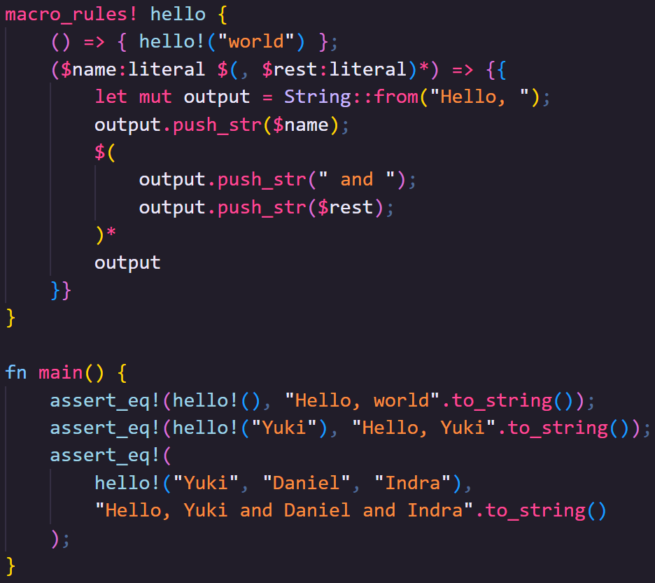

🦀👨🏻 You'll notice that the `,` after `$name:literal` has moved inside the repeat pattern, and the `,` being used as a separator for the repeat has been dropped.

🦀👨🏻 This is because if we were to try to match `($name:literal, $($rest:literal),*)` then we'd _have_ to use the comma after the first literal so `hello!("Yuki")` would _have_ to be `hello!("Yuki", )` to work.

🦀👨🏻 Instead, we've moved the comma token to the beginning of the repeat pattern which can contain things that aren't metavariables too.

Ok, so I wasn't exactly lying about not being able to treat the first and last elements differently with macro repeats... we can't do it with _just_ macro repeats

BUT, we can work around that with very low-cost language features like slices.

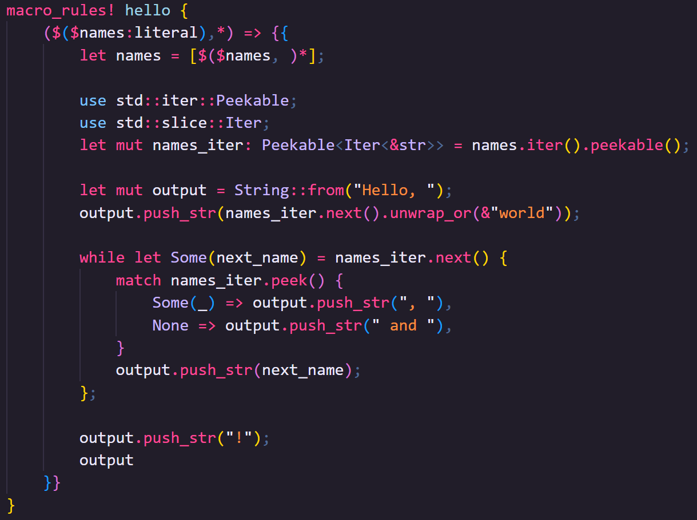

🦀👨🏻 We can split the names out directly into an array.

🦀👨🏻 This will be part of the binary, created at compile time, so doesn't require any heap allocations

🦀👨🏻 Next let's get an iterator over the array.

🦀👨🏻 By precisely specifying the type of the iterator here we can avoid Rust not knowing what type to infer if the iterator is empty.

🦀👨🏻 We'll initialise our string as before.

🦀👨🏻 If no metavariables were passed, then the array will be empty, so we'll use our default value

🦀👨🏻 We'll loop until no more items are in the iterator

🦀👨🏻 By looking ahead to see if there are more items, we can now use grammatically correct separators between names

🦀👨🏻 And we'll add an exclamation mark for funsies!

🦀👨🏻 Finally, we do need to update our tests for the improved grammar

Being able to quickly compose macros like this can save us a lot of time when repeating the same code over and over.

## Tokens, Metavariables, and Fragment-Specifiers

Rust (like most languages) turns your human written code into tokens that it can process.

Groups of tokens _can_ form a token tree.

If tokens are protons and neutrons, then token trees are atoms, and are the smallest thing that we can process in `macro_rules!`.

An important differentiation with Token Trees to a simple list of tokens are that delimiters (that's parentheses, square brackets and curly brackets) are matched up for us.

For example, if we break the statement `let hello = String::from("Hello");` into tokens, its looks like this.


But if we break it into token trees, then the parenthesis is a single token tree containing the token tree "Hello".


In the previous `hello!` example, we captured tokens that were literals into metavariables with fragment-specifiers, but we can categorise tokens and token trees as more than just literals in `macro_rules!`.

Here's a quick rundown of some of the most common fragment-specifiers:

---

`tt` matches a token tree, which is any single token (other than delimiters) or valid collection of delimited tokens.

Remember when we wrote `this must be present` in our silly example, each word is a token tree.

Token trees can be delimited by parentheses, square brackets or curly brackets so while `this must be present` is four token trees, we can make it a single token tree containing four token trees by surrounding it in brackets.

---

`literal` is the specifier we already used to match against a literal value.

This matches integers, floats, booleans, characters and a whole set of string types, string literals, raw string literals, byte string literals, C string literals, and so on.

---

`expr` it short for "expression".

An expression is any token tree that has a value.

For example, `String::from("Hello")` is an expression, but `let hello = String::from("Hello");` is not.

---

`block` is specifically a block expression.

Like the code we were generating in our `hello!` example, blocks can have multiple statements surrounded with curly brackets `{...}` to make it a block expression.

Of course, all block expressions are also expressions so you may not end up using this fragment specifier too often

---

`stmt` is short for "statement".

This is a line of code or an item.

For example `let hello = String::from("Hello");` is a statement but so are items like modules, structs and functions. 

---

`ident` is short for "identifier".

These are things like variable names, type names, or any word that's not specifically a keyword.

That said, you can make a raw identifier using `r#`, so while `true` is not an identifier because it's a keyword, `r#true` is an identifier.

You're most likely to see raw identifiers in macros, particularly ones that are for domain specific languages.

For example, DSLs that are used to create HTML might want to let you use the "type" keyword, as it's an HTML attribute, so you might see `r#type` to make it a raw identifier.

In our earlier `this must be present` example, each of those tokens is also an identifier, identifiers don't need to exist in code.

---

`path` is a type path.

This could be an identifier on its own, or a sequence of identifiers seperated by double colon tokens.

Like with identifiers, they don't need to exist within the code, they just need to fit the pattern.

---

`ty` is short for "type".

This could be a type or a type description.

For example `(dyn Clone + Send)` is what's called a parenthesised type, though traits like Clone and Send are also types on their own, as are structs like String.

---

`item` is anything that could belong to a crate, such as functions, modules, static items, use statements, etc.

---

`vis` short for "visibility" describes the visibility of something else for example `pub`, `pub(crate)`, or `pub(super)`.

---

`lifetime` matches lifetimes such as `'a` or `'static`

---

`meta`, this is a weird one, it matches attributes.

It could be useful if you want to construct a type and pass in attributes to apply to it.

---

There's a lot here, and I've ignored the backwards compatible fragment specifiers (some specifiers have changed behaviour over the years).

If you want to see the full list of fragment-specifiers, or more complete descriptions of each of them, check out the official documentation, link in the description

## Usefully DRY

The example we ran through earlier to build up our understanding of how macro's work was very abstract and not very useful, so I wanted to go over how I've started using Macro's.

I'm going to show you how I'm using macros in my own code, but for the purposes of IRISS I've modified the examples to avoid using crates.

Crates are how we share reusable Rust code between each other but, if you haven't noticed, I've avoided using any in this series to focus purely on the core language.

If you're comfortable with crates and async Rust already, and you're curious what the differences are in my real code, there's a link to the app I've been building on stream in the description of this video.

---

In the Job Tracker app I've been building with the help of folks on my streams, I've leaned heavily into composing my types using Traits to form common behaviour.

For example, at time of writing, I allow the user to create things like `Flags`, `Roles` and `Values` that belong to `Company`s, so those types implement the trait `HasCompany`.

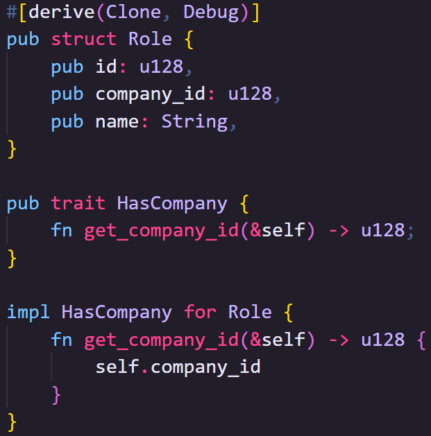

🦀👨🏻 Here's an example of how that might look for `Role`.

🦀👨🏻 Role is pretty simple, it has an id of its own, an id that links it to a company, and a name.

🦀👨🏻The `HasCompany` trait has a single method, `get_company_id`.

🦀👨🏻 When we implement it for role, it just returns that `company_id` which is `Copy` so the code is nice and simple.

🦀👨🏻 I'm also a huge advocate for unit testing and even for code like this we ought to provide a simple test.

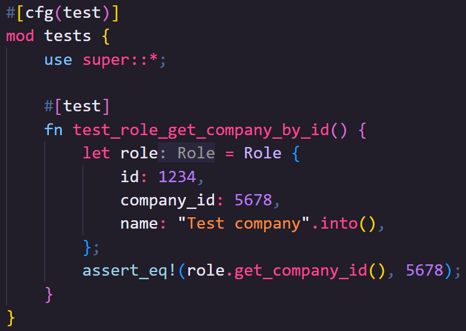

🦀👨🏻 This is pretty nice code, even if I do say so myself.

🦀👨🏻 It's clean, easy to understand, easy to use.

🦀👨🏻 But, is it DRY?

DRY in this context, stands for "Don't Repeat Yourself"

Every time we add a new storable item we'll have to implement the trait and write tests for its implementation.

This isn't the only Trait that is applied to storable types, and we have multiple storage types that also have lots of shared traits that all need implementing and testing.

---

🦀👨🏻 Let's look at how macros can help us generate boilerplate code.

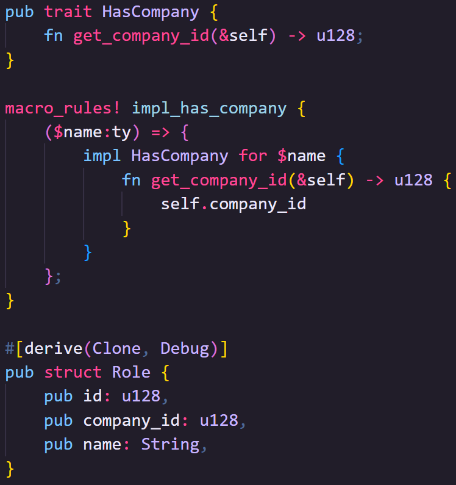

🦀👨🏻 First, we'll create a macro that will implement `HasCompany` for any type that has a `company_id` field.

🦀👨🏻 Obviously if you try to implement this trait on something without this field, the macro will generate code that won't compile, but if you _need_ to do that, you can still write your own implementation.

🦀👨🏻 Role does have this field though so we can now implement the trait with one short line

Replacing the test is a little harder though.

We can't easily write a generic test that will work for `Role` and `Flag` and `Values` as these types are instantiated in different ways.

What we need to do is have a consistent way to create test instances of the thing being tested.

🦀👨🏻 To do this, I created a TestHelper that can be applied to almost any type, its only job is to return an instantiated value of that type.

🦀👨🏻 This trait exists in a central location

🦀👨🏻 Each test macro sits alongside the trait it creates tests for

🦀👨🏻 We can make this test by taking two metavariables separated by a comma token.

🦀👨🏻 Test name is an ident which we'll use to name the thest function

🦀👨🏻 Storable is what I call any object in this project that can be stored, and in this case is the test subject.

🦀👨🏻 The test here is super rudimentary, we're just going to make sure that when we request the id, we get something back.
 
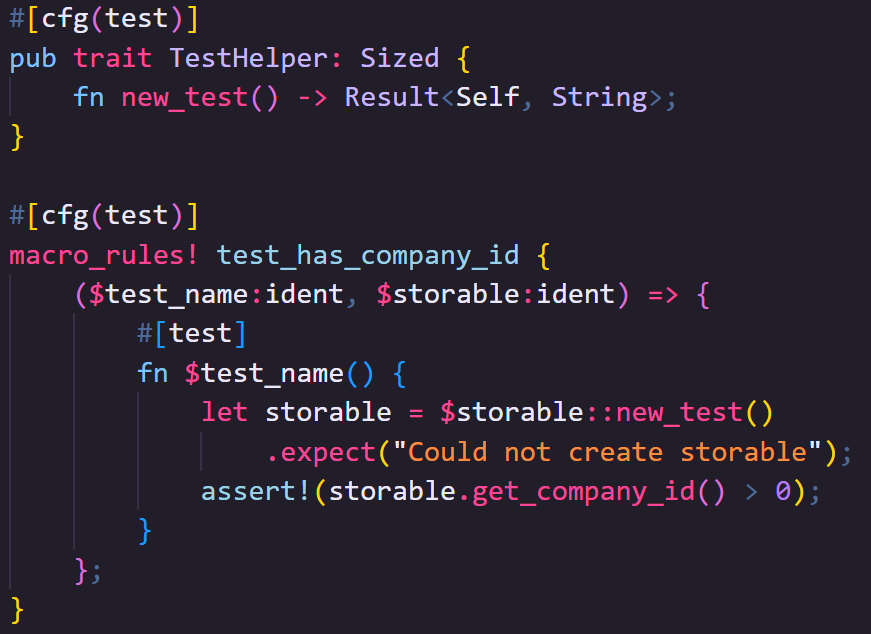

🦀👨🏻 By implementing the trait for each type that I want to test, I can add tests trivially like this:

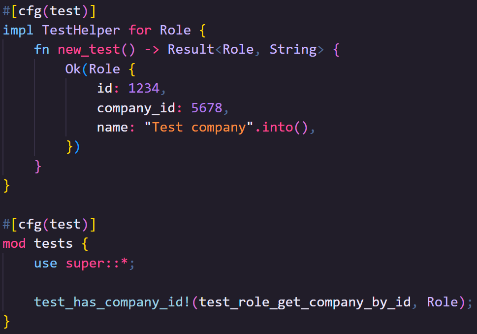

🦀👨🏻 This might initially seem like just as much work as before, as we add more traits and more types that implement those traits, the amount of extra work drops dramatically.

🦀👨🏻 Furthermore, there are more complex examples in Fio's Job Tracker like the ones that manage the storing and recalling of these storable objects.

## Next Time

A quick shout out to the folks supporting me on Patreon, you're all amazing!

This was already quite a long video but there's so much more to cover with macros, so I've split this video in two!

In the second part we're going to cover domain specific languages by making a macro that can parse a turing complete language.

If that interests you don't forget to like and subscribe.

If you're _really_ curious though, this part of the book is already published so if you can't wait for the next video, you can learn how we achieve this over there, link in the description.

I'm still streaming on Tuesday's at 7pm UK time, but we're nearing the end of making our Job Tracking app, and I'd love to hear if anyone has any suggestions on what to do next.

Whether I see you on the stream, or here, I'll see you next time.

## Domain Specific Languages

Ever wanted to write your own language?

We're going to get a little bit silly here, but Domain Specific Languages (DSLs) can be incredibly useful for conceptualising code in meaningful ways.

For example, JSX is a DSL for writing React in Javascript.

If you're a web develop, ultimately creating HTML, which of these is more readable:

```javascript
const heading = React.createElement(
    'h1',
    {className: 'example'},
    'Hello, world!'
);
```

```javascript
const heading = (
    <h1 className="example">
        Hello, world!
    </h1>
);
```

I think its undeniably easier to understand the latter

So, I promised silly, lets write our own DSL... a Brain Fudge interpreter.

The programming language Brain Fudge (which is not in fact called Brain Fudge) was created by Urban Müller in 1993.

The language is what's known as an "esoteric" language which is, loosely speaking, a fully functional language that you would never actually want to use.

Often they're considered jokes, but Brain Fudge actually lets us write real programs with just eight instructions.

This makes it ideal for creating a full DSL with little effort.

The language operates on theoretically infinite sequential memory initialised to `0`.

You start with a pointer pointing to the first cell in memory and then process instructions that allow you to move the pointer, modify the data at that point in memory and either output or input data at the current pointer location.

---

This is what the instructions do:


greater than, increments the pointer position, moving it to the next position in memory

less than, decrements the pointer position, moving it to the previous position in memory

add, increments the value at the current position in memory

minus, decrements the value at the current position in memory

period, outputs the value at the current position in memory

comma, takes one byte of input and stores it in memory (we won't use this in this example though)

square brackets contain a loop that repeats the contained code.

Each time the loop begins the value at the current position is checked, and the loop is then skipped if the value is 0.

That sounds easy enough, right... well, here's Hello World in Brain Fudge.

```text
++++++++[>++++[>++>+++>+++>+<<<<-]>+>+>->>+[<]<-]>>.>---.+++++++..+++.>>.<-.<.+++.------.--------.>>+.>++.
```

---

Don't panic! We're not here to learn Brain Fudge ourselves.

We'll just trust that this is the Hello World program, we'll implement the instructions and see what happens when we run it.

We're going to use two macros.

First let's create a macro that initialises the program.

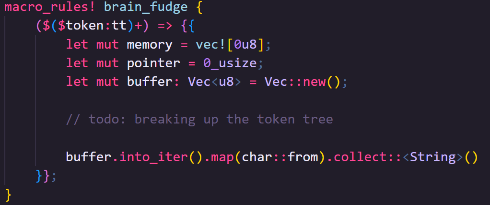

Let's break it down:

The input to our interpreter is a repeat pattern of token tree, which we'll store in the metavariable token.

As it happens the individual characters that make up Brain Fudge are all tokens in Rust so this _should_ work well... (**foreshadowing**).

`memory` is going to be our programs' memory.

We're using a Vec with a single initialised value of `0` under the assumption that even the smallest program requires one word of memory.

We'll expand the Vec as necessary.

This may not be the most efficient way to do this but it'll be ok.

For our memory we're using `u8` to represent one word (the width of our memory).

You can use larger words if you like but different programs might function differently depending on what word size is used and how overflows are handled (more on that later).

`pointer` points to the current position in memory (our Vector)

`output` is where we'll store output data from the program.

We're using a Vec<u8> here, but actually any type that has a method `.push(u8)` will work.

At the end of the macro we take the output Vec of `u8`s we've stored in output and collect it into a string by naively considering each byte to be a character.

Again, this won't be appropriate for every use case which is why utilising `Write` might be better but do you _really_ want to use this DSL properly 😅

So now we need to handle the token stream, but before we do that, lets write some tests.

We'll keep it simple for now, while this is the official Hello World

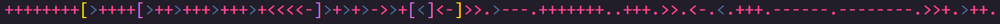

and... actually that's kinda hard to read, lets add some white space

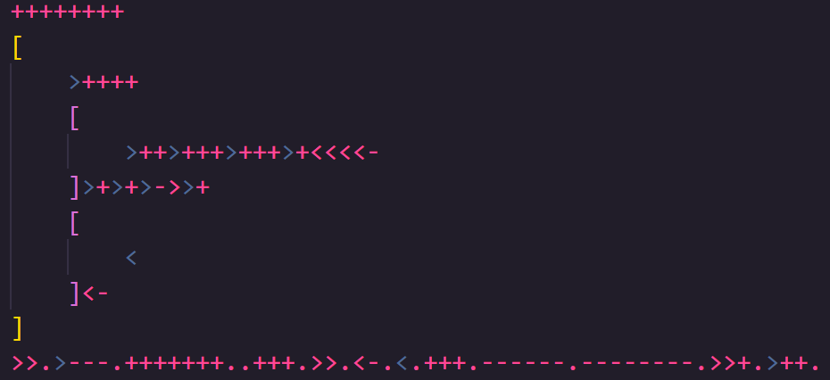

yeah... no that didn't help

anyway, while this is hello world, so is this

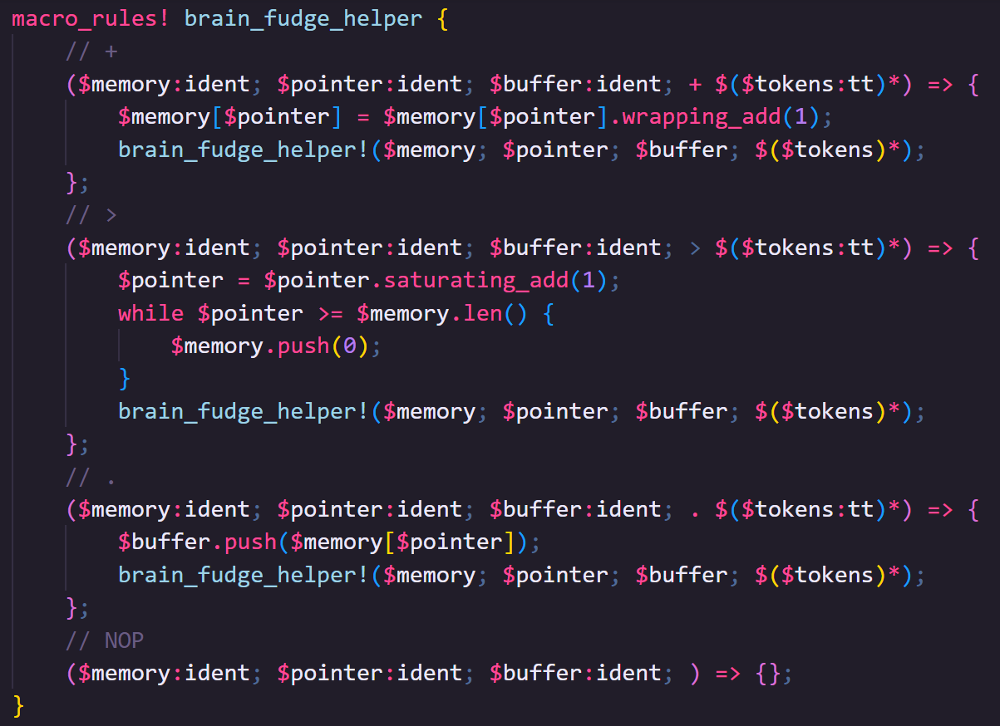

In the official hello world, loops are used to increment values, but in _this_ version, we're just adding to the current cell

exporting it

and moving to the next bit of memory

Let's turn this into a test

We're only using three characters out of the eight used in brain fudge, so to make this test pass, we only need to implement these operations

So now we have a test, lets work out how to handle greater than, add, and period.

We'll create a new helper macro that can handle each of these tokens with its by having a rule that matches a specific token.


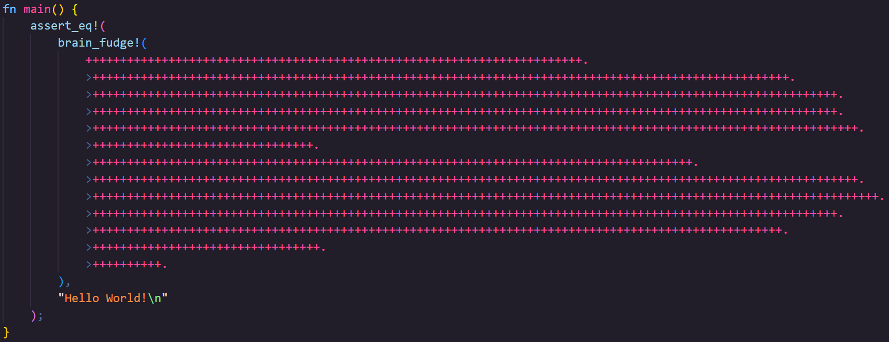


We also need a special rule to handle when there are no tokens left so we have an endpoint to our recursive calls.

To make it work, each rule will need to access the memory, the pointer and the output buffer, so we'll add an expectation of those to the match pattern.

Additionally, because each rule only handles one instruction, we need to pass the rest of the instructiosn to the macro again recursively.

Unlike before, when we create our match arms, we're going to use a semicolon as a separator.

The reason for this is that Brain Fudge uses `,`s as part of its syntax (even if we're not using it here).

This doesn't actually cause a problem with matching because we _always_ expect a comma before the start of the Brain Fudge program, but we _can_ use semicolons as a separator and as they don't appear in the Brain Fudge language, and it _will_ help readability, particularly if you opt in to the challenge at the end of the video.

So here we go.

This arm matches +, it adds 1 to the value at the current position We'll use wrapping_add to avoid overflows, so in our interpreter, adding 1 to 255 makes 0.

This arm matches >, it adds 1 to the pointer position. This time we're using saturating_add for the specific reason we want to be consistent and don't want to wrap a  usize on -, you'll see why later! We also need to make sure that any time we go outside of the Vec we resize the Vec appropriately and zero memory, we can do this with a quick loop, pushing 0's

This arm matches ., it takes the value at the current pointer and writes it to our output buffer

This arm matches there being no Brain Fudge tokens left, it does nothing

Now we can update our `brain_fudge!` macro to call the helper, passing in the program state.

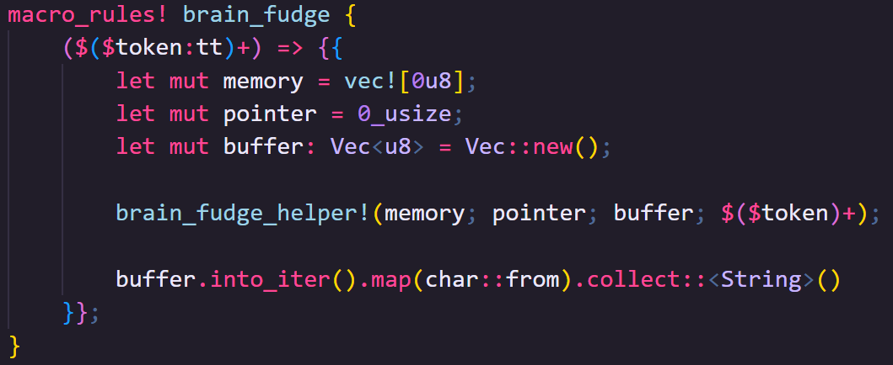

So we now have a program that has our brain fudge macro, a brain fudge helper macro that passes 3 of the 8 tokens

and a test... when build the program

we get this error

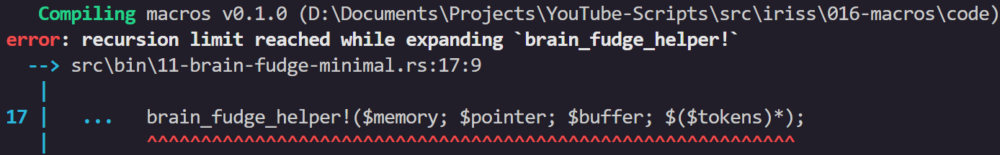

Rust keeps track of how many times we recurse, that is, call a function or macro from the same function or macro.

By default, the maximum amount of times we can do this is 128.

Our macro, when parsing our silly Hello World example, recurses 1120 times!

So, we _could_ avoid recursing by looping through the tokens instead, and that will work for this current instruction set... but it won't work for loops.

We probably could come up with a way of mixing loops and recurssion but to keep things simple, we're going to play a dangerous game and manually tell Rust it's fine for it to recurse 2048 times.

The `recursion_limit` attribute applies at the crate level so be careful with this one!

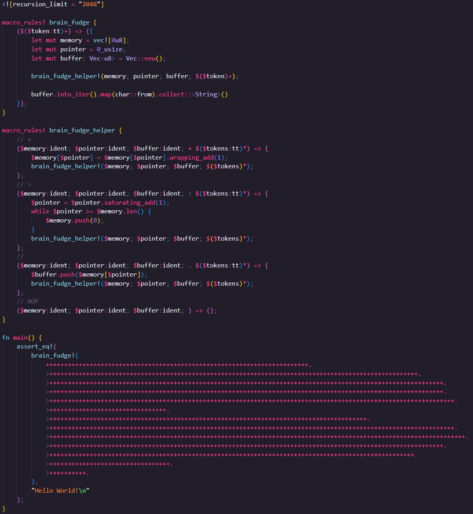

And now our code runs!

We've made a great start, we've got almost half the language done already.

Dealing with less than and minus will be easy enough, they're the opposite of what we already have.

More complex is the loop.

Luckily, we aren't dealing with individual tokens, we're dealing with token trees!

In Rust, these bracket pairs soecifically are all considered tokens that wrap other tokens.

They're treated as a single token trees that contain more token trees.

So Rust will correctly handle them in pairs, even when nested.

This means to make our loop arm work, we can match against any token tree that starts with a `[`, contains more tokens which may include more `[]` pairs, matches its ending `]` and is followed by yet more tokens! How cool is that!?

Let's write up the missing arms and run our test against the original Hello World program:


// -: Like + but does a wrapping_sub instead 
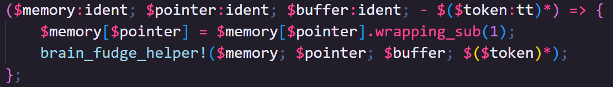

    // <: Like > but does a saturating_sub instead. This is why saturating is
    // potentially better here as we don't want to wrap and have to fill a Vec
    // with around 18,446,744,073,709,551,615 zeros
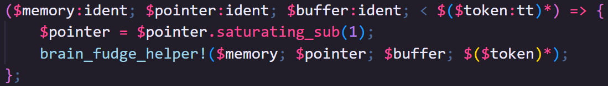

    // []: And here's the magic! We match against $loop_statement tokens inside
    // a square bracket pair potentially followed by more tokens. We then loop
    // while the data at the pointer isn't 0, and once it is, move on to the
    // rest of the tokens
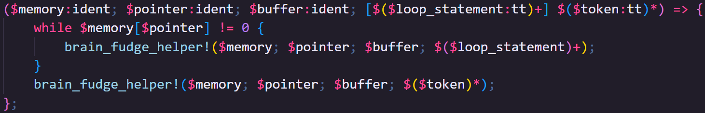


# fn main() {
assert_eq!(
    brain_fudge!(
        ++++++++[>++++[>++>+++>+++>+<<<<-]>+>+>->>+[<]<-]>>.>---.+++++++..+++.>>.<-.<.+++.------.--------.>>+.>++.
    ),
    "Hello World!\n"
);
# // keeping the old test to make sure we don't have a regression
# assert_eq!(
#     brain_fudge!(
#         // H
#         ++++++++++++++++++++++++++++++++++++++++++++++++++++++++++++++++++++++++.
#         // e
#         >+++++++++++++++++++++++++++++++++++++++++++++++++++++++++++++++++++++++++++++++++++++++++++++++++++++.
#         // l
#         >++++++++++++++++++++++++++++++++++++++++++++++++++++++++++++++++++++++++++++++++++++++++++++++++++++++++++++.
#         // l
#         >++++++++++++++++++++++++++++++++++++++++++++++++++++++++++++++++++++++++++++++++++++++++++++++++++++++++++++.
#         // o
#         >+++++++++++++++++++++++++++++++++++++++++++++++++++++++++++++++++++++++++++++++++++++++++++++++++++++++++++++++.
#         //
#         >++++++++++++++++++++++++++++++++.
#         // W
#         >+++++++++++++++++++++++++++++++++++++++++++++++++++++++++++++++++++++++++++++++++++++++.
#         // o
#         >+++++++++++++++++++++++++++++++++++++++++++++++++++++++++++++++++++++++++++++++++++++++++++++++++++++++++++++++.
#         // r
#         >++++++++++++++++++++++++++++++++++++++++++++++++++++++++++++++++++++++++++++++++++++++++++++++++++++++++++++++++++.
#         // l
#         >++++++++++++++++++++++++++++++++++++++++++++++++++++++++++++++++++++++++++++++++++++++++++++++++++++++++++++.
#         // d
#         >++++++++++++++++++++++++++++++++++++++++++++++++++++++++++++++++++++++++++++++++++++++++++++++++++++.
#         // !
#         >+++++++++++++++++++++++++++++++++.
#         // \n
#         >++++++++++.
#     ),
#     "Hello World!\n"
# );
# }
```

And when we run this... it doesn't work again 

The important part of the error is this.

```text
67 |         ++++++++[>++++[>++>+++>+++>+<<<<-]>+>+>->>+[<]<-]>>.>---.+++++++..+++.>>.<-.<.+++.------.--------.>>+.>++.
   |                                                          ^^ no rules expected this token in macro call
   |
```

Why is it pointing at two greater than signs? We have a match on those already right?

Well here's the problem with using tokens for our DSL.

Rust considers two greater than signs to be a single token.

Specifically it's a "right shift" operator.

Tokens in Rust can be multiple characters. Here are our problem tokens and what they mean in each language:

| token | Rust                         | Brain Fudge                        |
|-------|------------------------------|------------------------------------|
| `..`  | range literal                | output the current value twice     |
| `>>`  | right shift                  | increment pointer twice            |
| `<<`  | left shift                   | decrement pointer twice            |
| `->`  | function/closure return type | decrement value, increment pointer |
| `<-`  | unused but reserved          | decrement pointer, decrement value |

Soooo... we need to take care of these special cases, unfortunately.

Luckily, while `>>` is a right shift token, `> >` _is_ two greater than tokens.

Tokens can be seperated by whitespace and will still match the `tt` fragment-specifier, all we need to do is split the token and pass it back into the macro

```rust
#![recursion_limit = "2048"]

macro_rules! brain_fudge {
    // snip
#     ($($token:tt)+) => {
#         {
#             let mut data = vec![0u8];
#             let mut pointer = 0_usize;
#             let mut output = Vec::new();
#             
#             brain_fudge_helper!(data; pointer; output; $($token)+);
#             
#             output.into_iter().map(char::from).collect::<String>()
#         }
#     };
}

macro_rules! brain_fudge_helper {
    // ... Snip existing tokens ...
#     // +
#     ($memory:ident; $pointer:ident; $buffer:ident; + $($token:tt)*) => {
#         $memory[$pointer] = $memory[$pointer].wrapping_add(1);
#         brain_fudge_helper!($memory; $pointer; $buffer; $($token)*);
#     };
#     // -
#     ($memory:ident; $pointer:ident; $buffer:ident; - $($token:tt)*) => {
#         $memory[$pointer] = $memory[$pointer].wrapping_sub(1);
#         brain_fudge_helper!($memory; $pointer; $buffer; $($token)*);
#     };
#     // >
#     ($memory:ident; $pointer:ident; $buffer:ident; > $($token:tt)*) => {
#         $pointer = $pointer.saturating_add(1);
#         while $pointer >= $memory.len() {
#             $memory.push(0);
#         }
#         brain_fudge_helper!($memory; $pointer; $buffer; $($token)*);
#     };
#     // <
#     ($memory:ident; $pointer:ident; $buffer:ident; < $($token:tt)*) => {
#         $pointer = $pointer.saturating_sub(1);
#         brain_fudge_helper!($memory; $pointer; $buffer; $($token)*);
#     };
#     // .
#     ($memory:ident; $pointer:ident; $buffer:ident; . $($token:tt)*) => {
#         $buffer.push($memory[$pointer]);
#         brain_fudge_helper!($memory; $pointer; $buffer; $($token)*);
#     };
#     // []
#     ($memory:ident; $pointer:ident; $buffer:ident; [$($loop_statement:tt)+] $($token:tt)*) => {
#         while $memory[$pointer] != 0 {
#             brain_fudge_helper!($memory; $pointer; $buffer; $($loop_statement)+);
#         }
#         brain_fudge_helper!($memory; $pointer; $buffer; $($token)*);
#     };
#     // end of program
#     ($memory:ident; $pointer:ident; $buffer:ident; ) => {};

    // Special "token" cases
    ($memory:ident; $pointer:ident; $buffer:ident; >> $($token:tt)*) => {
        brain_fudge_helper!($memory; $pointer; $buffer; > > $($token)*);
    };
    ($memory:ident; $pointer:ident; $buffer:ident; << $($token:tt)*) => {
        brain_fudge_helper!($memory; $pointer; $buffer; < < $($token)*);
    };
    ($memory:ident; $pointer:ident; $buffer:ident; .. $($token:tt)*) => {
        brain_fudge_helper!($memory; $pointer; $buffer; . . $($token)*);
    };
    ($memory:ident; $pointer:ident; $buffer:ident; <- $($token:tt)*) => {
        brain_fudge_helper!($memory; $pointer; $buffer; < - $($token)*);
    };
    ($memory:ident; $pointer:ident; $buffer:ident; -> $($token:tt)*) => {
        brain_fudge_helper!($memory; $pointer; $buffer; - > $($token)*);
    };
}

# fn main() {
assert_eq!(
    brain_fudge!(++++++++[>++++[>++>+++>+++>+<<<<-]>+>+>->>+[<]<-]>>.>---.+++++++..+++.>>.<-.<.+++.------.--------.>>+.>++.),
    "Hello World!\n"
);
# }
```

And we just created an interpreter for another language inside Rust! That's kind of wild, right?!

## Challenge

I stopped setting homework, but I thought I'd set a little challenge for anyone who wants to do it.

Can you edit our `brain_fudge!` macro to work with programs that take input via the comma token?

To do this I recommend making the following change to the `brain_fudge!` macro:

```rust
macro_rules! brain_fudge {
     ($input:ident, $output:ident, $($token:tt)+) => {
        {
          // That's all you get!
        }
     };
}
```

There is a test in the IRISS book that you can copy for a ROT13 program, that's a program that takes each alphabetical letter and shifts it 13 characters.

There's no prize, its just for you to practice.

## Next Time

As ever thank-you so much to my Patreons, I'm not sure if we'd have made it so far without your support!

For everyone else, 

Next time, in the penultimate video in the IRISS series, we're going to look at "unsafe" Rust, and specifically, how we keep ourselves... well... safe, while using it.

If you enjoyed the video, remember to like and subscribe!

Don't forget I stream on YouTube on Tuesday's at 7pm UK time, if you're interested in seeing me work on other projects.

And whether there or here, I'll see you next time.

