Unsafe Rust - open 1
====================

Today we're going to get unsafe, and this shirt is entirely too safe *calp 4 x*

### open 2

Arguably, the main reason you'd want to pick up Rust over any other compiled language is that Rust keeps you safe, but what does that mean?

When you write a program in a compiled high-level language like Rust, C, C++, Zig, et cetera, it's converted into low-level instructions for processors.

These instructions are very direct, they move data from one register to another, add, subtract, shift bits and so on

### open 4

There are no restrictions on what those low-level instructions can do, which means you can do things that might result in unexpected or undefined behaviour.

This is what we consider to be "unsafe".

For example, in low-level languages that instruct processors directly, there's nothing stopping you reading and writing to the same memory location at the same time from different threads.

### open 5

Using any high-level language allows us to abstract this behavior in ways that are easier for us to understand.

All compiled languages go further than just making the instructions easier to read and write. 

They also enforce their own rules as to how they're used.

### open 6

Rust with its ownership rules and borrow checker is just one example of how compiled languages make sure that we, the software engineers, don't ask the computer to do anything that _could_ be unsafe.

To the best of its ability, Rust will check that your code is safe.

But... if it _only_ let you do things it could _prove_ are safe, you'd be cut off from making a lot of programs.

### open 7

This series is accompanied by a free book, check the description for a link straight to this chapter.

My name is Daniel, welcome to IRISS.

Intro - intro 1
---------------

Sometimes when we use Rust, we need to access heap memory, use peripherals, and talk to other software, or even dip into those specific processor instructions we just mentioned.

We can't guarantee that any of these actions are safe.

### intro 2

But wait! Haven't we _been_ accessing Heap Memory throughout this series?

Why yes, yes we have. 

### intro 3

Types like `Vec` and `String` use the Heap to store their data. 

They take responsibility for, and abstract away, any unsafe work, meaning that _using_ those types _is_ safe.

### intro 4

As a Rust engineer, depending on the type of project you're working on, most of the time you won't personally need to worry about unsafe Rust.

You can get by with using other people's code and APIs like the standard library. 

The point of this video isn't to prepare you to write lots of unsafe Rust; it's to make you feel comfortable for the odd occasion you might have to touch it.

Recap on Memory - recap 1
-------------------------

We often talk about memory in programming as if it's a single thing, but our programs subdivide memory into three main types of usages, each of which has different pros and cons.

### recap 2

Stack Memory is where all variables live... kind of.

It's fast because the entire stack is pre-allocated when your program runs, but there are some catches.

### recap 3

First, it's actually quite limited.

When your program starts, it's given an amount of memory that you cannot specify ahead of time, and you cannot change.

It's _usually_ two Mebibytes, but you might find it's even less on targets such as embedded devices.

If you use more than this small amount of memory, your program will crash.

### recap 4

Second, the data stored on the stack must be of known size at compile time.

You don't really need to worry about why this is only that data on the stack cannot change in size.

### recap 5

But we've stored lots of things in variables that have variable size, right? `String`s, `Vec`s, `HashMaps`, etc. 

### recap 6

The data for these types is not stored in the variable. 

What typically happens is that data we care about is stored on the Heap, and that data's location, and some other metadata (all of which is of known size) is stored on the stack.

### recap 7

Semantically, it's probably fine to say that the variable contains that data; people will always know what you mean.

However, for this video, we really need to differentiate what is on the stack and what isn't.

### recap 8

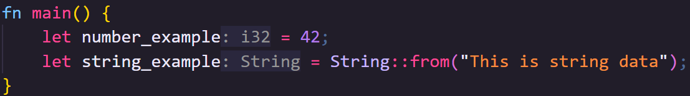

🦀👨🏻 In this code, `number_example` stores the actual number on the stack, since its of a known size, 32 bits unless otherwise specified.

🦀👨🏻 `string_example`, however, contains the location of the string data, not the data itself, which is stored on the heap.

🦀👨🏻 We'll talk about how it gets to the heap shortly.

### recap 9

The Heap is where we can store things of arbitrary size, and we can (usually) store things far larger than the entire stack there.

Heap memory is allocated on request and freed once you're done using it.

Technically, we can't resize heap allocations either; but we can request new, larger portions of heap memory, copy our data there, free the old memory, and add more things in the new location until we run out of space again.

### recap 10

So it's bigger and more flexible than the stack, but it also has some downsides.

It's much slower than stack memory because allocating and freeing the memory takes time.

Allocation and Freeing in Rust is usually handled by the standard library and, other than what we're going to discuss in this chapter, you almost never need to think about that process, but it's not free.

### recap 11

Sidebar:

Once heap memory is allocated, it's _almost_ free to use, with the only overhead essentially being the redirection from the stack to the heap in O(1) time.

For this reason, some software and languages will actually allocate large amounts of memory called Page Files that can store lots of different things.

This can be done in Rust too, and again there are pros and cons, but it's far outside the scope of this video.

### recap 12

There's a third kind of memory we don't really talk about as much, but it might be the most important.

Static Memory is where all values and data you write into your program are initially stored, though frequently it's subsequently moved somewhere else.

### recap 13

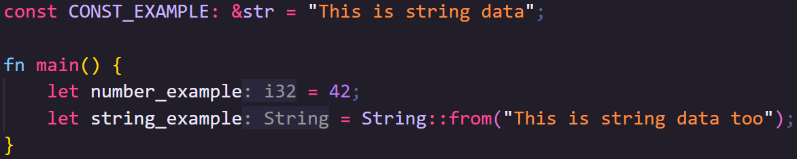

🦀👨🏻 For example, in this program, the data for `CONST_EXAMPLE` remains in static memory.

🦀👨🏻 But `CONST_EXAMPLE` itself is a reference to that data, see the ampersand.

🦀👨🏻 `42` and `"This is string data too"` are also initially stored in static data.

🦀👨🏻 However, `42` is copied to the stack in `number_example` whereas `"This is string data too"` is cloned onto the heap and the location of the data is stored in `string_example`.

🦀👨🏻 Differentiating where things are stored is about to become _very_ important, and *cough* it's easy to make mistakes if we don't differentiate between the stack, the heap and static memory.

Not really all that unsafe - not unsafe 01
------------------------------------------

It's important to note that Unsafe Rust doesn't turn _off_ any of Rusts safety measures.

What it does do is turn _on_ a whole other set of language features on which Rusts usual safety measures cannot work.

### not unsafe 02

I really can't stress this enough as it might be one of the greatest misconceptions about Rust.

Unsafe Rust does _not_ turn off _any_ safety measures.

It turns on tools that Rust cannot guarantee are safe, so you need to make extra certain you are using them safely.

### not unsafe 03

For example, in safe Rust we use references.

These are similar to pointers in other languages which point to a location in memory, but references are not pointers.

The validity of a pointer cannot be checked, but in Rust, a reference abides by rules that guarantee its validity at compile time before the program even runs.

In unsafe Rust we can access pointers too, but References... must still abide by the rules of the borrow checker.

### not unsafe 04

Most of these tools exist in other commonly used compiled languages that have been around for decades and are still, rightly, very popular today.

In many of these languages, these tools are available at any time.

### not unsafe 05

Having the tools is not a bad thing.

### not unsafe 06

They're necessary tools that we use to do things that there is no other way to do.

By making you explicitly opt in to these tools, though, Rust forces you to really think about how you're using them.

How to use unsafe - how 01
--------------------------

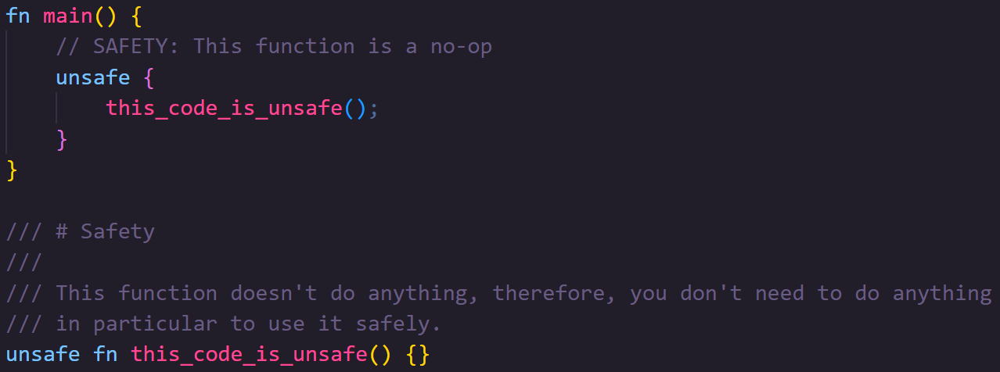

🦀👨🏻 Any time we use unsafe code we need to wrap it inside an `unsafe` block.

🦀👨🏻 This code uses an `unsafe` block to call a function that is itself marked as `unsafe`.

🦀👨🏻 Because the function is marked as `unsafe` it can _only_ be called within `unsafe` code.

🦀👨🏻 However, even within that function, code is treated as safe until you use another `unsafe` block.

🦀👨🏻 This helps constrain unsafe code further

🦀👨🏻 We'll talk about why you might mark functions as `unsafe` further on.

🦀👨🏻 But... what's with all the comments?

### how 02

🦀 This is not necessarily a widely used practice, but maybe it should be

🦀 The Rust Standard Library team, who have to work with `unsafe` a lot, have standardized around making safety communication almost contractual.

🦀 Prior to the `unsafe` block, the first thing we see is a `SAFETY:` comment.

🦀 This tells the reader how the author made sure this code was safe... this may seem odd.

### how 03

🦀 If the code is provably safe, why do we need `unsafe` at all? 

🦀 `unsafe` turns on language features that can't be proven safe by the compiler, but that's no excuse for writing `unsafe` code unsafely.

### how 04

🦀 The `# Safety` section of the doc comment on the function `this_code_is_unsafe` is used to tell consumers of that function how to use the function safely.

🦀 What you'll often find is that `SAFETY:` comments should mirror `# Safety` doc comments, to show that the code follows the guidelines laid out.

🦀 We'll talk more about unsafe functions later.

### how 05

The practice of writing a `SAFETY:` comment ensures that when we write `unsafe` code, we think hard about how we know this code isn't going to hurt us later.

Documenting how we know this code is safe is crucial.

You can read more about this practice in the official Standard Library Developer's Guide linked in the description

Raw Pointers - raw 01
---------------------

One of the main reasons you might want to dip into unsafe Rust is to communicate with memory directly.

Rust's abstractions around memory are powerful, usually free (or otherwise cheap) and very flexible, but they don't cover every possible need.

You may have a use case where you need to talk to memory without going through Rust's abstractions, and Rust lets you do that by turning on its unsafe features to access raw pointers.

### raw 02

We usually use References in Rust as if they were pointers, pointing to something that's actually stored elsewhere.

But while References include features that make them safer to use, a pointer is essentially just a number that is an address to a location in memory.

### raw 03

When you allocate heap data, even in Rust, the operating system provides you with a pointer to the location where the memory was allocated.

If we just used a pointer, it would still contain the numeric address of that location even if we subsequently told the operating system to free that memory.

### raw 04

Programmatically, we have no way to know if that location is still ours to use later.

Using that pointer after the memory is freed would be an error, and is the root of an extremely common bug you might have heard of called "use after free".

In fact, because we don't know from just the pointer whether the memory was freed or not, we might even try to free the memory again, leading to another bug called "double free".

### raw 05

References help us avoid that because we can track their use at compile time, helping us make sure that they are always valid before we even run the code... 

but the operating system doesn't use references.

### raw 06

Actually, references can't be used between _any_ two separate pieces of software, because of their compile time nature.

We can, however, share pointer locations.

### raw 07

So, even in Rust, pointers are being used all the time, whether we see them or not.

Sometimes, we may even need to use pointers directly ourselves.

### raw 08

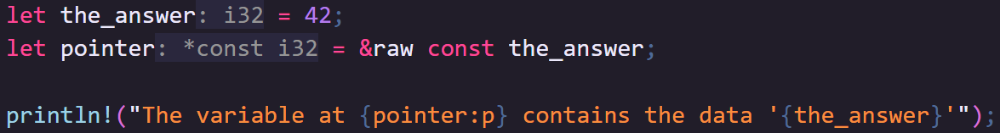

🦀👨🏻 You can actually get pointers in safe Rust, using "ampersand raw const" or for pointers to mutable data, "ampersand raw mut".

🦀👨🏻 If we run this program several times, you'll see we get a different number every time

🦀👨🏻 One cool thing worth pointing out is that Rust even types your pointers, including whether the data there is mutable, making it harder to mess things up later.

🦀👨🏻 An immutable pointer to an `i32` has the type `*const i32`

### raw 09

Remember, in some circumstances, the variable that you're accessing the data through does not contain the actual data.

Strings are a good example of this.

### raw 10

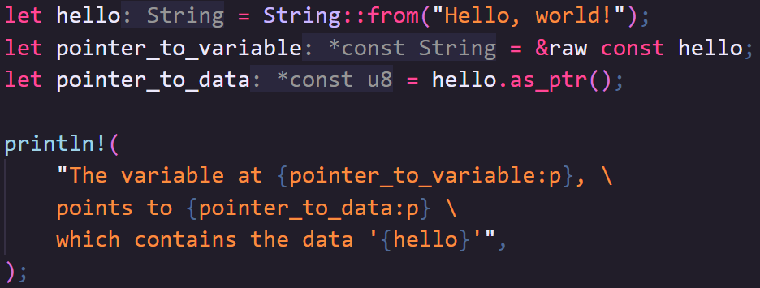

🦀👨🏻 The pointer to the variable does not point to the string data, it points to metadata which itself contains a pointer to the string data.

🦀👨🏻 We can access the pointer to the data via a method on the String itself.

🦀👨🏻 Again, there's nothing unsafe about doing this; we're just reading a numeric value that is definitely valid at the time we do it.

### raw 11

So getting pointers is perfectly safe. 

What we can't do is use those pointers to get the data stored at that location in safe Rust.

For that we need to dip into unsafe.

### raw 12

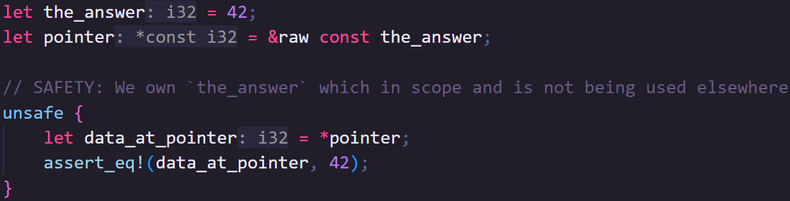

🦀👨🏻 Here we dereference the pointer to go back from the location to the data that's stored there.

🦀👨🏻 This is unsafe because Rust cannot confirm the validity of the pointer when we do it, it's just some number.

🦀👨🏻 Without us checking manually, `pointer` could outlive `the_answer`, after which, what is `pointer` pointing at?

Unsafe functions - fn 1
------------------------

When we write code, we regularly break it up into small reusable chunks known as functions.

### fn 2

You are, at this point, I hope, very familiar with this idea.

### fn 3

So far we've demonstrated that we can place unsafe code inside a block to encapsulate unsafe behavior. 

This means that you can write unsafe code inside a function, as long as you write the function to make sure that there's no risk, meaning, for someone calling the function, that function _is_ safe.

### fn 4

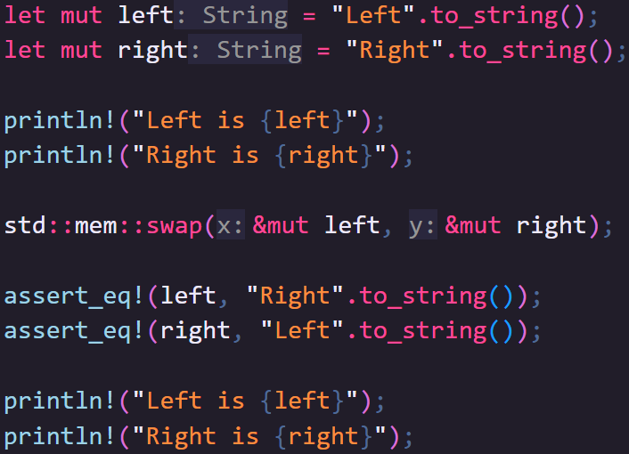

🦀👨🏻 A good example of this is "stud mem swap" which swaps the values at two mutable locations:

🦀👨🏻 Because `swap` guarantees the types are the same and, through using mutable references, knows nothing else is accessing the memory while it does its thing, conceptually this function is safe, even if the first thing it does internally is run unsafe code.

🦀👨🏻 This is what we call a safe abstraction around unsafe code.

### fn 5

But that's not always possible.

Sometimes, the very concept a function or method represents is unsafe.

### fn 6

Let's say that through arbitrary means, we've got a pointer to some heap data that we know represents a String. 

We know how long the String is and how much memory at that location is ours. We want to take ownership of that memory and turn it into a `String` type.

### fn 7

📕 We can use the `from_raw_parts` static method to build a `String` directly from memory, but the entire concept of manually creating a String like this is unsafe.

📕 Firstly, something else likely manages that Heap memory.

📕 If we create a `String` from it, we're going to take joint ownership of the heap data, and when our String goes out of scope, Rust will try to free it.

📕 How do we prevent a double free when the thing that originally created the data also wants to free it?

📕 Secondly, `from_raw_parts` takes a pointer, a length, and a capacity, none of which can be validated at compile time.

📕 And, String will cause a reallocation if the capacity is filled, causing us another problem to look out for!

### fn 8

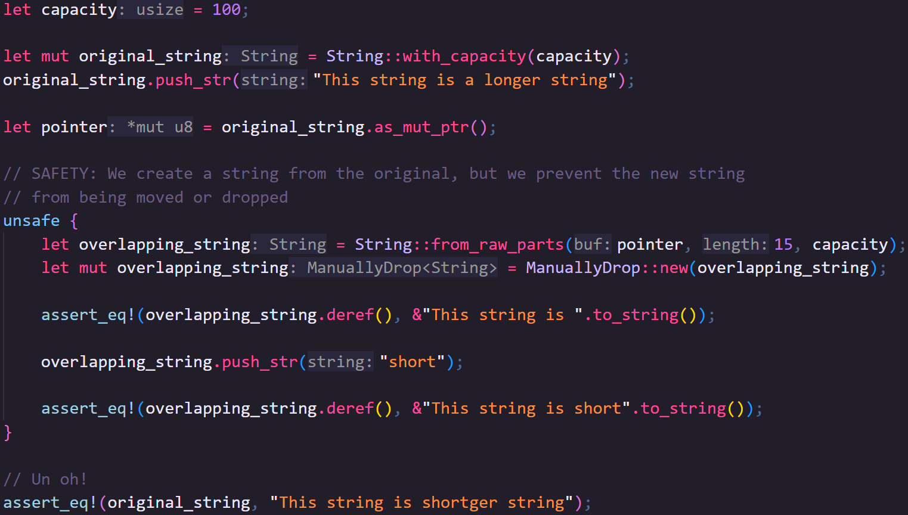

🦀 Luckily, by being aware of the problems ahead of time, we can still use this function safely.

🦀 We'll manually make sure our string never exceeds 100 bytes

🦀 Little side note: The string _may_ be created with more than 100 bytes, but we will own the entire _actual_ capacity and need to free it all when we're done with it.

🦀 `from_raw_parts` is an `unsafe` method so can only be called inside an unsafe block

🦀 I'm intentionally calling it with a length less than the original string to make a point

🦀 Before we do anything else, we're going to prevent `overlapping_string` from being dropped, which would otherwise cause a double free when `original_string` is dropped later.

🦀 We could prevent  `original_string` being dropped instead, but, to me, it makes sense to have this behavior in the inner code block.
    
🦀 Counter intuitively, the ManuallyDrop type is actually safe.

🦀 Although it prevents the memory being freed, and _could_ result in memory leaks, that's not considered unsafe in the same way as other things in this video.

🦀 Just be careful using it.

🦀 Here we're going to check that the String is what we expect it to be.

🦀 Due to giving it a smaller length, we only see the first part of the original string.

🦀 We can push data onto the end of the string, and it will correctly change the string.

🦀 But look how we massacred our boy!

### fn 9

It's not unusual to create an unsafe function but then wrap that function in safe code.

Like the example we used earlier: "stud mem swap" is safe, even though it does unsafe things.

### fn 10

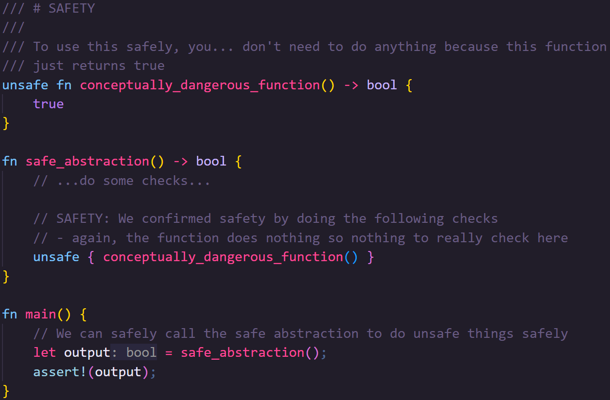

🦀👨🏻 Creating safe abstractions might look something like this

🦀👨🏻 We have a conceptually unsafe function that does some work.

🦀👨🏻 Ideally, we'd create a safe abstraction, a function that is safe to call by doing whatever necessary checks.

🦀👨🏻 The safe abstraction can then be called from safe code.

📕 stud mem swap does this simply by making sure you pass in mutable references of the same type, that's enough to guarantee safety.

### fn 11

When it comes to traits, if any of a trait's methods are unsafe, then the entire trait is considered unsafe, and so is its implementation.

It's actually kind of rare to _have_ to use this feature.

If your trait has an unsafe method but a safe abstraction, you might be able to move the unsafe method to an unsafe function.

### fn 12

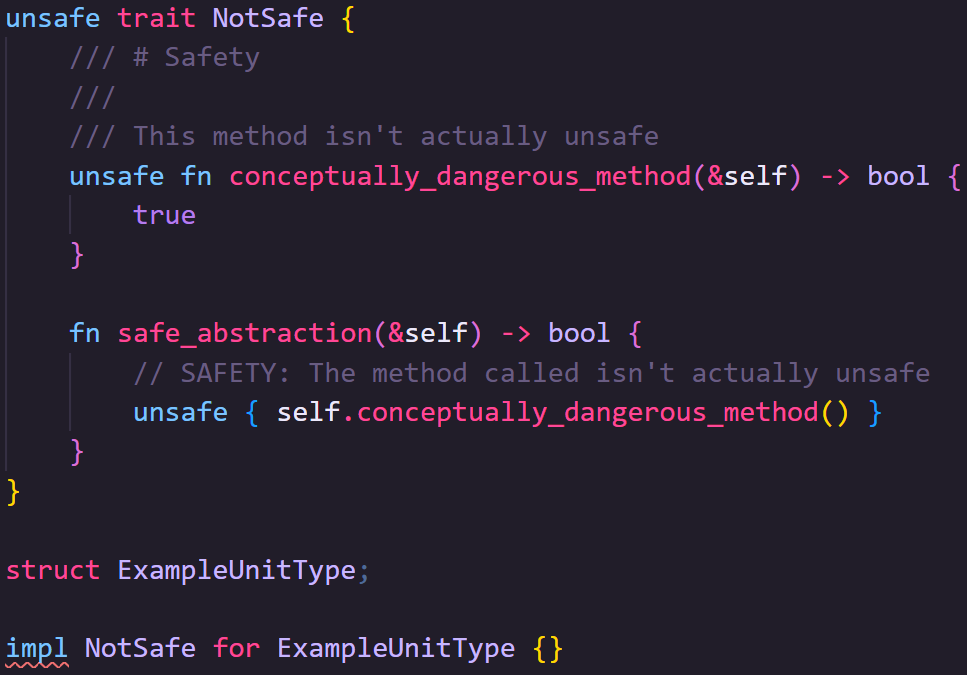
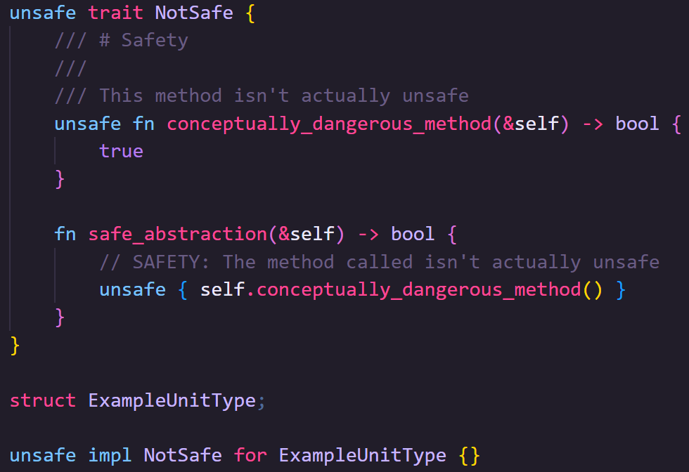
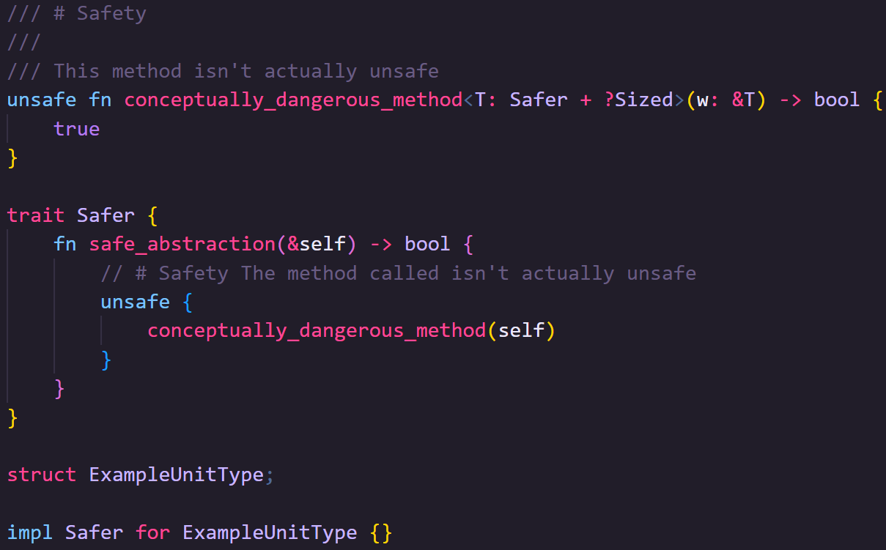

For example, this trait has two provided methods, but we still can't implement it safely, even with the default implementations.

We can implement it with the unsafe keyword though:

However, if we don't need to ever override the unsafe method, we could just extract it from the trait entirely

### fn 10

You're likely to need unsafe Traits only when the behavior the trait describes is itself is unsafe.

For example, `Send` and `Sync` are automatically applied to all types that are only constructed from types that are also `Send` and `Sync`, but both traits are conceptually unsafe.

If your type contains types that are not `Send` and/or `Sync` then the compiler can no longer guarantee safe implementation itself.

You can still implement `Send` and `Sync` for your type manually but its now up to you to check the implementation is safe, so implementing the traits themselves is `unsafe`.

Unions - unions 01
------------------

Unions, in software engineering, are a way of storing different types in the same section of memory.

They're typically broken into two flavors, tagged and untagged.

### unions 02

"Tagged" simply means the type is part of data, so you can only access the data _as_ the type that it is. We use tagged unions in Rust all the time, and they're perfectly safe:

### unions 03

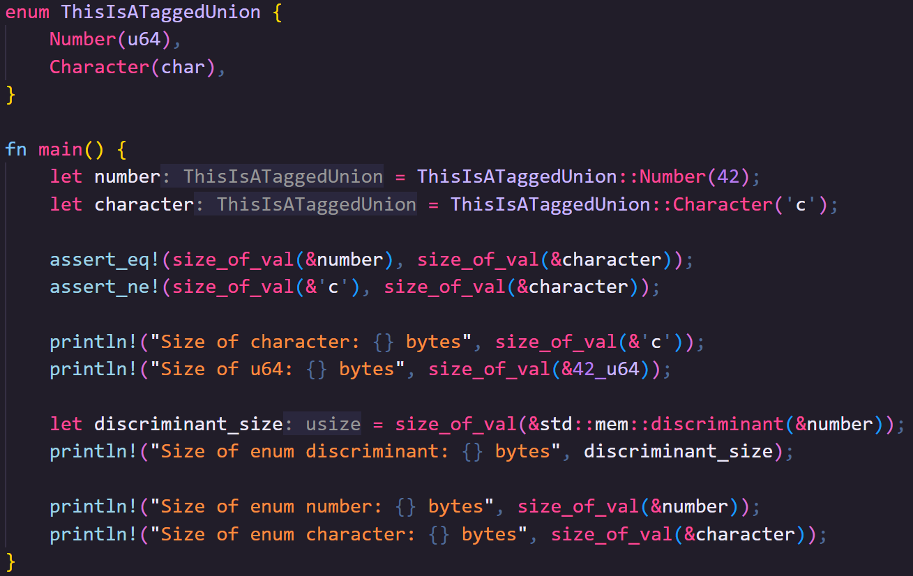

🦀👨🏻 Enums are tagged unions 

🦀👨🏻 They only ever take up as much memory as is taken by the largest data type representable inside them, plus a discrimination value which differentiates the variants at runtime

🦀👨🏻 The discrimination value is usually represented as an `isize` but Rust compilers _may_ use smaller numeric types

### unions 04

But Rust also has "untagged" unions, where the type being used is not part of the data, and you can access the binary value as any listed type. 

Untagged unions are obviously unsafe, but they provide several useful features, either by allowing you to interrogate the data in different ways, or for working with other programming languages that use untagged unions.

### unions 05

> Side Note

> My first attempt at an example for demonstrating untagged unions was an IPv4 address union that used both a 32bit integer, _and_ a four-byte array

> However, with that example we have to consider "endianness" which is the order in which bytes are stored in memory.

> This felt like it went too far off-topic, however, it's still worth pointing out that when creating unions that share multiple bytes of data, you too _may_ need to consider endianness.

### unions 06

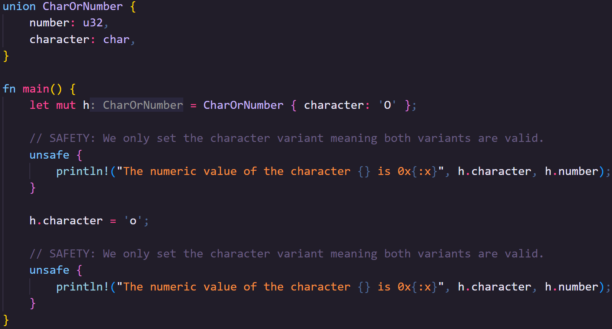

🦀👨🏻 In this example, we can interrogate characters as u32's (characters in Rust are four bytes, although most string types use a variable byte width encoding such as utf-8).

🦀👨🏻 Creating unions is safe:

🦀👨🏻 But, reading unions is unsafe. 

🦀👨🏻 Even in this case where both u32 and char are 32 bits wide, not all valid u32 values are valid chars, but all chars are valid u32s

🦀👨🏻 Writing values is also safe though.

🦀👨🏻 When we run the program, we can see that both character and number change

Assembly - asm 1
----------------

This next example of unsafe is so incredibly unsafe the only time you're ever likely to use it is if you need insane speed and know _exactly_ what you're doing with the _exact_ hardware you're targeting.

### asm 2

You might have heard of assembly, but crucially, it's not one language.

Assembly languages are languages that have a near 1:1 relationship with the actual instructions of the CPU you're building for.

### asm 3

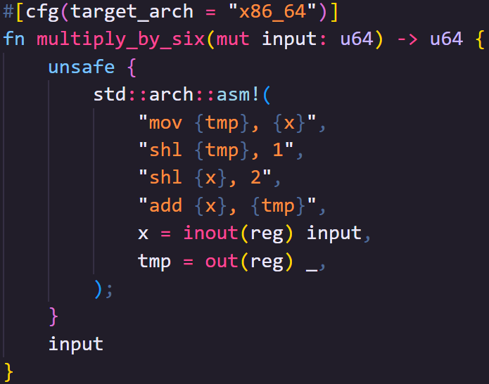

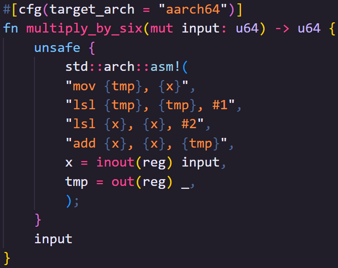

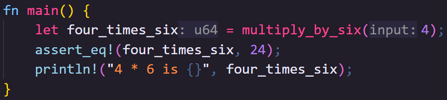

🦀 In this example you can see a function that takes a number and multiplies it by 6 using assembly.

🦀 There are two versions of the function: 

🦀 The first works on "x86_64" targets, which cover most Windows and Linux machines and older Macs. 

🦀 The second works on "aarch64" targets, which cover all modern Macs but also some newer Windows and Linux machines.

🦀 As you can see, apart from `mov`, the other instructions look very different but do the same things.

🦀 For obvious reasons, Rust cannot help keep you safe when you're sending instructions straight to hardware, so assembly is only available within unsafe code.

### asm 4

Of all Rust's unsafe features, this is the one you're least likely to need to touch, but, as with the others, it's there if you need it.

extern - extern 1
-----------------

A lot of the time you're going to be working with other peoples code.

Most often, that code will be written in Rust, downloaded as a crate, and combined with your code into a single binary.

### extern 2

Sometimes, though, you'll want to work with code written in other languages, either by consuming a library written in another language, or by building a library that another language can consume.

This is done with `extern`.

### extern 3

For compiled languages to interoperate, they need to use an Application Binary Interface.

Rust doesn't (and probably never will) have a stable ABI.

Instead, we use typically use C's, though other options also exist.

### extern 4

Creating a library that can be consumed by other languages is fairly safe.

You define a function that will be made available extern-ally (thus the name). 

The function itself is safe... exposing it is not.

To be made available, the name of the function has to be known.

### extern 5

Rust usually "mangles" its function names to avoid what's called symbol collisions, where two things have the same name.

To expose the function, we need to know its name, so we need to prevent the mangling, but that means there's a risk of collision.

### extern 6

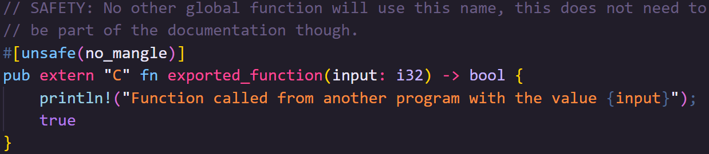

🦀👨🏻 Pre Rust-2024 preventing mangling was done with the `#[no_mangle]` attribute, but as of Rust 2024, we need to explicitly tell Rust that we understand the dangers.

🦀👨🏻 There's one more thing to consider, though. Our code will be called by code that we can't control.

🦀👨🏻 You probably want to make sure you validate data coming from eternal code, especially for anything more complex than a number.

### extern 7

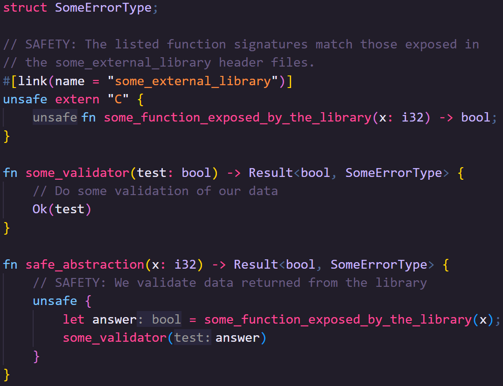

🦀👨🏻 You can also call functions from other libraries if they use a supported ABI too.

🦀👨🏻 You do this by linking an extern block to a specific library and then listing the signatures of the functions exposed by that library that you want to use in your code.

🦀👨🏻 Everything about this is unsafe.

🦀👨🏻 If there's no dynamic library on the target system that shares a name with the linked library, the program will panic.

🦀👨🏻 If the function names do not match, the program will panic.

🦀👨🏻 If the function names match but the signature doesn't, you'll get undefined behavior, or it will panic.

🦀👨🏻 Nonetheless, the ability to import libraries written in other languages can be a powerful tool in your arsenal.

Mutable Statics - statics 1
---------------------------

In older editions of Rust, it was possible to have mutable statics via unsafe Rust.

This would allow you to have mutable global variables that were safe to use so long as they weren't shared between threads.

As of Rust 2024, this is no longer the case.

### statics 2

If you don't mind sacrificing a tiny bit of speed, the same thing can be achieved through safe abstractions and tools like atomic types or interior mutability.

If you really need the speed, then you can still fall back on raw pointers.

At the end of the day, though, mutable globals are a bit of a crutch and should generally be avoided where possible, and I think there's a lesson here.

### statics 3

Any time you find yourself reaching for unsafe code, you want to be sure that there's no other acceptable way to do the same thing.

Unsafe Rust can speed up your code and can let you do things there's no other way of doing, but you should assess the various possibilities and trade-offs of alternatives before commiting to unsafe.

Even if you have to use unsafe code, are there existing safe abstractions for what you're attempting in the standard library or well-tested crates?

You shouldn't be afraid of unsafe, but you should understand that it is going to turn on features that you are responsible for making sure are used safely.

If you don't need them, don't use them.

Summary - summary 1
-------------------

Outside of specialist use cases, you're unlikely to have to write much, if any, unsafe code yourself.

### summary 2

Nonetheless, hopefully after this chapter you see that it's not as scary as it seems.

You still have all the normal safety checks, but now you have additional features you can't get otherwise

You now know a bit more about what to look for to keep yourself safe when the compiler can no longer help.

### summary 3

If you are going to be writing unsafe Rust, there's a tool called [Miri](https://github.com/rust-lang/miri) that will, in your running code, help you detect potentially undefined behavior you might have missed.

It's not a panacea, it can't catch everything, but it is a final potential safety net you should use to protect yourself.

Next Time - next 1
------------------

We're going to lean into pretty much everything we've learned so far to learn async Rust.

This is going to be a bit of a unique chapter.

### next 2

We'll go deeper than you generally need to go, in our exploration of the space.

Typically, you'd grab a crate like Tokio or AsyncStd to do all the hard stuff for you.

### next 3

But by learning the core concepts, you should come out the other side with a much better idea of how async works under the hood.

As with this video, you may never need to write any of the complex stuff, but...

It should help you feel comfortable with what I think many would agree is the last remaining truly sharp edge of Rust programming.

### next 4

So, if that excites you, then I'll see you next time

