Async Rust
==========

### open 1

Often, when we write code, we have to wait on certain "things that take time" to happen.

"Things that take time" are usually things like IO, such as reading or writing to a disk, getting data from a database, downloading a file, and so on.

Sometimes "things that take time" could just be computationally expensive, such as processing large amounts of data.

### open 2

Usually our programs are complex with multiple parts to them.

For example, applications often have a user interface, whether that's via a terminal, a web page, or a full desktop GUI.

If our application has to do "things that take time", we don't want other aspects (like the UI) to freeze up, unable to do anything while we wait.

Asynchronous programming is an implementation-independent way to structure our code so that we can continue to do work while waiting on other things.

### open 3

This series is accompanied by a free book, check the description for a link straight to this chapter.

My name is Daniel, welcome to IRISS.

Intro
-----

### intro 1

Asynchronous programming doesn't necessarily mean threads.

Some languages that support async programming don't even support multiple threads.

Under the hood, we might use threads, or we may depend on Operating System hooks, or even, for embedded programming, we might directly depend on hardware interrupts and exceptions.

### intro 2

In this video we're going to explore the modular design of async programming in Rust.

Our aim is to get a solid(ish) understanding of the concepts involved, even though, in the real world, you're likely to depend on others to design and build the more complex parts of the system.

Move and Pin
------------

### pin 1

Before we jump into the main part of the video, as ever, we once again need to talk about memory, specifically: moving and pinning.

All data in our running program exists somewhere in memory, whether it's the stack, the heap, or static memory.

That means that everything has a pointer address in memory.

### pin 2

When we pass a variable to another function, ownership of that variable "moves" to the other function.

When we add a variable to a `Vec` then ownership of that variable "moves" to the heap.

Any time data "moves" ownership, it also physically moves in memory.

### pin 3

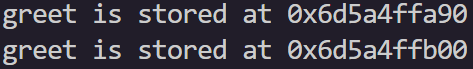

🦀 We can see this in action with some simple code and some knowledge about pointers from our previous video.

🦀 We'll create a `String` type and give it to the variable `greet`.

🦀 As we know from last time, the data we care about, in this case "Hello, world!" will exist on the Heap.

🦀 The variable `greet` contains some metadata about where our `String` is in the Heap, but `greet` is stored on the stack.

🦀 We can get the pointer address to `greet` on the stack like this.

🦀 Now lets move `greet` to another function, and get the new `greet`s pointer.

🦀 When we run the program, we get two similar, but different addresses.

### pin 4

This is usually fine, but _occasionally_ things might need to know where they themselves are in memory. 

This is called self-referencing. 

If something references itself, and we move it, where does that reference now point?

### pin 5

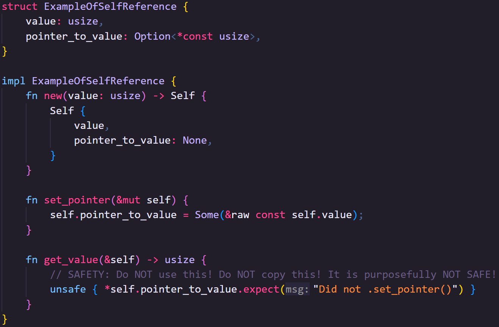

🦀 Let's create a completely ridiculous struct that contains some data and a pointer to that data.

🦀 When we create the struct, we'll need to set the pointer to `None` because the constructor itself will move the data.

🦀 Instead, we'll set the pointer via a method after it's been moved into place.

🦀 Finally, we'll do the really stupid thing and dereference the pointer into the value.

🦀 Let's not forget that safety comment!

🦀 That's better.

### pin 6

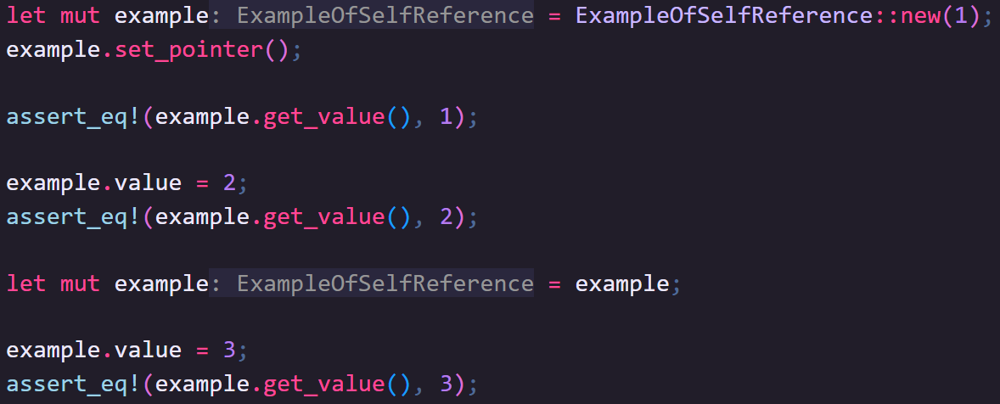

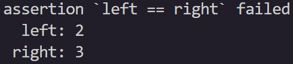

🦀 Let's write some code to instantiate our example struct... and get that pointer set up.

🦀 When we read the value via the pointer, it, perhaps surprisingly, works as expected!

🦀 We can also change the value directly, and the pointer correctly gives us that updated value.

🦀 Now let's move ownership, and, yes, this is actually enough to do so. 

🦀 We're technically moving it within the same stack frame, but this is a new variable even if it has the same name.

🦀 Updating the value works, but reading it now gives us the old value. 

🦀 `pointer_to_value` is just a number pointing at a location in memory.

🦀 We moved the data, but the pointer is still pointing at the old location.

### pin 7

Self-referential data is dangerous... but it can also be useful in certain circumstances.

> Not in the example I just gave, but still.

For this reason, some Generic types occasionally need to take it into consideration.

To keep ourselves safe, we can "pin" arbitrary data to memory, preventing it from being moved.

### pin 10

We use the `Pin` type to express this behavior.

> `Pin` used to confuse me, but I actually don't think it's doing anything remotely clever.

The type itself is just a container for a mutable reference, so the `Pin` itself is safe to move around

Through the magic of the borrow checker, holding that single mutable reference is enough to lock the data in place.

It's more like a guard or guarantee than anything magical.

### pin 11

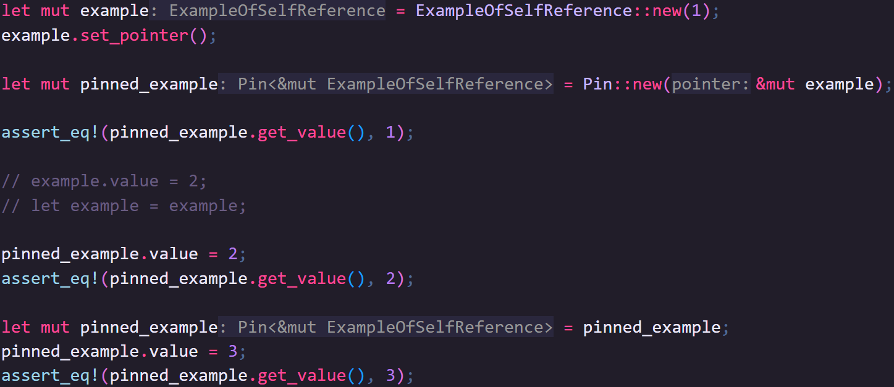

[//]: # (Review Pin example compared to changes in book)

🦀 We can pin our example from earlier using `Pin::new`

> 🦀 You can't always use this, its kinda goofy, I'll explain in a minute

🦀 We now can't modify the original struct or move it because `Pin` is holding the mutable reference. 

🦀 But we _can_ modify the data via the `Pin` thanks to `Deref` and `DerefMut`.

🦀 We can also move the `Pin` and, unlike our earlier example, this works because the `Pin` is just a reference.

### pin 12

📕 There's a lot to `Pin` so and if you're curious about it, the standard library documentation has a lot more information.

📕 For this video its enough to know that, in specific circumstances, like in modular asynchronous architecture where we don't necessarily control everything, we need to be certain data won't move unexpectedly, and this is achieved through the `Pin` type.

### pin 13

`Pin::new` only works with types that are `Unpin`, which is the automatically implemented marker trait for types that... don't need to be pinned.

> Told you it was goofy.

For things that do need to be pinned you can use things like `Box::pin` and the `pin!` macro which have their utility but, crucially...

...do move the data you're trying to prevent moving, so take care of your references!

### pin 14

That said, you would have to Box a pin if you want to return it doesn't the stack.

In our example this is fine so long as we set the pointer after moving it into the Pin.

Breaking Down Work
------------------

### tasks 1

🎨 When we build software, we can compartmentalize different parts of our program into tasks.

🎨 Imagine we want to download two websites and compare the contents.

🎨 We download website A, then download website B, then compare the contents of the two sites.

🎨 However, now that we've broken it down into tasks, we can see the tasks for getting the websites don't depend on each other and could be performed at the same time.

🎨 Asynchronous design allows us to reason about our code at the task level.

🎨 It doesn't specifically tell us how that work will get done, though.

### tasks 2

Different languages provide asynchronous utilities in different ways.

In C# the default way async tasks are run is using multiple threads in a thread pool.

Node.js is a single-threaded runtime, though, so async code uses operating system callbacks to let your program know when a task is complete.

### tasks 3

Importantly, in both languages, async code "just works"

You can start using it out of the box. 

### tasks 4

Rust provides ways to structure asynchronous code but doesn't have a default way of making sure Asynchronous work is actually performed.

Arguably this makes async Rust harder to work with than other languages that support async fully out of the box.

However, this allows software engineers to choose the method of task execution that will work best for their application.

### tasks 5

Over the rest of the video we'll go over the Rust way of thinking about asynchronous tasks and create our own way of getting the work described by those tasks to run asynchronously.

## Tasks, Schedulers, Futures, and Executors

### concepts 1

Asynchronous architectures allow us to break our work up so that we can process different bits of that work while waiting on other bits.

As discussed, conceptually, we break the work into tasks and then have some sort of scheduler that decides which task gets run when.

### concepts 2

In Rust, we represent tasks with the `Future` trait, which can be applied to any type.

We manage task scheduling through what are usually called executors (or sometimes runtimes), which themselves use `Waker`s to decide when to run different tasks.

### concepts 3

This sounds complicated, but by the end of this video, you'll hopefully have a reasonable idea of how `Future`s, executors, and `Waker`s work together, and if you don't... that's actually ok.

### concepts 4

Most of the time you won't need to write any of these things yourself, but having even a vague understanding of them will help you write better async code, as well as spot and fix common issues you might run across.

Let's get started by building up our understanding step by step.

Futures
-------

### futures 1

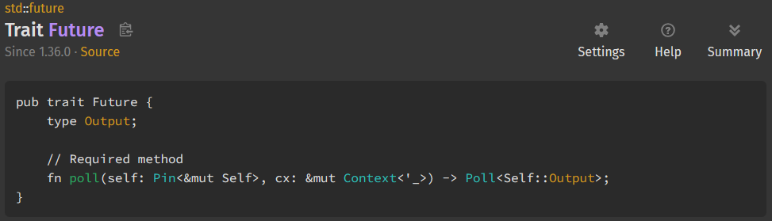

📕 The `Future` trait represents a task that may or may not be complete.

📕 Something that will be completed in the future, but not necessarily now.

📕 It has an associated type, `Output` and a single method, `.poll()`.

📕 `Output` represents the type of the data eventually returned by the `Future`.

📕 Usually this type will actually be a `Result<T, E>` because if we're waiting on something happening, there's a chance that it might not.

📕 The `.poll()` method is a lot more interesting though.

### futures 2 (cont image)

📕 Firstly, you'll notice that `self` is typed, which we haven't seen in this series before.

📕 In `Future`'s, `self` is a Pinned mutable reference to data of the type the `Future` is applied to.

📕 The reason for this is _where_ the `Future` executes might change, but because you might want to apply a `Future` to a self-referential type, we need to know the data the `Future` represents won't itself move.

### futures 3 (cont image)

📕 `.poll()` also takes a mutable reference to some sort of `Context` type.

📕 For now, the only thing `Context` contains is a `Waker` which we'll talk about later.

📕 The reason we don't pass the `Waker` directly though is that in the future... of `Future`s... we might want to add more data to a `Context`.

### futures 4

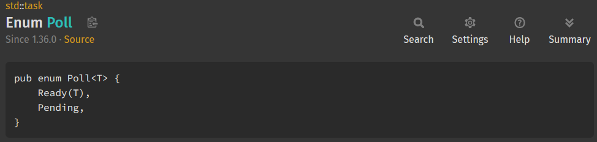

🦀 Finally, the return type of the `.poll()` method is a `Poll` enum.

🦀 The `.poll()` method should be called any time we want to make progress on a task.

🦀 The return type tells us whether that call has resulted in an `Output`, represented by `Poll::Ready(Self::Output)`, or if the poll is not currently complete and needs to be called again, represented by `Poll::Pending`.

### futures 5

> Once a Future has returned Ready, you _shouldn't_ call it again.
> 
> The official documentation explicitly says, calling poll after Ready may result in a panic.
> 
> We will be breaking this rule later, but we'll be very cautious when we do.

### futures 6

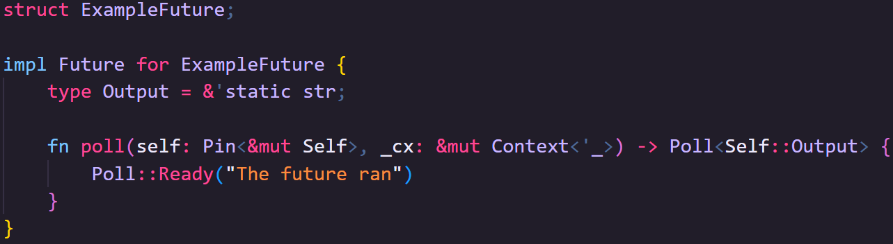

🦀 Let's make our first Future then.

🦀 We can apply the Future trait to anything, even a unit struct is fine.

🦀 For now, our poll method will immediately return `Poll::Ready` with a static lifetime string slice reference.

### futures 7

🦀 We'll instantiate our unit struct, and immediately pin it.

🦀 Next we're going to create a context with a no-op `Waker`.

🦀 Don't worry about this yet, the "noop" `Waker` doesn't do anything, and we're not even using the context in this example.

🦀 Unlike some languages, in Rust, Futures don't do anything unless you call the `.poll()` method, so we'll do that and store the response

🦀 We can then use a match to extract the output from the Poll enum

🦀 Normally, `Future`s won't be "ready" immediately, and will need to be polled again.

### futures 8

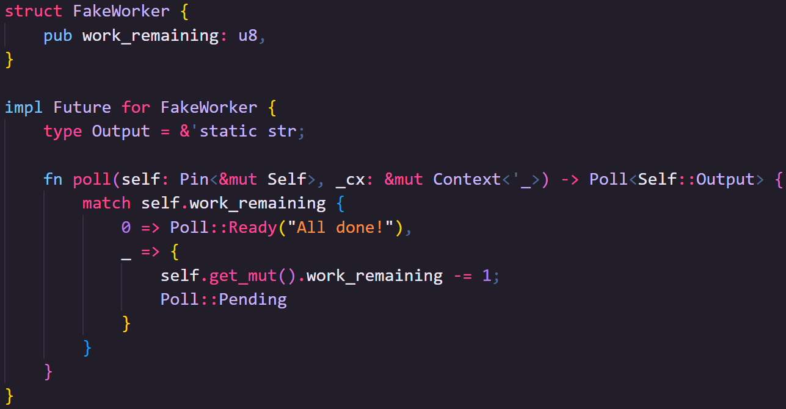

🦀 Let's create a `Future` that doesn't complete the first time you poll it, using a simple counter.

🦀 Each time we call the `.poll()` method we'll check if we're at zero by dereferencing the pin. 

🦀 If it's zero, then we're ready.

🦀 If it's not zero, we need to change the work remaining however, you'll notice that `self` is not mutable.

> 🦀 This is where things get a little... interesting.

🦀 How you’ll manage mutability in a `Future` you write yourself might depend on whether the `Future` needed to be pinned or not.

🦀 If it did, you'll have to work out some kind of interior mutability mechanism for yourself.

🦀 If it didn't, then in all likelihood your type automatically implemented `Unpin`, which means you can safely(ish) take the mutable reference out of the Pin with `.get_mut`.

🦀 This consumes the Pin but lets you mutate the data via the mutable reference.

🦀 So here we can subtract from work remaining and return Poll::Pending

### futures 9

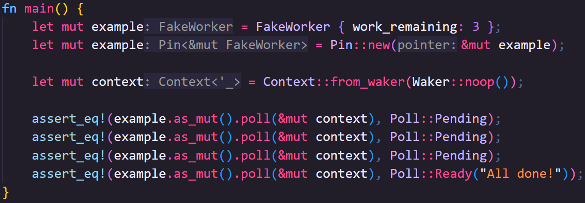

🦀 Once again we'll create our Future and pin it.

🦀 Then we'll create a context that doesn't do anything.

🦀 When we call the `.poll()` method it consumes the `Pin`, but we can get a copy of the `Pin` with `as_mut()`, so long as our Pin is mutable

> 🦀 Its a bit weird but easy enough to work with.

🦀 Now poll the future until the work is done. 

### futures 10

So managing futures is just about repeatedly calling `.poll()` right? 

Well... no, not quite.

Executors
---------

### executors 1

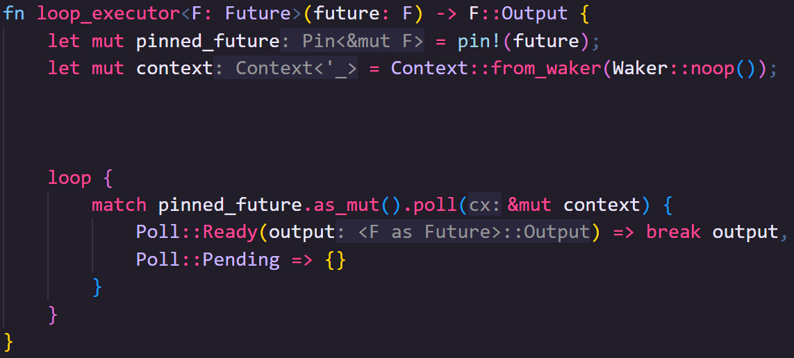

🦀 Let's create a simple executor that _will_ just poll `Future`s until they're `Ready`.

🦀 This executor takes a single generic `Future` and loops over the poll method

🦀 As I mentioned earlier, we can only use `Pin::new` if the thing we're pinning is `Unpin`.

🦀 We could restrict our executor to only accept `Future`s that are also `Unpin`, but using the `pin!` macro will let us keep our generic interface simple and broad.

🦀 Again, the `pin!` macro will cause the `Future` to move, but as long as no self-references have been formed yet, this should be fine. 

🦀 We'll create our noop waker and context.

🦀 Next, we'll repeatedly call `.poll()` on the future until we have an output, which we instantly return from the loop with break, and from the executor via the loop.

### executors 2

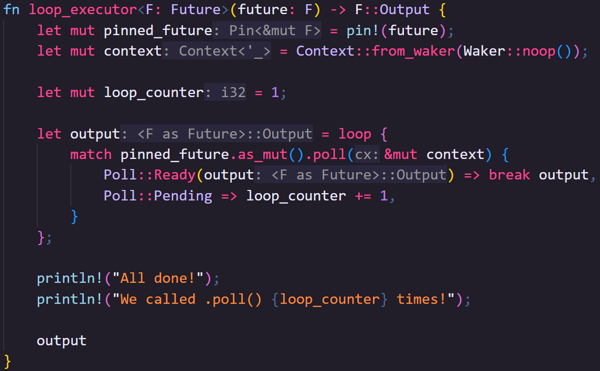

🦀 This is all we need but for demonstrative purposes, lets add a bit of code to show how many times we called `.poll()`. 

🦀 We'll start the counter at one, and add to it each time we get a Poll::Pending to get an accurate number of times we called `.poll()`.

🦀 We'll capture output here and return it at the end.

### executors 3

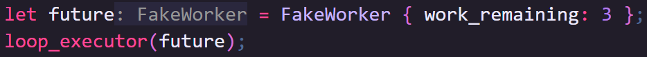

🦀 Passing our previous example in, this seems to work quite well.

🦀 We called poll four times, once for each of the three fake "work"s we needed to do, and once to get that final `Poll::Ready`.

### executors 4

🦀 But `Future`s usually wait on things like IO or heavy compute tasks which won't nicely finish after a set number of calls.

🦀 Let's try mimicking that with a simple timer.

🦀 We'll store a `SystemTime` after which our timer is considered to have elapsed, and we'll get that by instantiating the timer with a duration and adding it to the current time.

🦀 When calling the `.poll()` method for the future implementation, we'll simply compare the current system time to the time after which we want to end and return Ready or Pending as appropriate.

🦀 Let's give it to our loop executor and run it.

🦀 Woof.

### executors 5

🦀 Fifty _million_ calls to the poll method... in one second.

🦀 I guess this speaks to the speed of Rust, but, wow are we doing a lot of nothing real quick here.

🦀 This work is going to take resources like compute time away from other tasks, so we really want to avoid this.

🦀 Rather than us polling the `Future` over and over, if only there was a way for the `Future` to let us know when it was ready to be polled again.

Waking
------

### waking 1

`Waker` is a struct the `Future` can use to inform the executor it's ready to have its `.poll()` method called again.

Before we get to that, though, we're going to update our program to use threads for both tasks and scheduling.

It's important to note, however, that threads are not a necessary element of asynchronous Rust.

There are other ways to achieve Waking, but for now, this is the approach we'll take.

### waking 2

🦀 First, let's update our timer to use Threads.

🦀 This is a bit more complex, so we'll talk through each bit.

🦀 This time, we'll capture the `Duration` and save it for later.

🦀 Once we start the thread we'll store its join handler in here.

🦀 We won't actually join the thread in the traditional sense, so to be honest, I'm not sure if this is necessary, I just didn't like the idea of orphaning the thread.

🦀 Next we're finally going to use the Waker.

🦀 We need to store it, and access if mutably from both the executor thread and the thread we're creating, so into an Arc Mutex it goes.

🦀 When we instantiate the ThreadTimer we won't have a Waker yet, so we'll use the noop waker.

🦀 This saves using an Option and is safe as we won't start the timer until the first poll, at which point we're given a real Waker.

🦀 Finally, to mitigate a potential race condition we're going to mark the Timer as complete, and again, this needs to be accessible from both threads, so this is also an Arc Mutex.

### waking 3

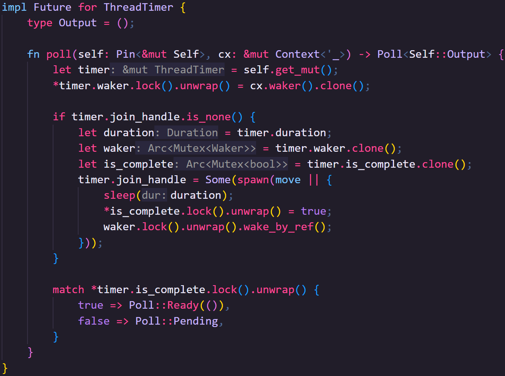

🦀 To implement the Future, first we need to access the Future mutably multiple times.

🦀 We know it's `Unpin` so we're going to grab the mutable reference to the Timer out of the pin with `get_mut`.

🦀 Next, we replace our `Waker` every time the `.poll()` method is called.

🦀 Normally this will actually be the same `Waker` each time, but it is technically possible to move a `Future` from one executor to another, which might mean we need to use a different Waker. 

🦀 In the event we're given a different `Waker` we'll store it every time `.poll()` is called.

🦀 `poll` will be called multiple times, so if we haven't started the thread yet, we should do that now.

🦀 We'll take a copy of the Duration and clone the Arc's for `waker` and `is_complete` so they can be moved into the thread.

🦀 The thread itself will simply sleep itself for the duration, then set `is_complete` to true, then call the waker.

🦀 Once the thread is set up, and on each subsequent call of `.poll()` we'll check if the Timer is complete and return the appropriate Poll variant.

### waking 4

🦀 Some important notes here.

🦀 First, I've used `.unwrap()` when getting the Mutex lock primarily to make this code easy to read but also because if either our inner or outer threads panic, the program is unrecoverable for reasons other than locking the mutex.

🦀 Ideally you should at least use `.expect()`, or our Future could return a `Result` but we'll come to that later.

🦀 Second, thread sleep is not remotely accurate. 

🦀 It's guaranteed to sleep for at least as long as the duration, but might sleep for longer... unless you give it a duration of Zero, in which case it might sleep, or it might not, depending on your system!

🦀 Thirdly, there's one more thing in this code that I'm hoping if you _already_ use a lot of async in Rust, this has you cold sweats... don't worry, it's safe, but we'll cover it at the end of the video. *wink*

### waking 5

🦀 Before we move on, lets test our new timer in our old loop executor.

🦀 Now when we run it... we hit `.poll()` 140 million times.

🦀 Technically, I guess we start the timer a bit later (after calling `.poll()` and constructing a thread), but also our comparisons are a bit cheaper.

🦀 Still, this is out of hand.

🦀 Time to fix it once and for all.

### waking 6

🦀 First, we need a `Waker`.

🦀 The `Waker` type itself is a concrete type, but when its created we can give it any type that implements the `Wake` trait.

🦀 To stop the executor from polling unnecessarily, our plan is to simply pause the whole thread the executor is on; this is called "parking" the thread.

🦀 This makes our `ThreadWaker` fairly straightforward.

🦀 We can create it with the `current_thread()` static method in which it takes a note of whatever thread it was created on.

🦀 We implement the `Wake` trait for it, and when we call `wake`, all we do is "unpark" that thread.

🦀 Parking and Unparking is akin to pausing and unpausing threads.

### waking 7

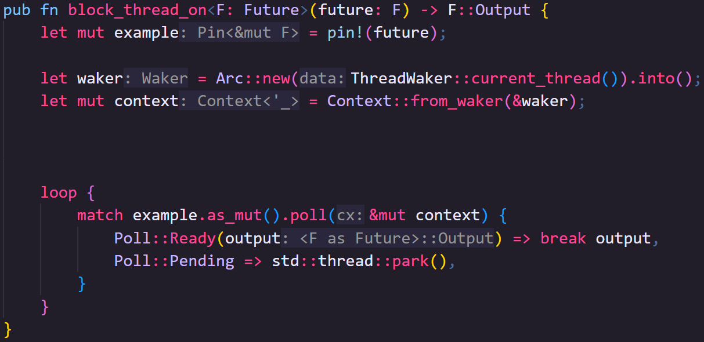
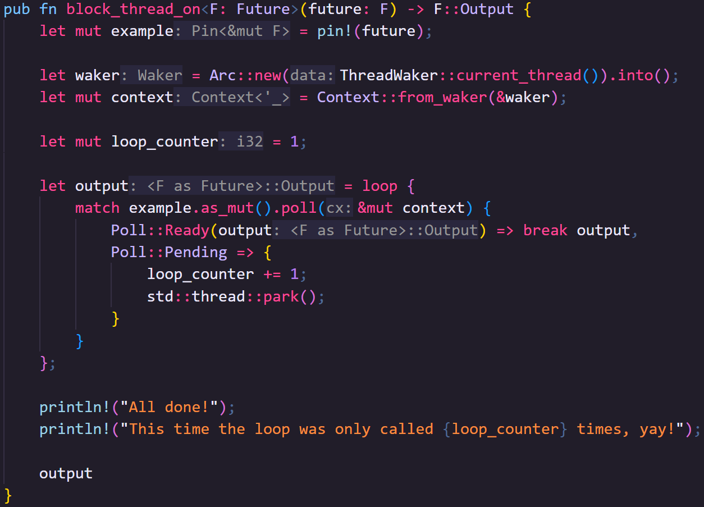

🦀 So, onto the executor.

🦀 We've got the same signature as the loop executor, accepting any future and returning its output.

🦀 We'll also pin the future before anything else, just like the loop executor.

🦀 Our first real difference then is we now actually care about the `Waker`.

🦀 We can create a `Waker` "from" an `Arc` of any type that implements the `Wake` trait.

🦀 By creating our `ThreadWaker` on the same thread as the executor, that's the thread that gets saved for later.

🦀 We'll then make our context from that waker.

🦀 Again, all we need now is a loop over the future.

🦀 If it's ready, we'll break from the loop and return that value.

🦀 If it's not ready, we'll park the thread.

🦀 When our ThreadTimer calls the `Waker` it unparks the thread, resuming the loop and causing the future to be called again.

🦀 It could mean the Future is ready to progress, in which case it will return Pending again, or it could be Ready.

🦀 Again, this is all that's needed, but to show the improvement we've made, lets add the counter back in

### waking 8

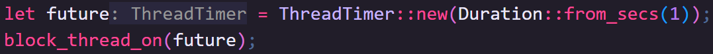

🦀 When we run our ThreadTimer in our new block_thread_on exectutor, you can see that our code is much more efficient with our poll method only being called twice.

🦀 Once to start progressing the future, and once more to complete the future after the `Waker` is called.

🦀 This means the program spends most of its one(ish) second runtime asleep, leaving resources like the CPU free to use.

Async / Await
-------------

### async 1

The whole point of asynchronous code architectures is that we break our code down into small tasks.

Implementing our own Futures is great for the very edge of our Rust code where we're waiting on some sort of I/O from outside our program, or something like a compute heavy task we control.

### async 2

Most of the time we won't necessarily even be doing that, though, as there are lots of crates for dealing with common I/O tasks, like reading files, accessing databases, or downloading files.

Most of the time, we just need to glue those bits together.

This is where async/await comes in. 

### async 3

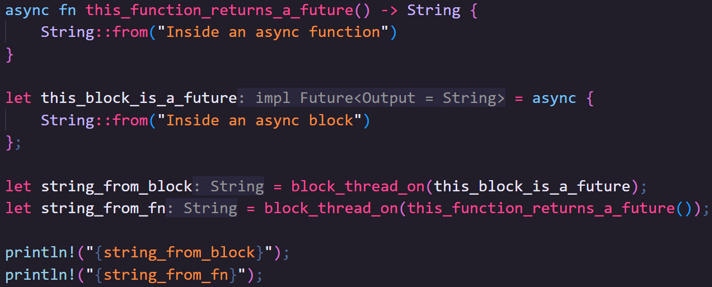

🦀 We can make any function or any block of code a `Future` with the `async` keyword.

🦀 When you write async in front of a code block, that code block will be evaluated as a `Future` with an `Output` type that matches that of the block.

🦀 In this example, we simply instantiate and return a `String`, so the async code block is a `Future` where the Output type is a String.

🦀 To use this `Future` we can pass it straight into our executor.

🦀 When you write `async` in front of a function, then the _return_ value of calling that function is a `Future` with an `Output` type that matches the return type of the function.

🦀 This example also returns a `String` but because the function is async, instead of getting a `String` when we call the function we get a `Future` where the `Output` type is a `String`.

🦀 In this case we need to call the `async` function to get the `Future` to pass into our executor.

### async 4

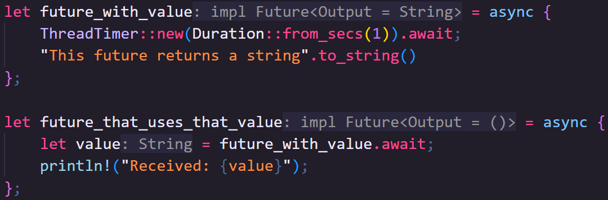

🦀 But async code blocks and functions do something a little bit special.

🦀 They can work up to another future and then pause until that future is ready to continue by using the `.await` postfix on a `Future`.

🦀 What's rather brilliant in async code, though, is that when waked? woken... the code resumes from where it got to.

🦀 Furthermore, `.await` will automatically unwrap the `Poll` enum for you, giving you the `Poll::Ready` value.

🦀 Because our Timer's don't return any values, let's have this async block called by another.

🦀 When we run this code, we go into `future_that_uses_that_value` then into `future_with_value`, then into the `ThreadTimer`.

🦀 The `Waker` from the executor is passed all the way into that future, and then the executor pauses until its told work can proceed.

🦀 After we exit out of `future_with_value` we get the value.

🦀 More importantly, because the value is considered to be instantly available after awaiting it, and because most of the time when waiting on something we have to assume that thing might fail... we arrive at the most sublime pairing of Rust syntax, `.await?`.

### async 5

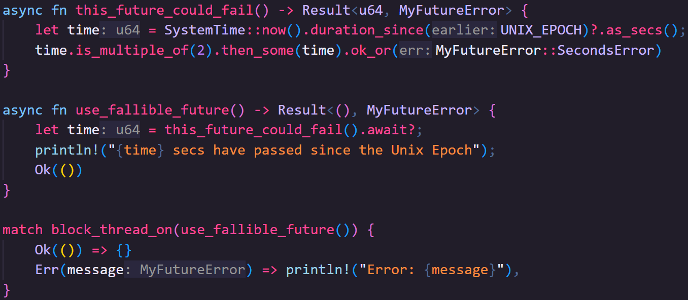

🦀 Functions that can fail should return a `Result`.

🦀 `Future`'s always return the `Poll` enum but `Future::Output` will _regularly_ be a Result.

🦀 Let's create a Future that could fail.

🦀 This future will Return the time since the Linux Epoch, in seconds...

🦀 ...but only if that time is divisible by two, otherwise we'll return an error.

🦀 Then we'll call that function, from another async function, and here is the magic!

🦀 `.await` gets the `Poll::Ready` value, which is a `Result`, and the question mark operator either unwraps the Ok variant or bubbles the Error variant.

🦀 We'll handle our error outside our async code.

🦀 A successful run looks like this... and an unsuccessful one looks like this!

### async 6

This doesn't need to be the end of the chain either!

Imagine a Future that returns `Poll<Result<Vec<T>, E>>`, you could `.await?.into_iter().map(|t: T| /* do some work */)...` etc.

This is another one of those Rust features that make the language really sublime to use!

### async 7

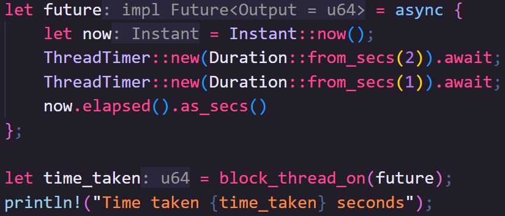

🦀 Anyway, because the `.await` postfix works on any future, and async code will resume from where it left off, we can `.await` several futures one after the other

🦀 `.await` essentially pauses the execution of the code until the ThreadTimer future is ready, then continues on from that point.

🦀 So this code is amazing, right? ... Right?

🦀 No! This code is bad, actually, but the reason may not be immediately obvious.

🦀 Let's time how long this takes using Instant.

🦀 The total time taken to run the timers is 3 seconds, which makes sense right?

🦀 We have a two-second timer and a one-second timer, combined, that's three seconds... but that's the problem...

Join
----

### join 1

The two timers in the previous examples are stand-ins for some arbitrary work and are completely independent of each other.

We should **not** be waiting for the first timer to complete before working on the second timer, that defeats the benefits of asynchronous programming.

### join 2

What would be more useful is if we do both bits of "work" at the same time.

To do that, we need both Futures to be polled at the same time. 

This is often called "joining".

### join 3

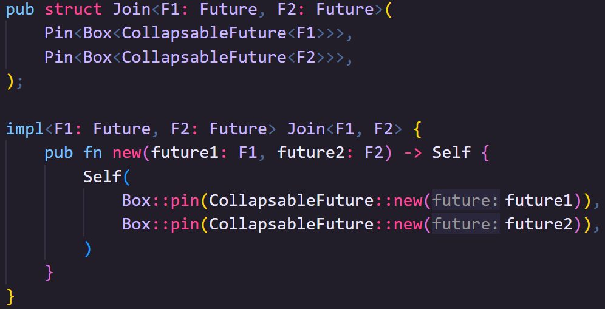

🦀 Here is a rough example of what a Join might look like.

🦀 I'm not going to go too deep into this code, because most of the time you'll end up using someone else's join code (heck, even the standard library has a proposed future join macro).

🦀 If you really want to see all the code, it's in the online IRISS book.

🦀 To gloss over it a little bit, the `CollapsableFuture` is a wrapper Future that I made that takes any other Future and stores the output after it's Ready so that it doesn't matter how many times you call `.poll()`... you'll see why in a moment.

🦀 When we create a new `Join` we pass in two Futures of any type, then pass those to new `CollapsableFuture`s.

🦀 If you need to wait three futures, make one of those two another Join... or use someone else's better code.

### join 4

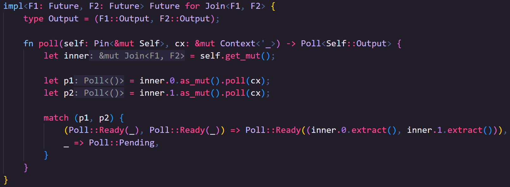

🦀 Let's implement `Future` for `Join`.

🦀 For a Join with the generic types F1 and F2, our Output will be a tuple of F1::Output and F2::Output.

🦀 When you poll `Join`, it polls the inner `Future`s.

🦀 It does this every time, which you aren't supposed to do, which is why I made the `CollapsableFuture` to keep my Join code simple.

🦀 Once both polls report Ready, then we extract the actual output from collapsable future and return Ready from the Join.

### join 5

Ideally, you won't be writing inefficient Join's like this one yourself.

Most async crates provide their own version of join, such as Tokio's `join!` macro, and Smol's `.zip()` function.

Even the Rust standard library has `std::future::join` which they're trying to stabilize.

Over in the Real World
----------------------

### real world 1

Rust doesn't come with its own Executors, or much in the way of Future utilities (other than what we've covered here).

This is because the implementation details can vary significantly depending on what you're doing.

For example, while here we've used Threads, Threads aren't necessary, aren't always available, and aren't particularly efficient in some situations.

### real world 2

If you're working on an embedded microcontroller, for example, rather than parking and unparking threads, you might use interrupts and exceptions to wake futures.

If you're running code inside an operating system, it might be more efficient to wait on callbacks from the OS to know when to wake a given future.

### real world 3

Rather than writing your own executors, though, you'll find that other people have provided executors for common use cases such as those in the Tokio and Smol crates.

These crates also come with a lot of utility types, functions, and macros, including substantially more efficient and ergonomic ways to join futures.

They also usually have code for common futures such as working with the file system or network traffic asynchronously, either via libraries or optional crate features.

### real world 4

Beyond this there are also executor agnostic libraries that provide futures for more specific needs like reqwest which provides HTTP specific futures, or SQLX, sequel x, squelex...

which provides connectivity to a variety of different database flavors.

### real world 5

So, most of the time when you work with async Rust in the real world, you won't need to write executors, and you won't need to implement the Future trait yourself.

You'll use third party libraries for futures at the outer bounds of your software, join futures with third party utilities, and you'll glue it all together with futures created with `async` blocks and functions.

### real world 6

🦀 Returning to our rather silly example from the very beginning of this video, your `async` code is less likely to look like what we've seen so far and much more likely to look like this:

🦀 Isn't it beautiful?!

🦀 Sure it's simplistic, but there's not a `Future` trait or `Pin` in sight, and that's genuinely what async Rust programming is like in the real world 99% of the time! 

🦀 So why did I just try to explain all of this?

🦀 Because my hope is that, when you understand what's happening under the hood, it will help you make the best use of async and avoid...

Common Gotchas
--------------

### gotchas 1

Other than forgetting you can and should poll as many futures together as possible, see the earlier section on Joining futures, there are two fairly common gotcha's in async code.

Luckily, they're much easier to spot when you have a fair understanding of what's going on underneath.

### gotchas 2

The first is blocking.

We used threads in our examples, but you may not end up using a threaded executor, and even when you do, some executors allow multiple futures to run on a single thread.

This means using any blocking code could prevent a thread from continuing until it's complete, which could impact the execution of some or all of your other futures.

### gotchas 3

This is an easier mistake to make than you might think.

For example, reading a file or TCP stream using the standard library will block your thread until the action is completed.

### gotchas 4

Worse still is `Mutex` which will block a thread until the lock becomes available.

If there are two futures on the same thread, and one has a MutexGuard when the other requests a lock, the second future will block the thread, preventing the first thread from dropping the MutexGuard.

This causes a bug called "Deadlock".

### gotchas 5

> If you cleverly noticed that I used standard library Mutexes earlier, good catch! 
> 
> Luckily, the specific way they're being used is safe as the locks are guaranteed to be on different threads.

### gotchas 6

Libraries like Tokio and Smol either come with (or provide separately) their own interpretations of typically blocking behaviors that use Futures instead.

### gotchas 7

The second gotcha is with borrowing and ownership. 

As we've seen, there's complexity around Futures that requires Pinning to be a thing.

This is because a Future might be moved by its executor, and if it is, self-referential data would point at old (or worse, freed) memory.

But it can get even more complex than that.

### gotchas 8

Rusts ownership model means that the lifetime of a reference must be trackable to make sure it doesn't outlive its owned data.

This gets a lot more challenging with futures as the compiler needs to track references through deferred work.

Thinking even more carefully about owned data, references, and the memory and CPU tradeoffs of cloning data can make async code harder to reason about.

### gotchas 9

It's worth remembering that, particularly for smaller projects, you don't _have_ to use async if it's causing your code to be more complicated than it would otherwise be.

Summary
-------

### summary 1

Hopefully, after this video, you have a bit more of an understanding about what's going on when you use async in Rust.

There are a variety of crates that help provide utilities for async each in their own way, so before you choose executor crates and `Future` supporting libraries, it's worth reading crate documentation to understand the options available and the choices made.

### summary 2

This is the end Idiomatic Rust in Simple Steps.

While there are many more language features available to you, I hope I've left you in a strong place to continue your journey.

### summary 3

I think I want to do a follow-up video for IRISS covering what you should do next on your learning journey, but after that I think we're done with the series.

I have some ideas for where to take Fio's Quest, including some quick potentially language agnostic videos on software engineering patterns, but what about you?

### gotchas 4

What would you like to see from the channel next?

Leave a comment or join our discord.

### gotchas 5

If you've enjoyed the series, then remember to like and subscribe.

My name is Daniel, and this has been IRISS. *wink*
